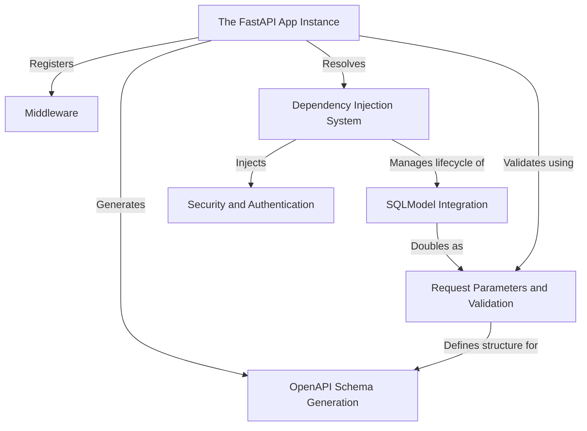

# Tutorial: fastapi

**FastAPI** is a modern, high-performance web framework for building APIs with Python. It acts as a central **App Instance** that orchestrates request handling, leveraging standard Python type hints to perform automatic *data validation* and generate interactive **OpenAPI documentation**. The framework uses a powerful **Dependency Injection** system to manage shared logic, database connections (via tools like **SQLModel**), and **Security** mechanisms effortlessly.

**Source Repository:** [https://github.com/fastapi/fastapi](https://github.com/fastapi/fastapi)

## Chapters

1. [The FastAPI App Instance](01_the_fastapi_app_instance.md)
2. [Request Parameters and Validation](02_request_parameters_and_validation.md)
3. [OpenAPI Schema Generation](03_openapi_schema_generation.md)
4. [Dependency Injection System](04_dependency_injection_system.md)
5. [SQLModel Integration](05_sqlmodel_integration.md)
6. [Security and Authentication](06_security_and_authentication.md)
7. [Middleware](07_middleware.md)

---

Generated by [Code IQ](https://github.com/adityasoni99/Code-IQ)