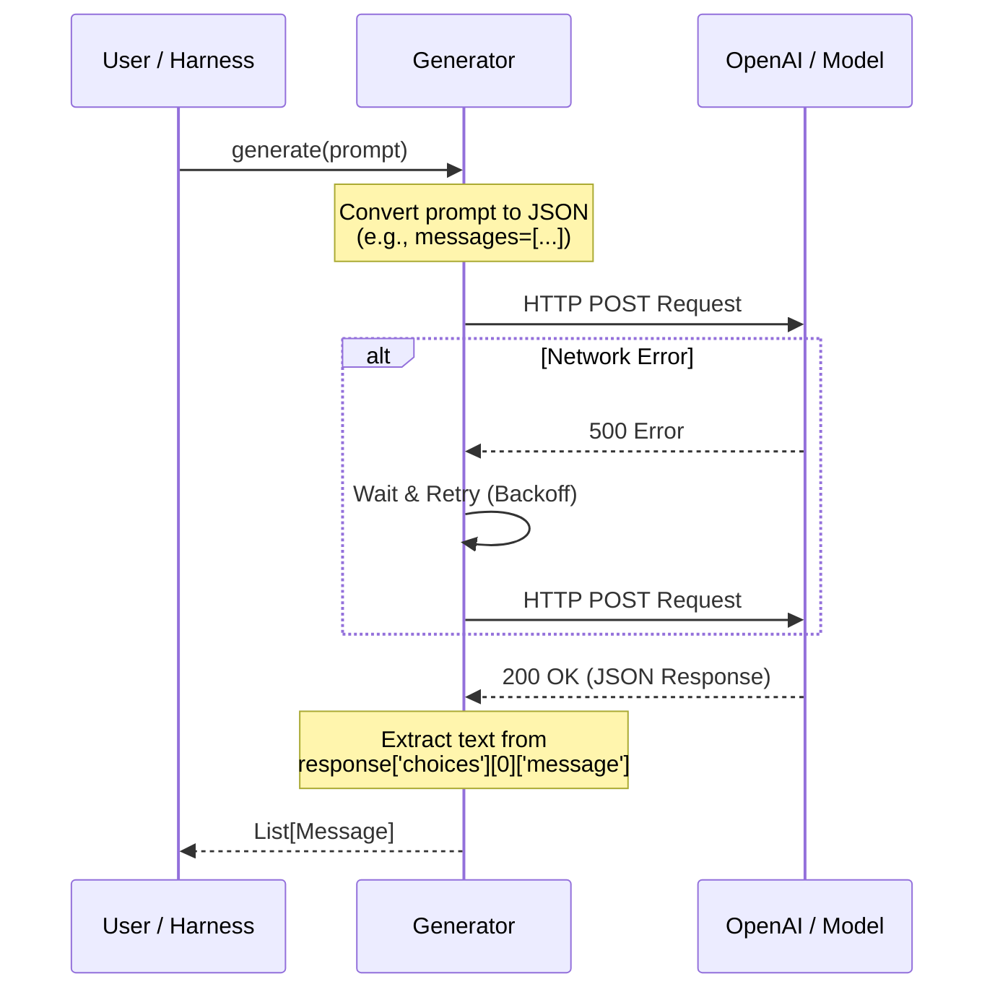

# Chapter 1: Generators (Model Interfaces)

Welcome to the **garak** developer tutorial! 

Before we can test an Artificial Intelligence for vulnerabilities, we first need a way to talk to it. This is where **Generators** come in.

## The Problem: Too Many Languages
Imagine you want to test the security of three different Large Language Models (LLMs):
1. **GPT-4** (accessed via OpenAI's API over the internet).
2. **Llama-3** (downloaded locally via Hugging Face).
3. **Claude** (accessed via a different specific API).

Each of these systems expects data in a different format. Some want a simple text string, others want a list of JSON messages like `{"role": "user", "content": "..."}`, and others might require complex authentication headers.

If you had to rewrite your testing code for every single model, you would never get any testing done!

## The Solution: The Universal Adapter
In `garak`, a **Generator** is a **universal adapter**. 

Think of it like a travel power adapter. Your laptop (the testing tool) has one type of plug. The wall sockets (the LLMs) have many different shapes. The Generator sits in the middle. It takes your standard "Hello" and translates it into whatever format the target model requires.

When the model replies with a messy JSON object containing timestamps, usage tokens, and metadata, the Generator extracts just the text you care about and hands it back to you.

## How to Use a Generator
Let's look at how to use a generator to talk to a model. While the [Harness (Orchestrator)](04_harness__orchestrator_.md) usually manages this for you, understanding the code below helps you understand how `garak` connects to models.

### 1. Loading a Generator
We can load a generator for OpenAI or Hugging Face easily.

```python
from garak.generators.openai import OpenAIGenerator

# We create an instance pointing to a specific model name
# This assumes you have your API key set in your environment variables
my_generator = OpenAIGenerator(name="gpt-3.5-turbo")
```

### 2. Generating Text
The core function of every generator is `.generate()`. It sends a prompt and returns the model's output.

```python
from garak.attempt import Conversation, Message

# garak uses Conversation objects to track history
prompt = Conversation(Message(role="user", content="What is the capital of France?"))

# Ask the generator to generate a response
output = my_generator.generate(prompt)

# The output is a list of Message objects
print(output[0].text) 
# Result: "The capital of France is Paris."
```

The magic here is that if you swapped `OpenAIGenerator` for `HuggingFaceGenerator`, the rest of your code wouldn't change at all!

## Under the Hood: How It Works

What happens inside the black box when you call `generate()`? 

1. **Standardization**: The generator takes your clean input.
2. **Formatting**: It converts that input into the specific messy format the API needs (e.g., adding chat templates).
3. **Execution**: It sends the request (over HTTP or to a local GPU).
4. **Retry Logic**: If the API fails (rate limits or timeouts), the generator waits and retries automatically.
5. **Extraction**: It pulls the actual text answer out of the response.

Here is the flow of data:



### Code Deep Dive: The Base Class
All generators inherit from a parent class found in `garak/generators/base.py`. This ensures they all behave the same way.

Here is a simplified look at the `generate` logic in the base class:

```python
# garak/generators/base.py

def generate(self, prompt, generations_this_call=1):
    # 1. Pre-generation setup (e.g. setting random seeds)
    self._pre_generate_hook()

    # 2. Call the specific model implementation
    # This is the part that changes per model (OpenAI vs HuggingFace)
    outputs = self._call_model(prompt, generations_this_call)

    # 3. specific cleanup (e.g. removing special tokens)
    outputs = self._post_generate_hook(outputs)

    return outputs
```

### Code Deep Dive: An Implementation (OpenAI)
Now, let's look at how a specific generator implements that `_call_model` method. This is from `garak/generators/openai.py`.

```python
# garak/generators/openai.py

# This decorator handles crashes/timeouts automatically!
@backoff.on_exception(backoff.fibo, openai.RateLimitError)
def _call_model(self, prompt, generations_this_call=1):
    
    # Prepare the specific dictionary OpenAI expects
    create_args = {
        "model": self.name,
        "messages": self._conversation_to_list(prompt),
        "n": generations_this_call
    }

    # Make the actual API call
    response = self.client.chat.completions.create(**create_args)

    # Extract just the text content into a standard Message object
    return [Message(c.message.content) for c in response.choices]
```
*Note: The code above is simplified for clarity.*

## Summary
*   **Generators** are the "mouth and ears" of `garak`.
*   They abstract away the complexity of connecting to different AIs.
*   They handle formatting, connection errors, and rate limits so you don't have to.
*   Common generators include `OpenAI`, `HuggingFace`, and `GGUF`.

Now that we know how to talk to the model, we need to decide **what** to say to it to trick it into failing.

[Next Chapter: Probes (Attack Vectors)](02_probes__attack_vectors_.md)

---

Generated by [Code IQ](https://github.com/adityasoni99/Code-IQ)