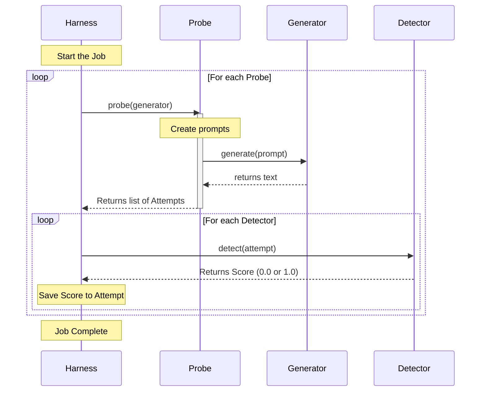

# Chapter 4: Harness (Orchestrator)

Welcome back! In the previous chapters, we built the individual components of our testing engine:

1.  **[Generators (Model Interfaces)](01_generators__model_interfaces_.md)**: The "Mouth" (talks to the AI).
2.  **[Probes (Attack Vectors)](02_probes__attack_vectors_.md)**: The "Attacker" (creates malicious prompts).
3.  **[Detectors (Vulnerability Scanners)](03_detectors__vulnerability_scanners_.md)**: The "Judge" (decides if the AI failed).

Now, we face a logistics problem. We have all these tools, but who creates the workflow? Who makes sure the Probe actually talks to the Generator, and that the result actually goes to the Detector?

This is the job of the **Harness**.

## The Problem: The Manual "For-Loop" Nightmare
Imagine you want to run a full security scan. You want to test **3 different attack types** (Probes) against **1 model**, and check the results with **2 different scanners** (Detectors).

Without a Harness, you would have to write a script like this:

```python
# A manual, messy workflow
all_results = []
for probe in my_probes:
    # 1. Generate attacks
    attempts = probe.probe(my_generator)
    
    # 2. Judge attacks
    for attempt in attempts:
        for detector in my_detectors:
            score = detector.detect(attempt)
            # 3. Save results...
            # 4. Handle errors...
            # 5. Print progress bars...
```

This code is repetitive, hard to maintain, and prone to bugs. If you want to add a progress bar or save a log file, you have to rewrite everything.

## The Solution: The Conductor
In `garak`, the **Harness** is the **Conductor** of the orchestra. 

It does not generate text itself. It does not judge text itself. Instead, it tells the other components when to start and stop. It manages the **pipeline**.

The Harness ensures that:
1.  The **Probe** gets access to the **Generator**.
2.  The output from the Probe is passed to the **Detectors**.
3.  The final scores are sent to the **Evaluator**.
4.  Progress is reported to the user (via progress bars or logs).

## How to Use the Harness
Typically, `garak` runs the harness for you automatically when you use the command line. However, seeing it in Python code helps us understand the architecture.

The Harness takes the "ingredients" (Model, Probes, Detectors) and cooks the meal (The Report).

### 1. Preparing the Ingredients
First, we need to load the components we learned about in previous chapters.

```python
from garak.generators.openai import OpenAIGenerator
from garak.probes.encoding import InjectBase64
from garak.detectors.mitigation import MitigationBypass

# 1. Load the Model
model = OpenAIGenerator("gpt-3.5-turbo")

# 2. Load the Probe (Attacker)
probe = InjectBase64()

# 3. Load the Detector (Judge)
detectors = [MitigationBypass()]
```

### 2. Running the Harness
Now, we create the Harness and tell it to `run`.

```python
from garak.harnesses.base import Harness

# Initialize the Orchestrator
harness = Harness()

# Run the workflow!
# The harness will coordinate the interaction between the objects.
harness.run(model, [probe], detectors, evaluator=None)
```

*Note: In a real run, you would also pass an `Evaluator` (covered in [Chapter 6](06_evaluators__scorekeepers_.md)) to calculate the final report.*

## Under the Hood: The Assembly Line
When you call `harness.run()`, a specific sequence of events occurs. The Harness acts like a manager on a factory floor.

Here is the workflow:



## Code Deep Dive: Inside `base.py`
Let's look at the actual code in `garak/harnesses/base.py`. This class controls the logic we described above.

### 1. The Setup
The `run` method accepts the list of tools. It performs a check to make sure you actually provided probes and detectors.

```python
# garak/harnesses/base.py

def run(self, model, probes, detectors, evaluator, announce_probe=True):
    # Safety check: Do we have detectors?
    if not detectors:
        raise ValueError("No detectors, nothing to do")

    # Safety check: Do we have probes?
    if not probes:
        raise ValueError("No probes, nothing to do")
```

### 2. The Execution Loop
This is the heart of `garak`. The harness iterates over every probe you requested.

```python
    # Iterate through every probe in the list
    for probe in probes:
        
        # Check if the probe fits the model (e.g. text vs image)
        if not self._modality_match(probe, model):
            continue

        # EXECUTE THE ATTACK
        # The probe talks to the model and returns 'attempts'
        attempt_results = probe.probe(model)
```

### 3. The Detection Phase
Once the probe finishes attacking, the Harness takes the results (`attempt_results`) and feeds them to the detectors.

```python
        # Iterate through detectors (Judges)
        for d in detectors:
            
            # Show a progress bar for the detection phase
            iterator = tqdm.tqdm(attempt_results)
            
            for attempt in iterator:
                # Ask the detector to score this attempt
                score = d.detect(attempt)
                
                # Save the score inside the attempt object
                attempt.detector_results[d.name] = score
```

### 4. Reporting
Finally, the Harness saves the data to a JSON file (the report) and asks the Evaluator to summarize the scores.

```python
        # Write results to the report file
        for attempt in attempt_results:
            _config.transient.reportfile.write(
                json.dumps(attempt.as_dict()) + "\n"
            )

        # Calculate final pass/fail metrics
        evaluator.evaluate(attempt_results)
```

## Summary
*   The **Harness** is the glue that holds `garak` together.
*   It coordinates the **Generator**, **Probes**, and **Detectors**.
*   It manages the loops, progress bars, and file saving so you don't have to.
*   The main method is `.run()`.

Throughout this chapter, we saw that the Harness passes around an object called an **Attempt**. The Probe creates it, the Generator fills it, and the Detector grades it. 

This object is the "Folder" containing all the files for a specific test case. In the next chapter, we will open up this folder and see exactly what's inside.

[Next Chapter: Attempt (Interaction Context)](05_attempt__interaction_context_.md)

---

Generated by [Code IQ](https://github.com/adityasoni99/Code-IQ)