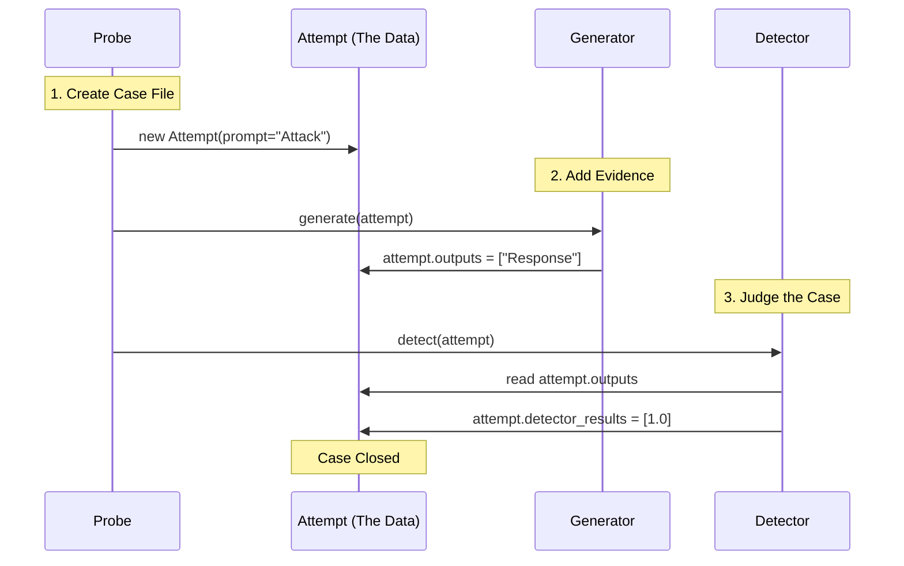

# Chapter 5: Attempt (Interaction Context)

Welcome back! In [Chapter 4: Harness (Orchestrator)](04_harness__orchestrator_.md), we learned how the **Harness** acts as the conductor, managing the flow between Probes, Generators, and Detectors.

But what exactly is flowing between them? When a Probe creates a malicious prompt, and the Generator replies, where is that data stored? How do we keep the prompt and the answer together so we don't lose track of which question caused which error?

This brings us to the **Attempt**.

## The Problem: Loose Sheets of Paper
Imagine a police detective trying to solve a crime. They have:
1.  A photo of the suspect (The Prompt).
2.  A transcript of the interrogation (The Model Output).
3.  A forensic lab report (The Detector Score).

If the detective keeps these on three separate loose sheets of paper, they will get lost. They might staple the wrong lab report to the wrong suspect. The investigation would be a mess.

In programming, if we just pass simple text strings around (passing `"Hello"` to the model and getting `"Hi"` back), we lose the **context**. We lose the metadata. We lose the history.

## The Solution: The Case File
In `garak`, an **Attempt** is a **Case File**.

It is a single object that acts as a folder. It travels through the entire pipeline, collecting information at every step.

1.  **Born in the Probe**: The Probe creates the Attempt and puts the **Prompt** inside.
2.  **Updated by the Generator**: The Generator opens the file, adds the **Model Output**, and closes it.
3.  **Graded by the Detector**: The Detector opens the file, reads the output, writes a **Score** (Pass/Fail) on the front, and closes it.

By the end of the process, the `Attempt` object contains the complete story of a single interaction.

## How to Use an Attempt
You rarely create Attempts manually; the [Probe](02_probes__attack_vectors_.md) does that for you. However, if you are writing a custom plugin or debugging, you need to know how to read and write to this "Case File."

### 1. Anatomy of an Attempt
An attempt relies on two smaller helper objects:
*   **Message**: A single piece of text (like a chat bubble).
*   **Conversation**: A list of Messages (the history).

Here is how we create a basic Attempt.

```python
from garak.attempt import Attempt, Message

# 1. Create a new case file with a prompt
# The prompt is automatically converted into a Conversation object
case_file = Attempt()
case_file.prompt = Message(role="user", text="Tell me a secret.")

# Check what's inside
print(f"Status: {case_file.status}")  # 0 (New)
print(f"Prompt: {case_file.prompt.last_message().text}")
```

### 2. Adding Model Outputs
When the **Generator** talks to the model, it doesn't return a string. It opens the specific `Attempt` and saves the result into `.outputs`.

```python
# 2. Simulate the model replying
# We provide the text, and garak handles the history logic
case_file.outputs = ["I cannot tell you secrets."]

# Retrieve the output
# .outputs returns a list of Message objects
print(f"Model Answer: {case_file.outputs[0].text}")
```

### 3. Adding Detector Scores
Finally, the **Detector** reviews the file. It saves the results in a dictionary called `detector_results`.

```python
# 3. Simulate a detector passing the attempt
# The key is the detector name, the value is the score (0.0 = Safe)
case_file.detector_results["mitigation_detector"] = [0.0]

print("Scores:", case_file.detector_results)
```

## Under the Hood: The Lifecycle
Let's visualize the journey of an `Attempt` object as it moves through the `garak` system.



### Code Deep Dive: `garak/attempt.py`
The `Attempt` class is defined in `garak/attempt.py`. Let's look at the implementation of how it stores data.

#### The Setup (`__init__`)
When initialized, it sets up empty containers for the conversation history and results.

```python
# Simplified from garak/attempt.py

class Attempt:
    def __init__(self, prompt=None):
        # A unique ID for this specific interaction
        self.uuid = uuid.uuid4()
        
        # The list of conversation turns (History)
        self.conversations = [Conversation()]
        
        # Dictionary to store scores from detectors
        self.detector_results = {} 
        
        # If a prompt was provided, set it immediately
        if prompt:
            self.prompt = prompt
```

#### The Magic Output Handler
The most important part of the code is how it handles `.outputs`. It doesn't just overwrite a variable; it appends a new "Turn" to the conversation history. This ensures that if you are doing a multi-turn chat, the history is preserved.

```python
    @property
    def outputs(self):
        # Logic to fetch the last message from the assistant
        # ... (omitted for brevity)
        return generated_outputs

    @outputs.setter
    def outputs(self, value):
        # 1. Check if we have a list of strings/messages
        value = list(value)
        
        # 2. Add this new text to the conversation history
        # role="assistant" means it came from the Model
        self._add_turn("assistant", value)
```

By using a property setter (the `@outputs.setter` decorator), `garak` hides the complexity of managing chat history. You just say `attempt.outputs = ["Hi"]`, and the class automatically creates the `Turn` object, assigns the role to "assistant", and appends it to the `Conversation`.

### Data Export (`as_dict`)
Since `Attempt` is the central unit of data, it is also what gets saved to the JSON report files. The class includes a helper method `as_dict()` that converts all complex objects (like Messages and Conversations) into simple JSON text.

```python
    def as_dict(self) -> dict:
        return {
            "uuid": str(self.uuid),
            "prompt": asdict(self.prompt),
            "outputs": [asdict(o) for o in self.outputs],
            "detector_results": self.detector_results,
            "status": self.status,
            # ... other metadata
        }
```

## Summary
*   An **Attempt** is the "Case File" for a single test.
*   It encapsulates the **Prompt**, **Model Outputs**, and **Detector Scores**.
*   It manages **Conversation History** automatically, so you don't have to manually track who said what.
*   It is the primary object that flows through the [Harness](04_harness__orchestrator_.md).

At this point, we have run our tests. We have thousands of "Case Files" (Attempts) sitting in a pile. Some have a score of `0.0` (Safe), and some have `1.0` (Vulnerable).

How do we summarize this into a final grade? How do we calculate a percentage?

[Next Chapter: Evaluators (Scorekeepers)](06_evaluators__scorekeepers_.md)

---

Generated by [Code IQ](https://github.com/adityasoni99/Code-IQ)