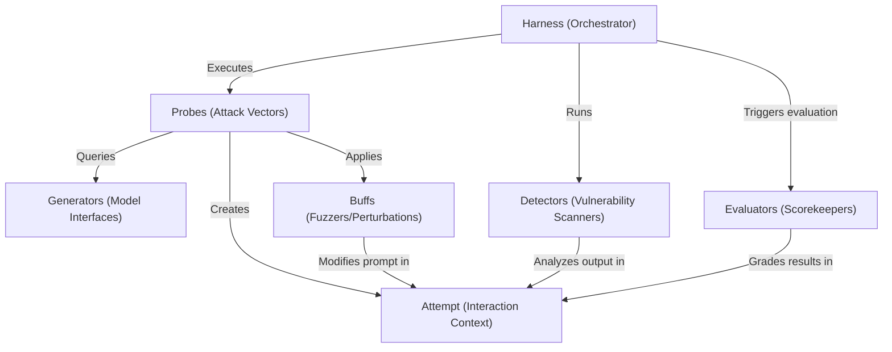

# Tutorial: garak

`garak` serves as an automated **vulnerability scanner** for Large Language Models (LLMs), functioning similarly to a *red team* or penetration tester. It orchestrates a workflow where **Probes** generate malicious prompts to attack a target **Generator**, **Buffs** obfuscate these attacks, **Detectors** analyze the model's outputs for failures, and **Evaluators** grade the overall security posture.

**Source Repository:** [https://github.com/NVIDIA/garak](https://github.com/NVIDIA/garak)

## Chapters

1. [Generators (Model Interfaces)](01_generators__model_interfaces_.md)
2. [Probes (Attack Vectors)](02_probes__attack_vectors_.md)
3. [Detectors (Vulnerability Scanners)](03_detectors__vulnerability_scanners_.md)
4. [Harness (Orchestrator)](04_harness__orchestrator_.md)
5. [Attempt (Interaction Context)](05_attempt__interaction_context_.md)
6. [Evaluators (Scorekeepers)](06_evaluators__scorekeepers_.md)
7. [Buffs (Fuzzers/Perturbations)](07_buffs__fuzzers_perturbations_.md)

---

Generated by [Code IQ](https://github.com/adityasoni99/Code-IQ)