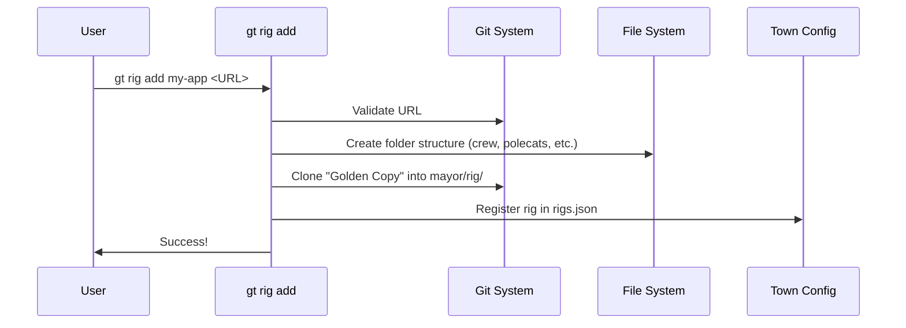

# Chapter 1: Rigs (Project Containers)

Welcome to Gas Town! If you are here, you likely want to manage AI agents to help you build software. But before we let the agents loose, we need to give them a place to work.

## The Problem: The "Messy Desk"

Imagine you hire five contractors to build a house, but you put them all in a single room with no blueprints and one pile of tools. They would trip over each other, mix up tasks, and probably accidentally demolish the wrong wall.

In software, if you run multiple AI agents on your machine without structure:
1. They might overwrite each other's files.
2. They don't know which database "issues" belong to which project.
3. You lose track of who did what.

## The Solution: The Rig

In Gas Town, we solve this with **Rigs**.

A **Rig** is a self-contained workspace for a specific project. Think of it like a fenced-off construction site. Inside the fence, you have:
*   **The Blueprints:** The official copy of the code.
*   **The Workers:** AI agents (Polecats) and humans (Crew).
*   **The Manager:** Supervisors (Witness/Refinery) that ensure quality.
*   **The Logbook:** A local database (Beads) tracking every task.

By using Rigs, you can have ten different projects ("Towns") running on your computer, and the agents in Rig A will never accidentally mess up the code in Rig B.

## Anatomy of a Rig

When you create a Rig, Gas Town sets up a specific directory structure. Here is what it looks like:

```mermaid
graph TD
    Rig[My-App Rig] --> Config[config.json]
    Rig --> Mayor[mayor/rig/ <br/>(The Golden Copy)]
    Rig --> Refinery[refinery/rig/ <br/>(The Merge Queue)]
    Rig --> Polecats[polecats/ <br/>(The Workers)]
    Rig --> Crew[crew/ <br/>(The Humans)]
    Rig --> Beads[.beads/ <br/>(The Database)]
```

*   **`mayor/rig/`**: This is the "Golden Copy" of your git repository. Agents look here to see the latest approved code.
*   **`polecats/`**: This is where the AI workers live. Each worker gets its own sandbox here so they don't fight. We will cover them in [Polecats (Ephemeral Workers)](02_polecats__ephemeral_workers_.md).
*   **`crew/`**: This is where *you* work. It contains your personal git clone.
*   **`.beads/`**: This is the local ledger that tracks tasks and issues. We will learn more in [Beads & Dolt (The Ledger)](04_beads___dolt__the_ledger_.md).

## Setting Up Your First Rig

Let's create a Rig for a project. We will use the CLI command `gt rig add`.

### Step 1: Add a Rig

You give the rig a **name** (how you refer to it in town) and a **git URL** (where the code comes from).

```bash
# Syntax: gt rig add <name> <git-url>
gt rig add my-app https://github.com/example/my-app.git
```

**What just happened?**
Gas Town cloned your repository, set up the directory structure, and initialized the AI supervisors for this project.

### Step 2: List Your Rigs

To see what projects exist in your town:

```bash
gt rig list
```

**Output:**
```text
Rigs in /Users/you/gt:

  my-app  OPERATIONAL
    Witness: ● running  Refinery: ○ stopped
    Polecats: 0  Crew: 0
```

This tells you that `my-app` is ready. The **Witness** (the health monitor) is running, but no workers (Polecats) are currently active.

## Under the Hood: How It Works

When you run `gt rig add`, Gas Town isn't just doing a simple `git clone`. It is constructing a complex environment.



### The Code Implementation

Let's look at how the `gt` tool handles this internally. This logic is found in `internal/cmd/rig.go`.

First, the system validates that you provided a real Git URL so we don't create a broken rig.

```go
// internal/cmd/rig.go

func runRigAdd(cmd *cobra.Command, args []string) error {
    name := args[0]
    gitURL := args[1]

    // 1. Validation
    if !isGitRemoteURL(gitURL) {
        return fmt.Errorf("invalid git URL %q", gitURL)
    }
    
    // ... continues
```

Once validated, the Rig Manager takes over. It creates the folders and performs the heavy lifting of cloning.

```go
    // 2. Create the Rig Manager
    mgr := rig.NewManager(townRoot, rigsConfig, g)

    // 3. Create the physical rig on disk
    newRig, err := mgr.AddRig(rig.AddRigOptions{
        Name:          name,
        GitURL:        gitURL,
        BeadsPrefix:   rigAddPrefix, // e.g., "app-" for issues
    })
```

Finally, to ensure the Town remembers this Rig even after you restart your computer, it saves the configuration to a JSON file.

```go
    // 4. Save to the Town Registry (mayor/rigs.json)
    if err := config.SaveRigsConfig(rigsPath, rigsConfig); err != nil {
        return fmt.Errorf("saving rigs config: %w", err)
    }

    fmt.Printf("Rig %s created!\n", name)
    return nil
}
```

## Summary

*   **Rigs** are the fundamental containers for projects in Gas Town.
*   They isolate code, configuration, and agents to prevent conflicts.
*   A Rig contains specific folders for the "Golden Copy" (`mayor`), the AI workers (`polecats`), and human workers (`crew`).
*   You manage them using `gt rig add` and `gt rig list`.

Now that we have a construction site, we need workers to actually build things!

[Next Chapter: Polecats (Ephemeral Workers)](02_polecats__ephemeral_workers_.md)

---

Generated by [Code IQ](https://github.com/adityasoni99/Code-IQ)