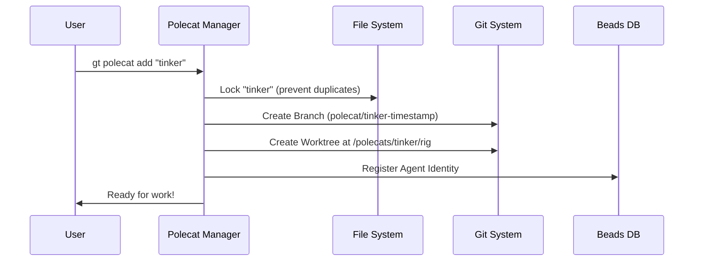

# Chapter 2: Polecats (Ephemeral Workers)

In the previous chapter, [Rigs (Project Containers)](01_rigs__project_containers_.md), we built the construction site (the Rig) where our software will be built. But a construction site is useless without workers.

In Gas Town, we don't just let AI agents roam free over your files. We hire specific workers for specific tasks, and when they are done, they leave. These workers are called **Polecats**.

## The Problem: "Too Many Cooks"

Imagine you are working on a new feature in your code. Suddenly, you need to fix a critical bug. If you use the same folder for both tasks:
1.  You have to stash your changes (messy).
2.  Or, you have to mix bug-fix code with feature code (dangerous).

Now imagine five AI agents trying to do this simultaneously in one folder. It would be chaos.

## The Solution: The Polecat

A **Polecat** is an ephemeral (temporary) worker agent.

1.  **Isolated:** Each Polecat gets its own private copy of the code (a Git Worktree).
2.  **Task-Specific:** It is spawned to do **one** thing (e.g., "Fix issue #102").
3.  **Disposable:** Once the code is merged, the Polecat and its folder are deleted.

Think of a Polecat like a freelance contractor. You hand them a copy of the blueprints, point them to a temporary shed, they do the repair, hand you the results, and then the shed is removed.

## Using Polecats

Let's see how to manage these workers using the Gas Town CLI.

### Spawning a Worker

To create a new worker named `fixer-bot` in your current rig:

```bash
gt polecat add fixer-bot
```

**What happens?**
Gas Town creates a new directory inside `polecats/`. This isn't just an empty folder; it contains a full checkout of your code, ready for work.

### Checking the Workforce

To see who is currently working:

```bash
gt polecat list
```

**Output:**
```text
Polecats in my-app:
  fixer-bot  (Working on: polecat/fixer-bot-123xyz)
```

### Removing a Worker

When the job is done (and the code is merged), you dismiss the worker:

```bash
gt polecat remove fixer-bot
```

**Safety First:** If the Polecat has written code that hasn't been saved (committed), Gas Town will refuse to delete it unless you force it.

## Under the Hood: The Implementation

How does Gas Town create these isolated environments so quickly without downloading the whole internet every time? It uses **Git Worktrees**.

### The Flow

Here is the lifecycle of a Polecat creation:



### 1. Creating Unique Branches

Every worker needs their own git branch so they don't conflict with the main codebase or other workers. We generate a unique name using the worker's name and a timestamp.

*From `internal/polecat/manager.go`:*

```go
func (m *Manager) buildBranchName(name, issue string) string {
    // We use a timestamp to ensure the branch name is unique
    // Example: polecat/tinker-1h5k9a
    timestamp := strconv.FormatInt(time.Now().UnixMilli(), 36)
    
    // Return a structured branch name
    return fmt.Sprintf("polecat/%s-%s", name, timestamp)
}
```

### 2. The Git Worktree Magic

This is the most important part. Instead of cloning the repo (slow), we add a **worktree**. This allows the Polecat to share the `.git` history with the Rig but have its own editable files.

*From `internal/polecat/manager.go`:*

```go
// AddWithOptions creates the physical worker environment
func (m *Manager) AddWithOptions(name string, opts AddOptions) (*Polecat, error) {
    // 1. Define where the worker lives
    clonePath := filepath.Join(m.rig.Path, "polecats", name, m.rig.Name)
    
    // 2. Determine where to branch from (usually "main")
    startPoint := "origin/main"

    // 3. Create the worktree (Fast!)
    // git worktree add -b <branch> <path> <start-point>
    if err := repoGit.WorktreeAddFromRef(clonePath, branchName, startPoint); err != nil {
        return nil, fmt.Errorf("creating worktree: %w", err)
    }
    
    // ... setup continues
}
```

### 3. Registering the Agent

Finally, we need to tell the town's database (see [Beads & Dolt (The Ledger)](04_beads___dolt__the_ledger_.md)) that this agent exists. This allows us to assign tasks to it later.

*From `internal/polecat/manager.go`:*

```go
    // Register the agent in the database (Beads)
    // We set its initial state to "spawning"
    err = m.createAgentBeadWithRetry(agentID, &beads.AgentFields{
        RoleType:   "polecat",
        Rig:        m.rig.Name,
        AgentState: "spawning",
    })
    
    if err != nil {
        return nil, err // Fail if we can't track the worker
    }
```

## Cleaning Up

When you run `gt polecat remove`, the manager ensures we don't lose work.

1.  **Check Status:** It looks at the Git status of the worker's folder.
2.  **Guard:** If there are uncommitted changes, it stops (unless you use `--force`).
3.  **Prune:** It removes the folder and tells Git to "prune" (forget) the worktree connection.

```go
func (m *Manager) Remove(name string, force bool) error {
    // Check if the worker has messy files (uncommitted code)
    if !force {
        status, _ := polecatGit.CheckUncommittedWork()
        if !status.Clean() {
            return errors.New("polecat has uncommitted work")
        }
    }

    // Safe to delete!
    return os.RemoveAll(polecatPath)
}
```

## Summary

*   **Polecats** are temporary workers that live in **Git Worktrees**.
*   They allow parallel work on the same project without file conflicts.
*   The `gt polecat` command handles the complex logic of branching, spawning, and cleanup.
*   They register with **Beads** so the system knows they exist.

Now that we have a Rig and Workers, we need a way to tell the workers *how* to perform complex sequences of tasks.

[Next Chapter: Molecules (Workflow Engines)](03_molecules__workflow_engines_.md)

---

Generated by [Code IQ](https://github.com/adityasoni99/Code-IQ)