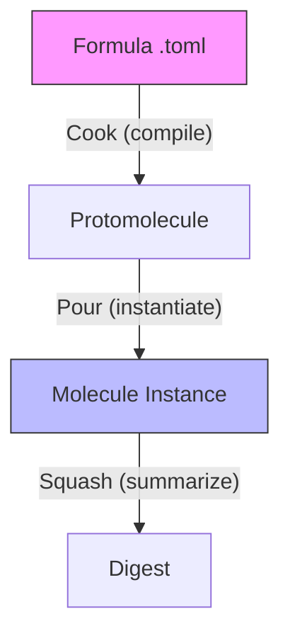
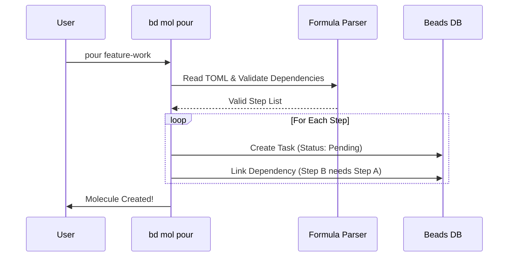

# Chapter 3: Molecules (Workflow Engines)

In the previous chapter, [Polecats (Ephemeral Workers)](02_polecats__ephemeral_workers_.md), we hired AI workers and gave them isolated sandboxes. But having a worker and a workspace isn't enough. If you tell a worker "Build the feature," they might skip writing tests, forget to update documentation, or break the build.

Workers need instructions. In Gas Town, these instructions are called **Molecules**.

## The Problem: The "Vague Instruction" Disaster

Imagine you are a pilot. You don't just jump in a plane and fly. You follow a **Pre-flight Checklist**:
1. Check fuel.
2. Check flaps.
3. Test radio.
4. Request taxi.

If you skip step 1, the plane falls out of the sky.

In software, if an AI agent (or a human) skips steps:
*   They merge code that fails tests.
*   They deploy without backing up the database.
*   They forget to tell the team what changed.

## The Solution: Molecules

A **Molecule** is a structured workflow—a rigid checklist that guides an agent from start to finish.

*   **It is Atomic:** You can't do "half" a molecule. You either finish the workflow or you abort.
*   **It is Ordered:** Step B cannot start until Step A is finished.
*   **It is Trackable:** Every step is recorded in the database, so you know exactly where the agent is.

If a Polecat is the *Worker*, the Molecule is the *Job Ticket*.

## The Lifecycle of a Molecule

Understanding Molecules requires learning a few specific terms from Gas Town chemistry.



1.  **Formula:** The static template (a file on disk). Ideally, like a recipe.
2.  **Protomolecule:** The compiled version of the recipe, ready to use.
3.  **Molecule:** The active cooking session. This creates actual tasks in the database.
4.  **Digest:** When finished, the history is compressed into a summary log.

### Ephemeral Molecules: "Wisps"
Sometimes you have a maintenance loop that runs every 5 minutes (like "Check server health"). You don't want to fill your permanent database with millions of these checks. For this, we use **Wisps**. They act like Molecules but vanish (evaporate) when done, leaving no trace unless they find an error.

## Using Molecules

Let's look at how to define and run a workflow.

### 1. The Formula (The Recipe)

Formulas are written in TOML files located in `.beads/formulas/`. Here is a simple "Feature Workflow" formula:

```toml
# .beads/formulas/feature-work.toml
name = "Standard Feature"
type = "workflow"

[[steps]]
id = "design"
title = "Read requirements and plan"

[[steps]]
id = "code"
title = "Implement code changes"
needs = ["design"]  # Dependent on previous step!

[[steps]]
id = "test"
title = "Run test suite"
needs = ["code"]
```

### 2. Cooking and Pouring

You cannot run a TOML file directly. You must "Cook" it first to validate it, then "Pour" it to create tasks.

```bash
# 1. Validate and prepare the template
bd cook feature-work

# 2. Instantiate it (create the tasks in the database)
bd mol pour feature-work --var issue=GT-101
```

**What just happened?**
Gas Town read your formula and created three linked tasks in your database. It automatically assigned dependencies: the "code" task is blocked until the "design" task is marked complete.

### 3. Tracking Progress

The agent (or you) can check where they are in the process:

```bash
bd mol current
```

**Output:**
```text
Molecule: GT-101 (Standard Feature)

  ✓ GT-101.1: Read requirements and plan
  → GT-101.2: Implement code changes  [IN PROGRESS]
  ○ GT-101.3: Run test suite          [WAITING]
```

The agent knows it *cannot* run tests yet. It must finish coding first.

## Under the Hood: The Graph Engine

Molecules are not just lists; they are **Directed Acyclic Graphs (DAGs)**. This means the system mathematically ensures steps happen in the right order.

### The Instantiation Process

When you run `bd mol pour`, Gas Town performs a "Format Bridge." It reads the template and generates discrete database entries (Beads) for every single step.



### Code Implementation

Let's look at how the system parses these workflows.

#### 1. Parsing the Formula

In `internal/formula/parser.go`, we read the TOML file and validate that there are no "cycles" (e.g., Step A needs Step B, and Step B needs Step A—which is impossible).

```go
// internal/formula/parser.go

func (f *Formula) validateWorkflow() error {
    if len(f.Steps) == 0 {
        return fmt.Errorf("workflow requires steps")
    }

    // Mathematical check to ensure no circular logic exists
    if err := f.checkCycles(); err != nil {
        return err
    }

    return nil
}
```

#### 2. Instantiating Steps (The "Pour")

In `internal/beads/molecule.go`, the system iterates through the template steps and creates real issues in the database.

```go
// internal/beads/molecule.go

// instantiateFromChildren creates tasks based on the template
func (b *Beads) instantiateFromChildren(mol *Issue, parent *Issue, templates []*Issue) ([]*Issue, error) {
    var createdIssues []*Issue

    for _, tmpl := range templates {
        // Create a new task in the DB for this step
        childOpts := CreateOptions{
            Title:    tmpl.Title,
            Type:     "task",
            Parent:   parent.ID, // Link to the main project
        }
        
        child, _ := b.Create(childOpts)
        createdIssues = append(createdIssues, child)
    }
    return createdIssues, nil
}
```

#### 3. Wiring Dependencies

After creating the tasks, we must link them so the agent knows the order. This logic ensures the "checklist" behavior.

```go
// internal/beads/molecule.go

    // Second pass: wire dependencies
    for _, tmpl := range templates {
        // If this step depends on another...
        for _, depID := range tmpl.DependsOn {
            // ... tell the database that Step B requires Step A
            b.AddDependency(newChildID, newDepID)
        }
    }
```

## Summary

*   **Molecules** are rigid workflows that ensure agents follow procedures.
*   They start as **Formulas** (TOML files), get cooked into **Protomolecules**, and are poured into active **Molecules**.
*   **Wisps** are temporary molecules for maintenance loops.
*   Under the hood, Gas Town converts the formula into a dependency graph in the database.

We have a workspace (Rig), a worker (Polecat), and instructions (Molecule). But where do we actually store the record of this work? We need a ledger that can handle distributed data and merging.

[Next Chapter: Beads & Dolt (The Ledger)](04_beads___dolt__the_ledger_.md)

---

Generated by [Code IQ](https://github.com/adityasoni99/Code-IQ)