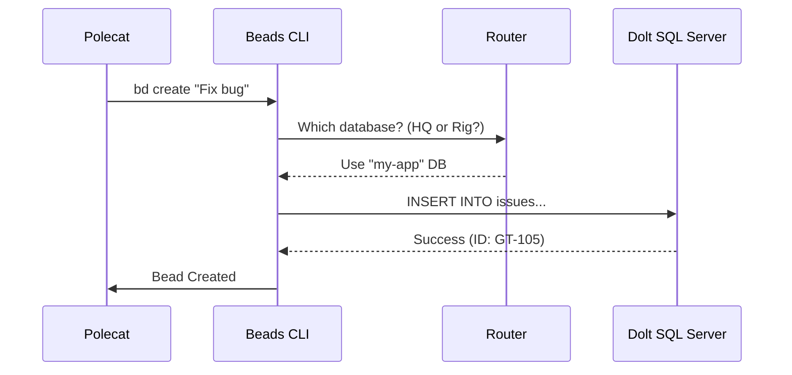

# Chapter 4: Beads & Dolt (The Ledger)

In the previous chapter, [Molecules (Workflow Engines)](03_molecules__workflow_engines_.md), we gave our agents checklists to follow. But as any project manager knows, handing out checklists is easy; tracking who has finished what, who is stuck, and who is currently working is the hard part.

Welcome to the **Ledger** of Gas Town.

## The Problem: The "Post-it Note" Nightmare

Imagine you have 10 construction workers (Polecats) building a house. They are all working fast.
*   Worker A finishes the plumbing.
*   Worker B needs to know if the plumbing is done before starting the drywall.
*   Worker C finds a crack in the foundation.

If they write these updates on sticky notes and put them on a wall, two workers might try to write on the same note at the same time, or a note might fall off.

In software, if agents store their status in simple text files (JSON/YAML), they will overwrite each other's changes. If we use a massive cloud database, setup becomes a nightmare for a local tool.

## The Solution: Beads & Dolt

Gas Town solves this with a two-part system:

1.  **Beads:** The individual records. A "Bead" can be a task, a bug, or even an agent's current mental state.
2.  **Dolt:** The engine. Dolt is a SQL database that **acts like Git**.

### Why Dolt?
Dolt is the magic ingredient. Because it supports branching and merging (just like Git), every AI agent can create its own "database branch," do its work, and merge the results back without corrupting the main list.

## The Architecture: Two Levels of Memory

Gas Town organizes memory into two distinct levels to keep things tidy.

```mermaid
graph TD
    Town[Town Headquarters (HQ)] --> Global[Global Settings]
    Town --> Mayor[Mayor's Mailbox]
    
    Rig[Project Rig (My-App)] --> Issues[Project Issues]
    Rig --> PRs[Merge Requests]
    Rig --> AgentState[Agent Status]

    style Town fill:#f9f,stroke:#333
    style Rig fill:#bbf,stroke:#333
```

1.  **The HQ (Town Level):** Stores high-level decisions, mail between projects, and global agent roles.
2.  **The Rig (Project Level):** Stores the nitty-gritty details: bugs, tasks, and code reviews for *that specific project*.

## Using the Ledger

You interact with the ledger using the `bd` (Beads) CLI tool.

### 1. Listing What's Happening

To see all open issues in your current rig:

```bash
# List all open beads (tasks)
bd list --status=open
```

**Output:**
```text
ID        Title                   Status    Assignee
GT-101    Fix login bug           open      -
GT-102    Refactor database       open      gastown/polecats/tinker
```

### 2. Creating a Task

You can create a new bead easily. This is what molecules do automatically, but you can do it manually too.

```bash
bd create --title="Update documentation" --priority=1
```

### 3. Checking Agent State

Beads doesn't just track work; it tracks workers. Every agent (like a Polecat) has a corresponding Bead that stores its state.

```bash
# Check on a specific agent bead
bd show polecat-tinker-123
```

## Under the Hood: The SQL Server

While `bd` is the friendly face, the engine powering it is a real SQL server running locally on your machine (usually port 3307).

When an agent needs to record data, it doesn't write to a file. It queries the server.



### The Implementation

Let's look at how Gas Town manages this database server. The logic is in `internal/doltserver/doltserver.go`.

### 1. Starting the Server

Gas Town spins up a dedicated Dolt process. It sets the data directory to `~/.gt/.dolt-data`, ensuring all your projects live in one manageable place.

```go
// internal/doltserver/doltserver.go

func Start(townRoot string) error {
    config := DefaultConfig(townRoot)
    
    // Command: dolt sql-server --port 3307 --data-dir ~/.gt/.dolt-data
    args := []string{"sql-server",
        "--port", strconv.Itoa(config.Port),
        "--data-dir", config.DataDir,
    }
    
    cmd := exec.Command("dolt", args...)
    return cmd.Start()
}
```

**Explanation:** We aren't relying on an external MySQL installation. Gas Town bundles its own server. It uses a specific port (3307) to avoid clashing if you already have MySQL running for your own work.

### 2. The Branching Magic

This is where Gas Town differs from standard project management tools. When a Polecat starts work, we create a **database branch** for it. This prevents "Optimistic Lock" errors where two agents try to update the same row.

```go
// internal/doltserver/doltserver.go

func CreatePolecatBranch(townRoot, rigDB, branchName string) error {
    // SQL: CALL DOLT_BRANCH('polecat-tinker-123')
    query := fmt.Sprintf("CALL DOLT_BRANCH('%s')", branchName)

    // Execute safe SQL command
    return doltSQLWithRecovery(townRoot, rigDB, query)
}
```

**Explanation:** By calling `DOLT_BRANCH`, we create an isolated timeline of the database. The agent can spam updates to its heart's content. When it's done, we merge that branch back to `main`.

### 3. Routing (Finding the Data)

Since we have multiple databases (HQ vs. Rigs), the system needs to know where to look. We use `beads.go` to resolve the directory.

```go
// internal/beads/beads.go

func (b *Beads) getResolvedBeadsDir() string {
    // If explicitly set, use that
    if b.beadsDir != "" {
        return b.beadsDir
    }
    // Otherwise, calculate based on current directory
    return ResolveBeadsDir(b.workDir)
}
```

**Explanation:** If you run `bd list` inside `~/gt/my-app/`, the system automatically detects you are in a Rig and connects to the `my-app` database. If you are in `~/gt/`, it connects to `HQ`.

## Accessing SQL Directly

Because it is standard SQL, you can pop the hood and run queries yourself if you want to perform complex analytics on your project's progress.

```bash
# Enter the SQL shell
gt dolt sql
```

Then run:
```sql
USE `my-app`;
SELECT * FROM issues WHERE status = 'open';
```

## Summary

*   **Beads** are the units of data (tasks, states) in Gas Town.
*   **Dolt** is the engine, allowing Git-style branching for data to prevent agent conflicts.
*   The architecture is split into **HQ** (Town) and **Rig** (Project) levels.
*   Under the hood, `bd` commands translate into SQL queries sent to a local server on port 3307.

Now that we have a Ledger to track our work, we need a way to organize large groups of tasks and move work between Rigs.

[Next Chapter: Convoys (Work Logistics)](05_convoys__work_logistics_.md)

---

Generated by [Code IQ](https://github.com/adityasoni99/Code-IQ)