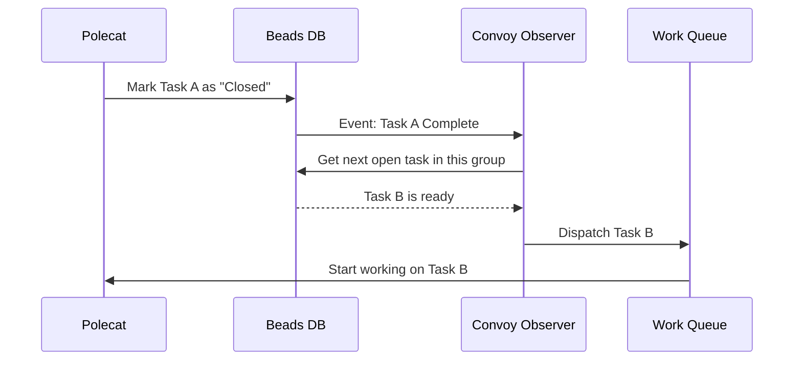

# Chapter 5: Convoys (Work Logistics)

In the previous chapter, [Beads & Dolt (The Ledger)](04_beads___dolt__the_ledger_.md), we learned how to record tasks and issues in a distributed database. We now have a pile of tasks (Beads) sitting in our ledger.

But a pile of tasks is just a list. It doesn't get the work done. You don't want to manually assign every single task to an agent, wait for it to finish, and then assign the next one. That is micromanagement.

In Gas Town, we automate this flow using **Convoys**.

## The Problem: The "Bucket Brigade"

Imagine you are moving a library. You have 500 books (Beads) to move to a new room.
1.  **The Manual Way:** You pick up one book, hand it to a helper (Polecat), wait for them to walk back, and hand them another. You are stuck there managing the flow.
2.  **The Gas Town Way:** You put 50 books in a cart (Convoy). You tell the helpers, "Empty this cart." You walk away. The helpers grab books from the cart automatically until it is empty.

In software, a feature often consists of 10 different tasks (frontend, backend, database, tests). Managing these individually is tedious.

## The Solution: The Convoy

A **Convoy** is a logistical container. It is the delivery truck of Gas Town.

*   **Grouping:** It bundles related issues (e.g., "The Login Feature").
*   **Visibility:** It provides a dashboard to see the progress of the whole batch.
*   **Automation:** It acts as a dispatcher. When one task finishes, the Convoy can automatically offer the next ready task to the swarm of agents.

## Using Convoys

Let's look at how to manage a batch of work.

### 1. Creating a Convoy

Let's say we have three tasks (Beads) created in the previous chapter: `GT-101`, `GT-102`, and `GT-103`. We want to group them into a "Release 1.0" milestone.

```bash
# Syntax: gt convoy create "Name" [issue-ids...]
gt convoy create "Release 1.0" GT-101 GT-102 GT-103
```

**What happens?**
Gas Town creates a parent tracking object (the Convoy) and links the three tasks to it.

### 2. The Dashboard

You can view the status of your logistics operation using the list command. This opens a visual TUI (Text User Interface).

```bash
gt convoy list
```

**Output:**
```text
Convoys
▶ 1. 🚚 Release 1.0: (1/3 completed)
```

If you press `Enter` to expand it:

```text
▼ 1. 🚚 Release 1.0: (1/3 completed)
  ├─ ✓ GT-101: Design Database schema
  ├─ → GT-102: Write API endpoints [IN PROGRESS]
  └─ ○ GT-103: Update Documentation [OPEN]
```

This view tells you exactly where the blockage is. One task is done, one is being worked on, and one is waiting.

### 3. Adding More Cargo

Did you forget a task? You can throw it onto the moving truck.

```bash
gt convoy add <convoy-id> GT-104
```

## Under the Hood: Reactive Logistics

Convoys are not just static lists; they are **Reactive Observers**.

When a Polecat finishes a task, it doesn't just stop. The Convoy notices the completion and immediately checks: *"Is there anything else in the truck that is ready to go?"*

If yes, it "slings" (assigns) that task to the rig.

### The Flow of Work



### Code Implementation

Let's look at how Gas Town implements this "Observer" pattern. The logic lives in `internal/convoy/observer.go`.

#### 1. Checking for Next Steps
When an issue is closed, the system calls `CheckConvoysForIssue`. This function looks for any convoys tracking that specific issue.

```go
// internal/convoy/observer.go

func CheckConvoysForIssue(townRoot, issueID, observer string, log func(...)) {
    // 1. Find which convoy cares about this issue
    convoyIDs := getTrackingConvoys(townRoot, issueID)
    
    for _, id := range convoyIDs {
        // 2. Check if the convoy is now 100% complete
        runConvoyCheck(townRoot, id)

        // 3. If not complete, feed the next item!
        if !isConvoyClosed(townRoot, id) {
            feedNextReadyIssue(townRoot, id, observer, log)
        }
    }
}
```

#### 2. The Auto-Feeder
The `feedNextReadyIssue` function is the engine. It looks for tasks that are "Open" but have no "Assignee" yet.

```go
// internal/convoy/observer.go

func feedNextReadyIssue(townRoot, convoyID, observer string, logger func(...)) {
    // Get all tasks in this convoy
    tracked := getConvoyTrackedIssues(townRoot, convoyID)

    for _, issue := range tracked {
        // Find first task that is OPEN and unassigned
        if issue.Status == "open" && issue.Assignee == "" {
            
            // Dispatch it!
            dispatchIssue(townRoot, issue.ID, rigName)
            return // We only feed one at a time to prevent flooding
        }
    }
}
```

**Why is this cool?**
Because of this loop, you (the human) only need to start the *first* task. As soon as the agent finishes it, the Convoy automatically hands them the second task. The work flows continuously without your intervention.

#### 3. The Visuals (TUI)
How does `gt convoy list` look so nice? It uses a library called Bubbletea. In `internal/tui/convoy/view.go`, we convert raw data into icons.

```go
// internal/tui/convoy/view.go

func statusToIcon(status string) string {
    switch status {
    case "open":
        return "🚚" // The Truck
    case "closed":
        return "✓"  // Done
    case "in_progress":
        return "→"  // Working
    default:
        return "●"  // Waiting
    }
}
```

## Summary

*   **Convoys** are containers for batches of work (features, milestones).
*   They provide a **Dashboard** to visualize progress (Open vs. In Progress vs. Closed).
*   They are **Event-Driven**: When a task completes, the Convoy automatically dispatches the next one.
*   This allows a "Swarm" of agents to work through a backlog autonomously.

We have Rigs (workspaces), Polecats (workers), Molecules (instructions), Beads (ledger), and Convoys (logistics). But what happens when five Polecats try to merge their code into the main branch at the same time? We need a traffic controller.

[Next Chapter: Refinery (The Merge Engineer)](06_refinery__the_merge_engineer_.md)

---

Generated by [Code IQ](https://github.com/adityasoni99/Code-IQ)