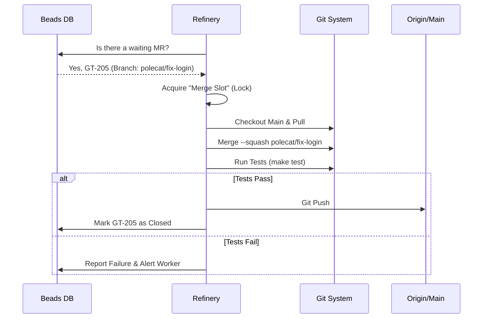

# Chapter 6: Refinery (The Merge Engineer)

In the previous chapter, [Convoys (Work Logistics)](05_convoys__work_logistics_.md), we learned how to organize swarms of agents to work on batches of tasks. Now imagine you have five agents (Polecats) working on five different features. They all finish at the exact same time.

If they all try to push their code to the main branch simultaneously, chaos ensues.

## The Problem: The "Merge Trainwreck"

In a traditional team, "Landing" code (merging it) is dangerous:
1.  **Merge Conflicts:** Agent A changes line 10. Agent B changes line 10. Who wins?
2.  **The "It Works on My Machine" Syndrome:** Agent A's code works alone. Agent B's code works alone. But when merged, they break the system.
3.  **The Bottleneck:** A human has to sit there, review every PR, and click "Merge" carefully.

## The Solution: The Refinery

The **Refinery** is an autonomous agent that acts as the **Gatekeeper** (or Air Traffic Controller) for your codebase.

*   **It is Serial:** It processes one merge request at a time, ensuring order.
*   **It is Rigorous:** It runs the test suite *before* merging.
*   **It is Self-Healing:** If it finds a conflict, it doesn't crash; it assigns a task back to a worker to fix it.

Think of the Refinery as a factory line. Raw code comes in from Polecats, gets refined (tested/squashed), and pure, clean code lands in the `main` branch.

## How the Refinery Works

The Refinery operates on a loop. It constantly watches the Ledger (Beads) for a specific type of issue: the **Merge Request (MR)**.

In Gas Town, an MR isn't just a web page on GitHub. It is a Bead in the database, just like a task or a bug.

### The Workflow

1.  **Queue:** Polecats finish work and create an "MR Bead."
2.  **Claim:** The Refinery picks up the bead and "locks" the queue (acquires a Merge Slot).
3.  **Verify:** It checks out the code, checks for conflicts, and runs tests.
4.  **Land:** If successful, it performs a **Squash Merge** and pushes to the main branch.

## Monitoring the Queue

Since the Refinery is an automated agent, you mostly just watch it work. However, you can inspect the queue using the CLI.

### Viewing Active Merge Requests

```bash
# List beads labeled as merge requests
bd list --label=gt:merge-request --status=open
```

**Output:**
```text
ID        Title                       Status   Assignee
GT-205    MR: Fix login button        open     gastown/refinery
GT-206    MR: Add database index      open     -
```

In this example, `GT-205` is currently being processed (assigned to the refinery), and `GT-206` is waiting in line.

## Under the Hood: The Engineer

The logic for the Refinery lives in `internal/refinery/engineer.go`. Let's break down how this agent processes the queue safely.

### The Process Diagram



### 1. Finding Work (The Loop)

The Refinery polls the database for MRs that are ready. A "Ready" MR is one that is Open, Unassigned, and not blocked by other tasks.

```go
// internal/refinery/engineer.go

func (e *Engineer) ListReadyMRs() ([]*MRInfo, error) {
    // 1. Ask the database for beads with type="merge-request"
    issues, _ := e.beads.ReadyWithType("merge-request")

    var ready []*MRInfo
    for _, issue := range issues {
        // 2. Filter out ones that are already claimed or closed
        if issue.Status == "open" && issue.Assignee == "" {
            ready = append(ready, issueToMRInfo(issue))
        }
    }
    return ready, nil
}
```

### 2. The Safe Merge (Squashing)

Gas Town prefers **Squash Merges**. If a Polecat made 50 messy commits ("fix typo", "try again", "oops"), we don't want that history in `main`. The Refinery compresses them into one clean commit.

```go
// internal/refinery/engineer.go

func (e *Engineer) doMerge(ctx context.Context, branch, target string) ProcessResult {
    // 1. Check for conflicts before trying
    conflicts, _ := e.git.CheckConflicts(branch, target)
    if len(conflicts) > 0 {
        return ProcessResult{Conflict: true}
    }

    // 2. Perform the Squash Merge locally
    // This takes all changes from 'branch' and stages them on 'target'
    err := e.git.MergeSquash(branch, "Squash merge message")
    
    // ... continue to testing ...
}
```

### 3. Running the Tests

Before pushing, the Refinery acts as a quality gate. It executes the test command defined in your `config.json`.

```go
// internal/refinery/engineer.go

func (e *Engineer) runTests(ctx context.Context) ProcessResult {
    // 1. Get the command from config (e.g., "go test ./...")
    cmdStr := e.config.TestCommand
    
    // 2. Execute it in the shell
    cmd := exec.CommandContext(ctx, "sh", "-c", cmdStr)
    
    // 3. Return success only if exit code is 0
    if err := cmd.Run(); err != nil {
        return ProcessResult{Success: false, TestsFailed: true}
    }
    return ProcessResult{Success: true}
}
```

### 4. Handling Conflicts (The "Kickback")

What if the merge fails? The Refinery does not give up. It creates a **Conflict Resolution Task**.

This is a powerful concept: The Refinery automatically creates a *new* job, assigns it back to the workforce, and says, "Fix these conflicts."

```go
// internal/refinery/engineer.go

func (e *Engineer) HandleMRInfoFailure(mr *MRInfo, result ProcessResult) {
    if result.Conflict {
        // 1. Create a new task for a Polecat
        title := fmt.Sprintf("Resolve merge conflicts: %s", mr.Title)
        
        task, _ := e.beads.Create(beads.CreateOptions{
            Title:    title,
            Type:     "task",
            Priority: mr.Priority - 1, // Boost priority!
        })

        // 2. Block the MR until the task is done
        e.beads.AddDependency(mr.ID, task.ID)
    }
}
```

**Why is this cool?**
The Refinery doesn't stop working. It pushes the problem MR aside, blocks it, and moves on to the *next* MR in the queue. The workflow never stalls.

## Summary

*   The **Refinery** is the autonomous Merge Engineer.
*   It processes **Merge Requests (MRs)** from the Bead ledger one by one.
*   It enforces a **Squash Merge** policy to keep history clean.
*   It runs **Tests** automatically; if they fail, the code is rejected.
*   It handles **Conflicts** by generating new tasks for Polecats to fix.

By having a Refinery, you can have 10, 20, or 50 agents working simultaneously. As long as the Refinery is running, they will queue up neatly and land their code safely.

Now that our code is safely merged, the agents need a way to send messages about their success (or failure) to the rest of the town.

[Next Chapter: Mail Router (Communication Bus)](07_mail_router__communication_bus_.md)

---

Generated by [Code IQ](https://github.com/adityasoni99/Code-IQ)