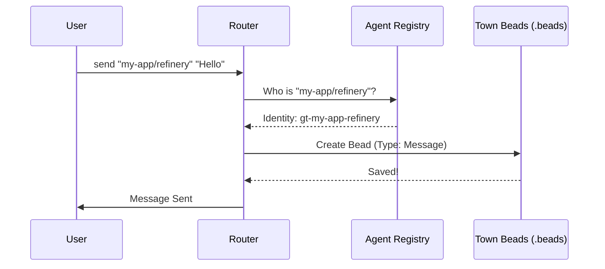

# Chapter 7: Mail Router (Communication Bus)

In the previous chapter, [Refinery (The Merge Engineer)](06_refinery__the_merge_engineer_.md), we learned how to automate code integration. We now have a bustling town with Rigs (workspaces), Polecats (workers), and Refineries (managers).

But there is one final piece missing: **Communication**.

How does a Polecat tell the Refinery, "I'm done"? How does the Refinery tell the Mayor (you), "The build failed"? How do you send a quick instruction to an agent without editing a database file manually?

Welcome to the **Mail Router**, the central nervous system of Gas Town.

## The Problem: "Shouting Across the Job Site"

Imagine a construction site where workers have no walkie-talkies.
*   If a worker finishes a wall, they have to walk to the manager's office to report it.
*   If the manager needs to change the plan, they have to run around looking for the worker.
*   Instructions get lost, and no one keeps a record of who said what.

In software, agents often operate in silence. They might write logs to a text file, but other agents (or humans) might not know where to look. We need a standardized way to pass messages.

## The Solution: The Mail Router

The **Mail Router** is Gas Town's internal postal service. It abstracts away the complexity of where agents live and how to reach them.

*   **Universal Addressing:** You can send mail to `mayor/`, `my-app/refinery`, or `my-app/polecats/fixer`.
*   **Persistence:** Messages aren't just transient network packets; they are stored in the Ledger (Beads) forever.
*   **Notification:** When mail arrives, the router "nudges" the recipient (via terminal alerts) to wake them up.

## Using the Mail System

You interact with the router using the `gt mail` command.

### 1. Sending Mail

Let's send a message to the "Mayor" (that's usually you, the human overseer) to report progress.

```bash
# Syntax: gt mail send <address> -s <subject> -m <message>
gt mail send mayor/ -s "Status Update" -m "I finished the login feature."
```

You can also send instructions to a specific worker in a specific rig:

```bash
# Tell the refinery in the 'my-app' rig to pause
gt mail send my-app/refinery -s "Hold on" -m "Don't merge yet, found a bug."
```

### 2. Checking Your Inbox

To see what messages are waiting for you:

```bash
gt mail inbox
```

**Output:**
```text
Inbox for mayor/:
  1. [GT-501] From: my-app/refinery  Subject: Build Failed
  2. [GT-502] From: my-app/polecat   Subject: Ready for review
```

### 3. Reading Mail

To read the details of a message:

```bash
gt mail read 1
```

## Under the Hood: The Architecture

The Mail Router is clever because it doesn't invent a new storage system. It uses **Beads** (the database we learned about in Chapter 4) to store emails.

**A Message is just a Bead.**
When you send an email, Gas Town actually creates a task in the database with a special label: `gt:message`.

### The Routing Flow

Unlike project tasks, which live in specific Rigs, **all mail lives in the Town Square (Town Beads)**. This ensures that even if a Rig is offline or broken, communication remains possible.



## Code Implementation

Let's look at `internal/mail/router.go` to see how Gas Town handles this logic.

### 1. Validating the Address

Before sending, the router checks if the recipient actually exists. It looks at the "Town Registry" (the list of all agents).

```go
// internal/mail/router.go

func (r *Router) validateRecipient(identity string) error {
    // 1. Check if it's the human overseer
    if identity == "overseer" {
        return nil
    }

    // 2. Query the database for known agents
    agents := r.queryAgents("")

    for _, agent := range agents {
        // 3. Match the address (e.g., "my-app/refinery")
        if agentBeadToAddress(agent) == identity {
            return nil // Found them!
        }
    }
    return fmt.Errorf("no agent found")
}
```

### 2. Converting to a Database Command

Once validated, the Router constructs a `bd create` command. This is how the message gets saved to the database.

```go
// internal/mail/router.go

func (r *Router) sendToSingle(msg *Message) error {
    // 1. Resolve the internal ID (e.g., "gt-my-app-refinery")
    toIdentity := AddressToIdentity(msg.To)

    // 2. Prepare the database command
    args := []string{"create",
        "--assignee", toIdentity,     // Who gets it
        "-d", msg.Body,               // The message body
        "--labels", "gt:message",     // Mark it as email
        "--actor", msg.From,          // Who sent it
    }

    // 3. Execute!
    // We always use the Town Root beads for mail.
    beadsDir := r.resolveBeadsDir("") 
    _, err := runBdCommand(ctx, args, ..., beadsDir)
    return err
}
```

### 3. The "Nudge" (Notification)

A message in a database is useless if the agent doesn't look at it. The Router uses a system called `tmux` (a terminal multiplexer) to send a physical notification to the agent's active session.

```go
// internal/mail/router.go

func (r *Router) notifyRecipient(msg *Message) error {
    // 1. Find where the agent is working (tmux session ID)
    sessionIDs := addressToSessionIDs(msg.To)

    // 2. Send a "Nudge" (a visual banner or text injection)
    notification := fmt.Sprintf("📬 You have mail from %s", msg.From)
    
    return r.tmux.NudgeSession(sessionIDs[0], notification)
}
```

## Advanced: Mailing Lists and Queues

The Router supports more than just 1-to-1 messaging.

*   **Mailing Lists (`list:team`):** If you send to a list, the Router "fans out" the message, creating a copy for every member of that list.
*   **Work Queues (`queue:bugs`):** You can send a message to a queue. Unlike a list, this creates *one* message. The first worker to "Claim" it gets the job. This is great for distributing work to a pool of Polecats.

## Summary

*   The **Mail Router** connects all agents in Gas Town.
*   It uses **Addresses** (like `rig/role`) to find recipients.
*   It stores messages as **Beads** in the central Town database.
*   It actively **Nudges** recipients so they know to check their inbox.

---

# Conclusion

Congratulations! You have completed the Gas Town architectural tour.

You now understand the full stack of an autonomous coding civilization:

1.  **Rigs:** The construction sites where code lives.
2.  **Polecats:** The ephemeral workers that do the job.
3.  **Molecules:** The checklists that ensure quality.
4.  **Beads:** The distributed ledger that remembers everything.
5.  **Convoys:** The logistics system for moving batches of work.
6.  **Refinery:** The gatekeeper that merges code safely.
7.  **Mail Router:** The communication bus that ties it all together.

With these seven components, you don't just have "AI writing code." You have an **AI Organization**—auditable, scalable, and resilient.

Go forth and build your town!

---

Generated by [Code IQ](https://github.com/adityasoni99/Code-IQ)