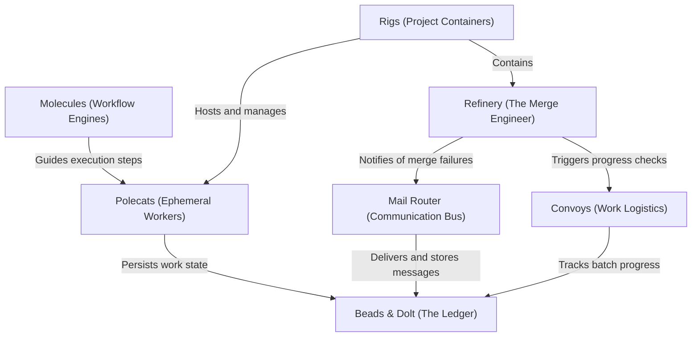

# Tutorial: gastown

Gas Town is a **multi-agent orchestration system** designed to manage AI coding workflows with persistent state. It organizes work into self-contained **Rigs**, employs ephemeral **Polecat** agents to execute tasks, and utilizes a git-backed ledger called **Beads** (powered by Dolt) to ensure no context is lost between restarts. The system automates the full development lifecycle, from assigning batched work via **Convoys** to merging code through an autonomous **Refinery**.

**Source Repository:** [https://github.com/steveyegge/gastown](https://github.com/steveyegge/gastown)

## Chapters

1. [Rigs (Project Containers)](01_rigs__project_containers_.md)
2. [Polecats (Ephemeral Workers)](02_polecats__ephemeral_workers_.md)
3. [Molecules (Workflow Engines)](03_molecules__workflow_engines_.md)
4. [Beads & Dolt (The Ledger)](04_beads___dolt__the_ledger_.md)
5. [Convoys (Work Logistics)](05_convoys__work_logistics_.md)
6. [Refinery (The Merge Engineer)](06_refinery__the_merge_engineer_.md)
7. [Mail Router (Communication Bus)](07_mail_router__communication_bus_.md)

---

Generated by [Code IQ](https://github.com/adityasoni99/Code-IQ)