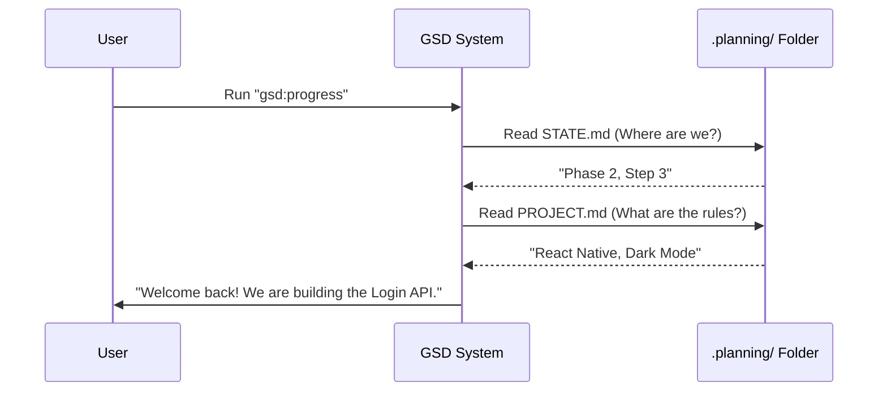

# Chapter 1: Project State (Context Memory)

Welcome to the **Get-Shit-Done (GSD)** tutorial! If you've ever tried to build a complex project with an AI, you've probably hit a frustrating wall: **Amnesia.**

You spend hours debating architectural decisions, but when you come back the next day or start a new chat session, the AI has forgotten everything. You have to waste time re-explaining the plan. This is called "Context Rot."

**Project State** is the cure. It is the system's persistent memory.

## The Problem: "What were we doing again?"

Imagine reading a complex novel, but every time you put the book down, your memory of the plot is erased. You'd never finish the book because you'd spend all your time re-reading Chapter 1.

AI models work similarly. They have a "context window" (limited short-term memory). To build big software, we need **Long-Term Memory** that lives on your hard drive, not just in the chat window.

### The Solution: The `.planning/` Directory

GSD creates a specific folder called `.planning/` in your project. This is the "Save File" for your project. No matter how many times you restart your AI client, it looks here first to understand:
1.  **PROJECT.md**: The big picture (Goals, Constraints).
2.  **STATE.md**: The immediate status (Where are we right now?).
3.  **Context Files**: Specific implementation decisions made in the past.

---

## Key Concept 1: PROJECT.md (The Constitution)

Think of `PROJECT.md` as the "Constitution" of your software. It holds the high-level facts that rarely change but are crucial for every decision.

If you are building a "Dark Mode To-Do App," `PROJECT.md` ensures the AI doesn't suddenly suggest a bright white background or a chat feature.

**Example Snippet from `PROJECT.md`:**

```markdown
# DarkMode Do

## Core Value
A tasks app that is easy on the eyes at night.

## Constraints
- **Tech Stack**: React Native, Supabase
- **Visuals**: Must use hex colors #121212 for backgrounds.
```

*Explanation:* When the AI reads this, it knows *never* to violate the "Core Value" or the "Constraints," even if you don't remind it in every prompt.

## Key Concept 2: STATE.md (The Bookmark)

While `PROJECT.md` is the "Constitution," `STATE.md` is the "Bookmark." It changes frequently. It tells the AI exactly where you stopped last time.

**Example Snippet from `STATE.md`:**

```markdown
# Project State

## Current Position
Phase: 2 of 5 (Authentication)
Plan: Step 3 of 4 (Login Screen)
Status: In progress

## Session Continuity
Last session: Yesterday at 4:00 PM
Stopped at: Created login form UI, need to hook up API.
```

*Explanation:* When you start a new session, the AI reads this and says, "Ah, we are finishing the API hookup for the Login Screen." Zero setup required.

## Key Concept 3: Phase Context (The Blueprints)

Projects are broken down into **Phases**. Each phase has a context file (e.g., `01-setup-context.md`) that captures the detailed decisions for that specific chunk of work.

This prevents "decision loop." If you decided on "PostgreSQL" in Phase 1, the AI shouldn't ask you "Which database should we use?" in Phase 2. It checks the context.

---

## How It Works: The Flow

When you run a command in GSD, the system doesn't just guess what to do. It loads the "Brain."

Here is what happens when you ask the system to check progress:



### Internal Implementation

Let's look at how the code actually defines these templates. The system uses structured Markdown so that both humans *and* machines can read it easily.

#### The State Template
This is how GSD defines the structure of `STATE.md`. It keeps it small (<100 lines) so it fits in any context window.

```markdown
# Project State

## Project Reference
See: .planning/PROJECT.md (updated [date])

**Current focus:** [Current phase name]

## Current Position
Phase: [X] of [Y]
Status: [Ready to plan / In progress]
```

*What this does:* This template ensures that every time the state is updated, it keeps the same consistent format. The "Project Reference" link tells the AI where to find the detailed requirements.

#### The Context Template
This manages the decisions for a specific phase.

```markdown
<decisions>
## Implementation Decisions

### [Area discussed]
- [Specific decision made]

### Claude's Discretion
[Areas where AI has flexibility]
</decisions>
```

*What this does:* This is critical. By explicitly listing "Decisions," the AI knows what is **locked**. By listing "Discretion," the AI knows where it can be creative without asking you.

---

## Why this matters for Beginners

Without **Project State**, you are essentially teaching a new intern how to do the job every single morning.

**With Project State**, you have a veteran partner who remembers:
1.  What we agreed on last week (`PROJECT.md`).
2.  What we finished yesterday (`STATE.md`).
3.  Why we chose that specific library (`Phase Context`).

## Summary

In this chapter, we learned:
*   **Context Rot** is when AI forgets project history.
*   **`.planning/`** is the folder where we persist memory.
*   **`PROJECT.md`** stores the long-term goals and constraints.
*   **`STATE.md`** stores the current progress and bookmark.

Now that we have a memory system, we need a way to interact with it. How do we tell the system to read this memory and actually *do* something?

[Next Chapter: Orchestrators (Commands)](02_orchestrators__commands_.md)

---

Generated by [Code IQ](https://github.com/adityasoni99/Code-IQ)