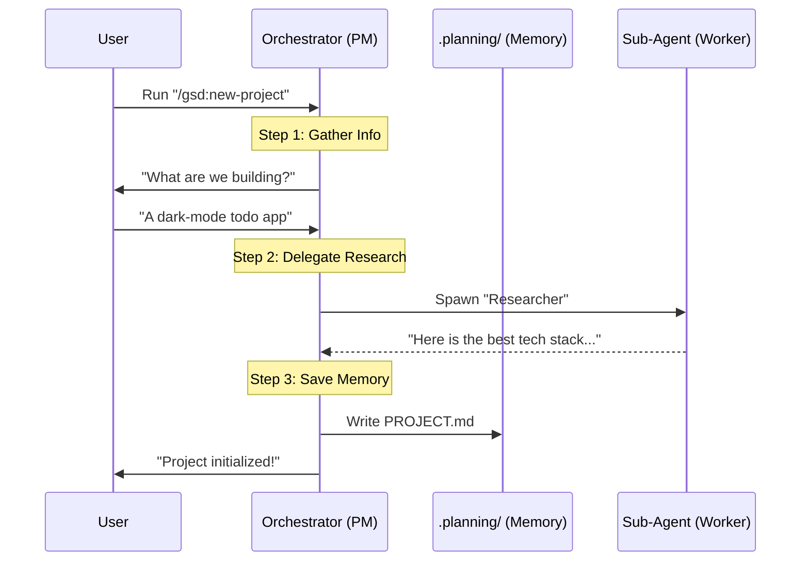

# Chapter 2: Orchestrators (Commands)

In [Chapter 1: Project State (Context Memory)](01_project_state__context_memory_.md), we built the "Brain" of our system—a way to remember what we are doing.

But a brain without a body can't actually *do* anything. We need a way to take action.

This brings us to **Orchestrators**. If Project State is the memory, Orchestrators are the **Project Managers**. They don't necessarily write the code themselves; instead, they coordinate the plan, talk to you, and hire specialized workers to get the job done.

## The Problem: The "One-Prompt" Limit

Standard AI interactions are usually "One-Shot":
1.  You ask a question.
2.  The AI answers.
3.  The interaction ends.

Building complex software requires thousands of steps: researching, planning, coding, debugging, and verifying. You can't fit that into one prompt. You need a system that can **persist** through a long process.

## The Solution: Orchestrators

An Orchestrator in **Get-Shit-Done (GSD)** is a high-level command (like `/gsd:new-project`) that drives a multi-step workflow.

Think of the Orchestrator as a **General Contractor** building a house:
1.  **Interface:** They talk to the client (You) to understand the vision.
2.  **State Management:** They check the blueprints (`PROJECT.md`).
3.  **Delegation:** They don't pour the concrete themselves. They hire a foundation specialist (a Sub-Agent) to do it.

## Key Concept 1: The Command Interface

Orchestrators are the entry points. They are defined as specific commands that the system recognizes.

When you type `/gsd:new-project`, you aren't just asking a question; you are triggering a specific **Workflow Script**.

**Example: The Definition of `new-project`**

This is the actual code (simplified) that defines the command. It tells the system *who* is in charge and *what* tools they can use.

```yaml
---
name: gsd:new-project
description: Initialize a new project
allowed-tools:
  - Read             # Can read files
  - Write            # Can create files
  - AskUserQuestion  # Can interview you
  - Task             # Can spawn sub-agents
---
```

*Explanation:* This YAML header defines the "permissions" for the Project Manager. Notice `AskUserQuestion`—this allows the Orchestrator to stop and ask you, "What do you want to build?" before proceeding.

## Key Concept 2: The Workflow (The Script)

Once triggered, the Orchestrator follows a strict script. It doesn't hallucinate a process; it follows a logical flow.

For a new project, the flow looks like this:
1.  **Check:** Is this a new folder or an existing one?
2.  **Interview:** Ask the user what they want to build.
3.  **Research:** (Optional) Go look up best practices.
4.  **Commit:** Write the `PROJECT.md` file (from [Chapter 1](01_project_state__context_memory_.md)).

## How It Works: The Flow

Let's visualize what happens when you run a command. Notice how the Orchestrator sits in the middle, coordinating the User, the Memory, and the Workers.



## Internal Implementation

How does the code actually achieve this? The Orchestrator uses a mix of **Context** (files it reads) and **Process** (steps it takes).

### 1. Loading the Context
Before the Orchestrator starts, it loads necessary templates. It needs to know what a "Project" looks like before it can create one.

```xml
<execution_context>
@templates/project.md
@templates/requirements.md
@references/questioning.md
</execution_context>
```

*Explanation:* This tells the AI: "Before you start, read these files so you know the format we expect for our documents."

### 2. The Logic Loop
The Orchestrator's logic is written in a Markdown file that acts like pseudo-code. Here is a simplified snippet from the `new-project` workflow:

```markdown
## 3. Deep Questioning

Ask the user: "What do you want to build?"

While (understanding_is_vague) {
    Ask follow-up questions from @questioning.md
}

When (ready) {
    Synthesize answers into PROJECT.md
}
```

*Explanation:* This isn't Python or JavaScript; it's natural language logic. The AI reads this and acts it out. It knows to loop (keep asking questions) until it has enough information to fill out the template.

### 3. Spawning Sub-Agents
This is the most powerful part. The Orchestrator can use the `Task` tool to spawn a specialized agent.

For example, when creating a roadmap, the Orchestrator doesn't guess. It calls a specialist:

```python
# Simplified Orchestrator Logic
Spawn_Agent(
    agent_type="gsd-roadmapper",
    goal="Create a phase-by-phase roadmap",
    input_files=["PROJECT.md", "REQUIREMENTS.md"]
)
```

*Explanation:* The Orchestrator pauses, hands off the heavy lifting to the `gsd-roadmapper`, waits for the result, and then presents it to you. We will cover these workers in detail in the next chapter.

## Summary

In this chapter, we learned:
*   **Orchestrators** are the high-level commands (like `/gsd:new-project`).
*   They act as **Project Managers**, coordinating the work rather than doing it all themselves.
*   They define the **Workflow**, ensuring steps (Research -> Plan -> Verify) are followed.
*   They **Spawn** specialized agents to perform difficult tasks.

Now that our Project Manager (Orchestrator) has defined the plan, who actually does the work?

[Next Chapter: Specialized Agents](03_specialized_agents.md)

---

Generated by [Code IQ](https://github.com/adityasoni99/Code-IQ)