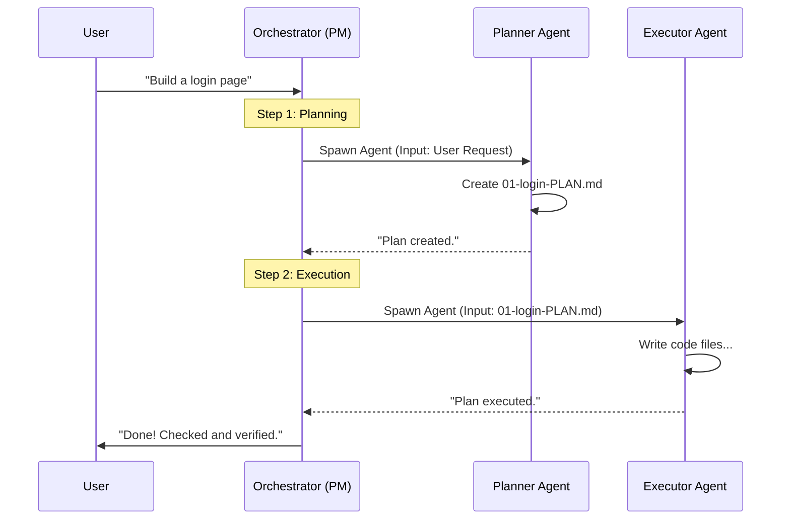

# Chapter 3: Specialized Agents

In [Chapter 2: Orchestrators (Commands)](02_orchestrators__commands_.md), we introduced the **Orchestrator**—the Project Manager who coordinates the workflow.

But a Project Manager doesn't pour concrete or wire electricity. If you ask a single generic AI to "Plan, Code, and Test" a complex feature all in one breath, it gets overwhelmed. It forgets details, writes buggy code, or skips testing entirely.

This is where **Specialized Agents** come in.

## The Problem: The "Jack-of-All-Trades" Failure

Imagine hiring one person to build a house. You expect them to be an expert Architect, a Master Carpenter, a Licensed Electrician, and a Safety Inspector all at once.

In AI terms, when you use a generic chat interface, you are asking for this "Jack-of-all-trades." The result is usually mediocre code and zero documentation.

## The Solution: The "Cross-Functional Team"

**Get-Shit-Done (GSD)** solves this by splitting the AI into distinct personalities. Each agent has:
1.  **A Specific Job:** A narrow focus (e.g., "Only write plans").
2.  **Specific Tools:** Only the tools they need (e.g., The Planner can't write code files, only plan files).
3.  **Specific Rules:** A unique system prompt that enforces strict behavior.

We treat the AI not as a chatbot, but as a **Crew**.

### Meet the Crew

Here are the four core specialists you will encounter in GSD:

1.  **The Researcher (`gsd-project-researcher`)**
    *   *Role:* The Scout.
    *   *Job:* Scans the internet and documentation *before* we start. Finds the best libraries so we don't reinvent the wheel.
    *   *Motto:* "Measure twice, cut once."

2.  **The Planner (`gsd-planner`)**
    *   *Role:* The Architect.
    *   *Job:* Breaks complex goals into small, executable steps. Creates the blueprints (`PLAN.md`).
    *   *Motto:* "A goal without a plan is just a wish."

3.  **The Executor (`gsd-executor`)**
    *   *Role:* The Builder.
    *   *Job:* Takes the blueprint and writes the actual code. It doesn't question the design; it builds it.
    *   *Motto:* "Get it done."

4.  **The Verifier (`gsd-verifier`)**
    *   *Role:* The Inspector.
    *   *Job:* Checks if the code actually achieves the goal. It doesn't trust the Executor's word; it checks the files.
    *   *Motto:* "Trust, but verify."

---

## How It Works: The Baton Pass

You rarely talk to these agents directly. The Orchestrator (from Chapter 2) manages them for you.

Here is the workflow for a typical task, like "Add a Login Screen":

1.  **Researcher:** Finds the best authentication library.
2.  **Planner:** Writes a step-by-step file (`PLAN.md`) using that library.
3.  **Executor:** Reads `PLAN.md` and writes the code files.
4.  **Verifier:** Checks the code to ensure the login actually works.

### Example: Defining an Agent

How do we create these personalities? We use **System Prompts**.

In GSD, agents are defined in Markdown files with a specific header. Let's look at the **Planner's** definition (simplified).

```yaml
---
name: gsd-planner
description: Creates executable phase plans.
tools: Read, Write, Bash
color: green
---
```

*Explanation:* This header tells the system "This is the Planner." It is allowed to Read files and Write plans, but it generally isn't given the tools to modify your main codebase directly—that's the Executor's job.

## Internal Implementation

Let's look "under the hood." When an Orchestrator spawns an agent, it creates a new chat session with a massive **System Prompt**. This prompt acts as the agent's "training."

### The Sequence Diagram

Here is how the system switches hats during a workflow:



### Code Example: The Planner's "Brain"

The magic is in the prompt text. Here is a simplified snippet of what makes the **Planner** behave like an architect.

```markdown
<role>
You are a GSD planner. 
Your job: Produce PLAN.md files that Executors can implement.
Plans are prompts, not documents.
</role>

<task_breakdown>
Every task must have:
1. <files>: Exact paths to create.
2. <action>: Specific implementation instructions.
3. <verify>: How to prove it works.
</task_breakdown>
```

*Explanation:*
*   **`<role>`**: Tells the AI it is NOT a chatbot. It is a Planner.
*   **`<task_breakdown>`**: Forces the AI to be specific. It can't just say "Make it work." It has to define the file path and verification step.

### Code Example: The Executor's "Brain"

Now look at the **Executor**. Its instructions are totally different. It focuses on Git commits and strict adherence to the plan.

```markdown
<role>
You are a GSD plan executor.
Your job: Execute the PLAN.md completely.
Do NOT deviate from the plan unless necessary for syntax errors.
</role>

<commit_protocol>
After each task:
1. Check modified files.
2. Create an atomic git commit.
3. Update the progress log.
</commit_protocol>
```

*Explanation:*
*   **`<role>`**: Tells the AI "Don't get creative." Just follow the instructions.
*   **`<commit_protocol>`**: Ensures that every single task is saved to Git history immediately. If the AI crashes later, you don't lose your work.

### Code Example: The Verifier's "Brain"

Finally, the **Verifier**. Its job is to be skeptical.

```markdown
<role>
You are a GSD phase verifier.
Your job: Goal-backward verification.
Start from the GOAL. Verify it exists in the code.
</role>

<core_principle>
Task completion ≠ Goal achievement.
Just because a file was created doesn't mean it works.
Check imports, check logic, check wiring.
</core_principle>
```

*Explanation:*
*   **Goal-Backward:** Most AIs check off a list: "Did I make the file? Yes." The Verifier asks: "Does the app actually run? Let me check the code references."

---

## Why this matters for Beginners

If you try to make one AI prompt do everything, you will fail on complex projects. The Context Window (short-term memory) fills up, and the AI gets confused.

By using **Specialized Agents**:
1.  **Focus:** The Planner doesn't worry about syntax errors; it worries about logic.
2.  **Quality:** The Executor doesn't worry about architecture; it worries about clean code.
3.  **Safety:** The Verifier catches mistakes the others missed.

It separates concerns, just like a professional software team.

## Summary

In this chapter, we learned:
*   Generic chatbots fail at complex tasks because they lack focus.
*   **Specialized Agents** are distinct personas with specific jobs (Researcher, Planner, Executor, Verifier).
*   **System Prompts** define these roles, giving them specific rules and limitations.
*   The **Orchestrator** coordinates these agents so they work together as a team.

Now that we have our team, the first step in any project isn't coding—it's understanding the landscape. Let's look at the first agent in the chain.

[Next Chapter: Research & Discovery](04_research___discovery.md)

---

Generated by [Code IQ](https://github.com/adityasoni99/Code-IQ)