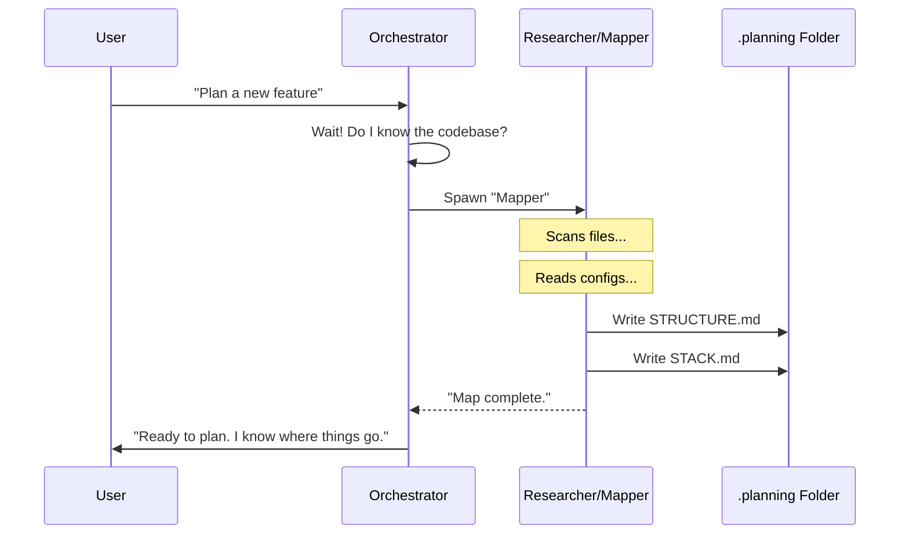

# Chapter 4: Research & Discovery

In [Chapter 3: Specialized Agents](03_specialized_agents.md), we met our "Crew"—the Researcher, Planner, Executor, and Verifier. We learned that splitting the AI into different personalities prevents it from getting overwhelmed.

Now, imagine you hire a contractor to build a deck. If they immediately pull out a saw and start cutting wood without measuring the yard or checking the blueprints, you would fire them.

Yet, this is exactly how most people use AI: "Write me a login system." The AI immediately starts writing code.

In **Get-Shit-Done (GSD)**, we don't guess. We send out **Scouts**. This phase is called **Research & Discovery**.

## The Problem: "Hallucinations" and "Spaghetti Code"

When an AI tries to code without researching first, two bad things happen:

1.  **Hallucinations:** The AI guesses a library function that *sounded* real in 2021 but was deleted in 2023. You waste hours debugging non-existent code.
2.  **Pattern Breaking:** The AI writes code that looks correct in isolation but completely ignores how *your* specific project is structured. It puts files in the wrong folders or uses a different coding style.

## The Solution: The "Scout" Mindset

Before we allow an AI to write a single line of code (Phase 2) or even make a plan (Phase 1), we force it to investigate.

GSD uses two specific types of investigation:
1.  **Project Research:** Looking **OUT** (at the internet/docs) to find the best tools.
2.  **Codebase Mapping:** Looking **IN** (at your files) to understand existing patterns.

---

## Key Concept 1: The Researcher (Looking Out)

The `gsd-project-researcher` is like a Librarian. Its job is to verify facts so we don't rely on the AI's "fuzzy memory."

AI models have a "knowledge cutoff." They don't know about the library released last week. The Researcher fixes this by using tools to browse the web and read official documentation.

### Example: The "Stack" File

When you start a new project, the Researcher creates a file called `.planning/research/STACK.md`.

**Input:** You ask, "I want to build a web app."
**Output (STACK.md):**

```markdown
# Technology Stack
**Analysis Date:** 2025-05-12

## Core Framework
- **React 19**: Chosen for new compiler features.
- **Vite**: For fast build times.

## Dependencies
- **Tailwind CSS**: For styling (standard in 2025).
```

*Explanation:* The AI didn't just guess React; it checked what is current. By saving this to a file, the Executor (who builds the code later) knows *exactly* which versions to install.

## Key Concept 2: The Mapper (Looking In)

The `gsd-codebase-mapper` is like an Archaeologist or Inspector. It is used on existing projects.

If you ask GSD to "Add a new button," the Mapper first runs around your folders to answer:
1.  Where do buttons usually live? (`src/components`? `src/ui`?)
2.  Do we use CSS modules or Tailwind?
3.  Do we use TypeScript or JavaScript?

### Example: The "Structure" File

The Mapper produces `.planning/codebase/STRUCTURE.md`.

```markdown
# Codebase Structure

## Directory Layout
src/
├── components/     # Reusable UI elements
├── features/       # Business logic
└── hooks/          # Custom React hooks

## Where to Add New Code
- **New UI**: Put in `src/components/ui/`
- **New Logic**: Put in `src/features/`
```

*Explanation:* This file becomes the "Rulebook." When the Planner (next chapter) creates a blueprint, it reads this file so it doesn't try to put UI code in the `hooks` folder.

---

## How It Works: The Flow

When you run a command that requires knowledge, the system pauses to "Gather Intel."



## Internal Implementation

How do these agents actually work under the hood? They rely on **System Prompts** that force them to be skeptical.

### The Researcher's Philosophy

In the code for `gsd-project-researcher.md`, we explicitly tell the AI that its training data might be wrong.

```markdown
<philosophy>
## Training Data = Hypothesis

Claude's training is stale. Knowledge may be outdated.

**Discipline:**
1. **Verify before asserting** — Check official docs.
2. **Prefer current sources** — Docs trump memory.
3. **Flag uncertainty** — Say "I don't know" if unsure.
</philosophy>
```

*Explanation:* This prevents the "Confidence Trickster" behavior of AI. It forces the AI to use its `WebSearch` or `Read` tools to double-check facts.

### The Mapper's Tools

The `gsd-codebase-mapper` isn't magic; it uses standard Linux commands to explore your computer.

Here is a simplified snippet of how it explores a "Tech Focus" area:

```bash
# Explore the codebase
ls package.json requirements.txt 2>/dev/null

# Find what imports we are using
grep -r "import.*aws" src/ --include="*.ts"

# Check for config files
ls -la .env* *.config.*
```

*Explanation:* 
1.  It lists files to see what language you use.
2.  It "greps" (searches) inside files to see what libraries you import.
3.  It summarizes this into the Markdown reports we saw earlier.

### The "Context7" Tool

For external research, GSD uses a special tool called `mcp__context7`. Think of this as a direct line to software documentation.

Instead of Googling "How to use Supabase" and getting a blog post from 2022, the agent does this:

```javascript
// Internal tool call
mcp__context7__query_docs({
  libraryId: "supabase",
  query: "How to authenticate in v2?"
})
```

*Explanation:* This fetches the *actual* current documentation text, ensuring the code we generate later is syntax-perfect for the current version.

---

## Why this matters for Beginners

If you skip Research & Discovery, you fall into the **"It works on my machine"** trap—except it's **"It works in the AI's imagination."**

By using Scouts:
1.  **Consistency:** Your new code looks like your old code.
2.  **Reliability:** You don't try to use libraries that don't exist.
3.  **Speed:** You spend less time debugging "Function not found" errors.

## Summary

In this chapter, we learned:
*   **Research & Discovery** is the phase *before* planning or coding.
*   **Scouts** are agents that investigate to prevent hallucinations.
*   The **Researcher** looks **OUT** (Internet/Docs) to find libraries.
*   The **Mapper** looks **IN** (Codebase) to find patterns.
*   They produce files like `STACK.md` and `STRUCTURE.md` in the `.planning/` folder.

Now that our Scouts have returned with a map of the territory and a list of valid ingredients, we are finally ready to cook. We need to create a blueprint.

[Next Chapter: The Plan (Executable Prompt)](05_the_plan__executable_prompt_.md)

---

Generated by [Code IQ](https://github.com/adityasoni99/Code-IQ)