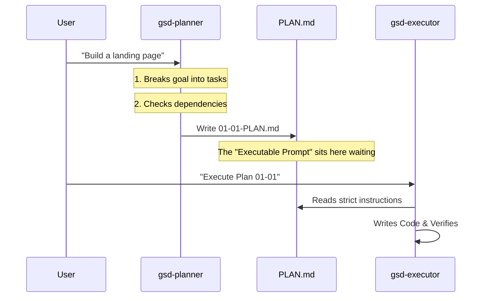

# Chapter 5: The Plan (Executable Prompt)

In [Chapter 4: Research & Discovery](04_research___discovery.md), our "Scout" agents mapped out the territory. We know what libraries to use and where the code should live.

But knowing *what* to build is very different from knowing *how* to build it.

If you tell a builder "Build me a house," you get a mess. If you give them a precise set of blueprints with step-by-step instructions, you get a home.

In **Get-Shit-Done (GSD)**, we don't send vague requests to the coder. We send **The Plan**.

## The Problem: The "Draw the Rest of the Owl" Syndrome

There is a famous internet meme where a drawing tutorial shows two steps:
1.  Draw two circles.
2.  Draw the rest of the owl.

This is exactly how most AI coding assistants fail. You say "Create a login page," and the AI tries to write the database schema, the API, the styling, and the validation logic all in one giant, broken response. It tries to "draw the rest of the owl" in one go.

## The Solution: `PLAN.md` (The Recipe)

GSD introduces the concept of an **Executable Prompt**.

We create a specific file (e.g., `01-01-PLAN.md`) that acts like a recipe card. It breaks a big feature down into tiny, atomic steps.

Crucially, **The Plan is written for the AI, not for you.**

When the Execution Agent (who we will meet in the next chapter) reads this file, it doesn't have to "think" about architecture. It just follows the instructions, line by line.

---

## Key Concept 1: The Structure

A Plan isn't just a bulleted list. It is a strictly formatted file that acts as a computer program for the AI.

It starts with **Frontmatter** (metadata at the top).

**Example: The Top of a Plan**

```yaml
---
phase: 01-foundation
plan: 01
type: execute
wave: 1
autonomous: true
files_modified: [src/app/page.tsx]
---
```

*Explanation:*
*   **`phase` & `plan`**: ID numbers so we keep track of order.
*   **`wave`**: This is cool—if two plans have `wave: 1`, the system can run them *at the same time* because it knows they don't conflict.
*   **`autonomous`**: `true` means "Run this whole thing without bugging the human."

## Key Concept 2: The Context (The Ingredients)

Before cooking, you need ingredients. The Plan lists exactly which files the AI needs to read to understand the task.

**Example: Context Section**

```markdown
<context>
@.planning/PROJECT.md
@.planning/research/STACK.md
@src/components/Button.tsx
</context>
```

*Explanation:* This prevents "Context Rot." We don't dump the whole codebase into the AI's brain. We only give it the specific files relevant to *this specific plan*.

## Key Concept 3: The Tasks (The Steps)

This is the most important part. We use **XML tags** to define tasks. Why XML? because AI models are very good at parsing strictly open/closed tags. It prevents them from skipping steps.

Each task has three critical components:
1.  **Files**: Where does the code go?
2.  **Action**: What specific code do we write?
3.  **Verify**: How do we prove it works?

**Example: An Atomic Task**

```xml
<task type="auto">
  <name>Create Hero Section</name>
  <files>src/components/Hero.tsx</files>
  <action>
    Create a functional component exporting 'Hero'.
    Use the <h1> style from @theme.ts.
  </action>
  <verify>npm run test src/components/Hero.test.tsx</verify>
</task>
```

*Explanation:*
*   **Targeted:** The AI knows exactly which file to touch.
*   **Instruction:** It is told to use a specific style from a specific file.
*   **Verification:** It is told exactly how to test its own work.

---

## How It Works: The Flow

How does this file get created? The **Planner Agent** (from Chapter 3) creates it for the **Executor Agent** to consume.



## Internal Implementation

How does GSD ensure these plans are high quality? It uses a strict **Template** and **Logic** within the Planner agent.

### 1. The Template (`phase-prompt.md`)

The system doesn't let the Planner improvise the format. It forces the Planner to fill out a template.

```markdown
<!-- Simplified Template -->
<objective>
[What this plan accomplishes]
</objective>

<tasks>
<task type="auto">
  <name>[Task Name]</name>
  <files>[Files to touch]</files>
  <action>[Instructions]</action>
  <verify>[Verification command]</verify>
</task>
</tasks>
```

*Explanation:* By feeding this template to the Planner Agent, we guarantee that the output is always machine-readable.

### 2. Dependency Analysis (Waves)

The Planner is smart. It looks at all the tasks you need and figures out what can be done in parallel.

**Simplified Logic inside `gsd-planner`:**

```python
# Pseudo-code for Wave Calculation
for plan in all_plans:
  if plan.depends_on is empty:
    plan.wave = 1  # Run immediately!
  else:
    # Run after the thing it depends on
    plan.wave = max(dependency.wave) + 1
```

*Explanation:* This creates "Waves."
*   **Wave 1:** "Setup Database" AND "Design Logo" (Can happen at the same time).
*   **Wave 2:** "Build Login API" (Must wait for Database).

### 3. Goal-Backward Verification (`must_haves`)

How do we know the plan actually solves the user's problem? The Planner works backward from the goal.

**Example from `gsd-planner` output:**

```yaml
must_haves:
  truths:
    - "User can see the 'Sign Up' button"
  artifacts:
    - path: "src/components/SignUp.tsx"
      provides: "The UI component"
```

*Explanation:* This section is used later by the Verifier. It says: "I don't care if you wrote code. If the 'Sign Up' button isn't visible on the screen, the plan failed."

---

## Why this matters for Beginners

When you are learning to code with AI, the biggest source of pain is **loops of doom**:
1.  AI writes code.
2.  Code has an error.
3.  AI fixes error but breaks something else.
4.  Repeat until you quit.

The **Plan (Executable Prompt)** fixes this by:
1.  **Isolating changes:** The AI only touches the files listed in `<files>`.
2.  **Forcing verification:** The AI *must* know how to verify the task (`<verify>`) before it writes the code.
3.  **Human Review:** You can read `PLAN.md` *before* any code is written. If the plan looks wrong, you change the plan, not the code.

## Summary

In this chapter, we learned:
*   **`PLAN.md`** is an "Executable Prompt"—a program for the AI to follow.
*   It uses **XML tags** to define specific tasks, files, and actions.
*   It uses **Waves** to organize work into parallel chunks.
*   It includes **Verification Steps** so the AI knows when it is done.

We have the Research, and now we have the Plan. It is finally time to let the builders into the construction site.

[Next Chapter: Execution Engine](06_execution_engine.md)

---

Generated by [Code IQ](https://github.com/adityasoni99/Code-IQ)