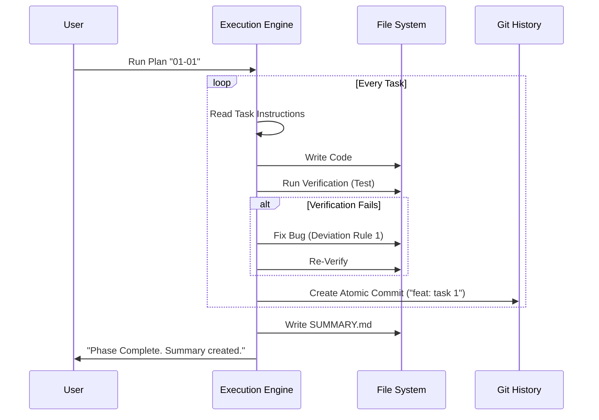

# Chapter 6: Execution Engine

In [Chapter 5: The Plan (Executable Prompt)](05_the_plan__executable_prompt_.md), we acted like Architects. We drew up a precise blueprint (`PLAN.md`) detailing exactly what files to create and how to verify them.

But a blueprint is just paper. It doesn't build the house.

In this chapter, we meet the **Execution Engine**. If the Planner is the Architect, the Execution Engine is the **Senior Developer** you hired to actually write the code. It takes the plan, sits down at the keyboard, and works through the night until the job is done.

## The Problem: The "Lazy AI" Loop

If you have used ChatGPT or Claude for coding, you know the pain:
1.  **The "Half-Finished" Code:** You ask for a feature, it writes 80% of it, then stops due to output limits.
2.  **The "Regression":** It fixes one bug but deletes a file you created five minutes ago.
3.  **The "Amnesia":** If it crashes halfway through, you have no idea which files are safe to keep.

## The Solution: The Execution Engine

**Get-Shit-Done (GSD)** uses an Execution Engine that treats coding like a factory line, not a chat session.

It follows a strict loop:
1.  **Read** the specific task from the Plan.
2.  **Write** the code for *only* that task.
3.  **Verify** it works (run tests).
4.  **Commit** it to Git (save progress).
5.  **Repeat**.

It turns "I hope this works" into "I know this works because we verified it step-by-step."

---

## Key Concept 1: Atomic Execution

The Engine doesn't try to build the whole app at once. It reads the `<task>` tags from your `PLAN.md` and executes them one by one.

**Analogy:**
Imagine building a Lego set. You don't dump all 5,000 pieces on the floor and try to build the roof and the basement at the same time. You follow the booklet: "Bag 1: The Foundation." "Bag 2: The Walls."

The Execution Engine opens "Bag 1," builds it, checks that it's sturdy, and *then* moves to "Bag 2."

## Key Concept 2: Deviation Handling (Common Sense)

This is the "Senior Developer" part. Sometimes, the plan has a minor mistake. Maybe we forgot to install a library.

A Junior Developer (basic AI) would stop and cry, "Error: Library not found!"

The GSD Execution Engine has **Deviation Rules**. It is allowed to fix small problems automatically.

*   **Rule 1 (Bug):** "I made a typo. I will fix it." (Auto-fix)
*   **Rule 2 (Missing Critical):** "We forgot to hash the password. I will add security." (Auto-fix)
*   **Rule 3 (Blocking):** "We are missing a library. I will install it." (Auto-fix)
*   **Rule 4 (Architectural):** "The plan says use SQL, but you want NoSQL?" -> **STOP.** Ask the human.

## Key Concept 3: The Summary

When the Engine finishes, it doesn't just say "Done." It writes a report called `SUMMARY.md`.

This file lists:
*   What files were created.
*   What decisions were made.
*   What unplanned bugs were fixed (Deviations).

This ensures the *next* time we plan, we know exactly what happened here.

---

## How It Works: The Flow

You trigger the engine with a command like `/gsd:execute-phase`. Here is what happens inside the machine:



## Internal Implementation

Let's look at the code that powers this logic. The Execution Engine is primarily defined in the `gsd-executor` agent definition.

### 1. The Execution Loop

The agent isn't just chatting; it's following a script in its system prompt. It looks for the `PLAN.md` and iterates through tasks.

```bash
# Simplified Logic in gsd-executor
load_plan()

for task in plan.tasks:
    if task.type == "checkpoint":
        stop_and_ask_user()
    else:
        execute_code(task.files, task.instructions)
        verify_work(task.verification_cmd)
        git_commit(task.name)
```

*Explanation:* This loop ensures we never move to Task 2 until Task 1 is verified and saved.

### 2. The Deviation Rules Prompt

How does the AI know when to fix bugs vs. when to stop? We explicitly program it in the system prompt (`agents/gsd-executor.md`).

```markdown
<deviation_rules>
**RULE 1: Auto-fix bugs**
Trigger: Syntax errors, logic errors.
Action: Fix immediately. Track in Summary.

**RULE 4: Ask about architectural changes**
Trigger: Changing database schema, switching frameworks.
Action: STOP. Ask User.
</deviation_rules>
```

*Explanation:* This text is fed to the AI. It acts as the "Company Policy." It gives the AI permission to be helpful but prevents it from going rogue.

### 3. Atomic Commits

This is unique to GSD. Most AI tools just write files. GSD commits them to your version control history instantly.

```bash
# Inside the task_commit_protocol step
# 1. Check what changed
git status --short

# 2. Add ONLY the files for this task
git add src/components/Login.tsx

# 3. Save with a specific message
git commit -m "feat(01-01): implement login component"
```

*Explanation:* By running these commands after every single task, we create a "Save Point." If the power goes out, or the AI hallucinates in Task 5, Task 1 through 4 are safe in Git.

### 4. The Summary Generation

Finally, the engine compiles its work into `SUMMARY.md`. This isn't just for you; it's for the *next* agent (the Planner for the next phase).

```markdown
# Phase 01 Plan 01: Login Summary

## Accomplishments
- Created Login UI
- Connected to Supabase

## Deviations
- **Rule 3 Fix:** Installed missing 'zod' library for validation.
```

*Explanation:* When the Planner starts Phase 2, it reads this. It sees "Oh, they installed `zod`, so I can use that in the next phase!"

---

## Why this matters for Beginners

Without an Execution Engine, using AI for code feels like herding cats. You spend more time copy-pasting code and fixing import errors than actually building.

With the **Execution Engine**:
1.  **Reliability:** You can walk away and get coffee. The engine handles the boring stuff (installing packages, fixing typos).
2.  **Safety:** If it messes up, you can revert to the last "Atomic Commit."
3.  **Documentation:** You get a `SUMMARY.md` automatically, so you never forget what you built.

## Summary

In this chapter, we learned:
*   The **Execution Engine** turns the `PLAN.md` into code.
*   It uses **Atomic Execution**, building one task at a time.
*   It applies **Deviation Rules** (Common Sense) to fix bugs without bothering you, but stops for big architectural changes.
*   It produces a **Summary** so the project maintains its memory.

We've mentioned "Commits" and "Git" a lot in this chapter. It is the safety net that makes this whole system possible. Let's dive deeper into how GSD handles version control.

[Next Chapter: Atomic Git Integration](07_atomic_git_integration.md)

---

Generated by [Code IQ](https://github.com/adityasoni99/Code-IQ)