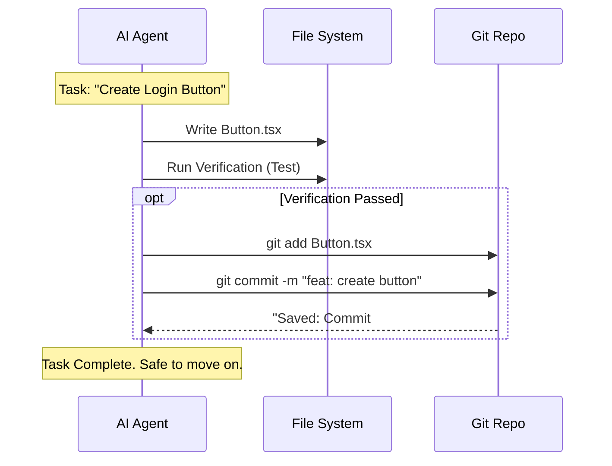

# Chapter 7: Atomic Git Integration

In [Chapter 6: Execution Engine](06_execution_engine.md), we watched our "Senior Developer" (the Executor Agent) build your project task by task.

But even Senior Developers make mistakes. Imagine the Executor builds a beautiful login page in Task 1, sets up the database in Task 2, and then accidentally deletes the login page while working on Task 3.

If you haven't saved your work, you are back to square one.

This chapter introduces **Atomic Git Integration**. It is the "Quick Save" system for your project. It ensures that every time the AI finishes a tiny piece of work, it is permanently saved in history before moving to the next step.

## The Problem: The "House of Cards"

When working with AI, things can go wrong fast:
1.  **Context Overflow:** The AI writes too much code and cuts off halfway through a file.
2.  **Regression:** The AI fixes a bug but breaks a feature you built an hour ago.
3.  **Catastrophic Failure:** The AI gets confused and deletes a folder.

If you only save your work at the end of the day, a single AI mistake can wipe out hours of progress. You are building a house of cards; one shake, and it collapses.

## The Solution: Video Game "Save Points"

Think of **Atomic Git Integration** like a video game. Before you fight a boss, you save the game. If you lose, you don't restart the game; you just reload the save.

In **Get-Shit-Done (GSD)**, every single task in the `PLAN.md` ends with a Git Commit.

*   **Human Workflow:** Work for 4 hours → `git commit -m "updates"`
*   **GSD Workflow:** Create Button → **Commit**. Style Button → **Commit**. Add Click Handler → **Commit**.

---

## Key Concept 1: The Atomic Commit

"Atomic" means "indivisible." An atomic commit contains the changes for **one specific task** and nothing else.

If the plan says "Create a User Interface," that is too big.
If the plan says:
1.  Create Header
2.  Create Footer
3.  Create Sidebar

The GSD system will create **three** separate commits.

**Why this helps:** If the Sidebar code breaks the app, you can revert *just* the Sidebar without losing the Header and Footer.

## Key Concept 2: The Structured Message

Because an AI is writing the history, we need the history to be readable by... other AIs.

We use a strict format called **Conventional Commits**:

`type(phase-plan): description`

**Examples:**
*   `feat(01-02): create login button` (New Feature)
*   `fix(01-02): repair submit handler` (Bug Fix)
*   `test(01-02): add failing test for auth` (Testing)

This turns your Git log into a clean list of accomplishments that the **Planner** (from [Chapter 3](03_specialized_agents.md)) can read later to understand what happened.

---

## How It Works: The Flow

Let's look at the cycle the Execution Engine follows. Notice that **Git** is integrated directly into the build loop.



## Internal Implementation

How does GSD force the AI to do this? It's not magic; it's a protocol defined in the system prompts.

### 1. The Protocol Definition (`git-integration.md`)

The system uses a reference file to teach the AI *when* to commit.

```markdown
<!-- Simplified from references/git-integration.md -->
<commit_points>
| Event              | Commit? | Why?                         |
|--------------------|---------|------------------------------|
| PLAN.md created    | NO      | It's just a plan, no code yet|
| Task completed     | YES     | Atomic unit of work          |
| Plan completed     | YES     | Save the Summary             |
</commit_points>
```

*Explanation:* This tells the AI: "Don't spam commits while you are thinking. Only commit when you have finished a task."

### 2. The Execution Command (`gsd-executor.md`)

Inside the **Executor Agent**, there is a specific instruction block that runs after every task.

```bash
# 1. Check what changed
git status --short

# 2. Add ONLY the files for this specific task
git add src/components/LoginButton.tsx

# 3. Commit with the strict format
git commit -m "feat(01-01): implement login button

- Added consistent padding
- Linked to auth state
"
```

*Explanation:*
1.  **`git add ...`**: The AI explicitly picks files. It avoids `git add .` (add everything), so it doesn't accidentally commit a temporary file.
2.  **`git commit ...`**: It writes a detailed description of what it did.

### 3. The Resulting Log

If you type `git log` in your terminal after a GSD session, you won't see "wip" or "fixed stuff." You will see a high-fidelity history.

```text
a1b2c docs(01-01): complete foundation plan
d4e5f feat(01-01): connect prisma to database
g7h8i feat(01-01): install tailwind css
j0k1l docs: initialize project
```

*Explanation:* Even if you delete the entire project folder by accident, you can rebuild it step-by-step from this history.

---

## Use Case: The "Undo" Button

Here is a concrete example of why this saves you hours of pain.

**Scenario:**
The AI is building a "Dark Mode" toggle.
1.  **Task 1:** It creates the toggle button. (Commit: `feat: create toggle`)
2.  **Task 2:** It adds the CSS variables. (Commit: `feat: add css vars`)
3.  **Task 3:** It tries to add an animation library, but it breaks the entire React build process. The app crashes.

**Without Atomic Git:**
You have a broken app. You have to manually hunt through files to delete the animation library code, hoping you don't accidentally delete the toggle button code too.

**With Atomic Git:**
You simply tell the AI (or do it yourself):
`git reset --hard HEAD~1`

*Poof.* You go back in time exactly one step. The animation library is gone, but your Toggle Button and CSS are safe.

## Why this matters for Beginners

When you start coding, you are often afraid to touch working code because you might break it.

**Atomic Git Integration gives you courage.**

1.  **Freedom to Experiment:** You can let the AI try crazy ideas. If they fail, you just roll back the commit.
2.  **Clear History:** You can look back at the log to see *how* a feature was built, step-by-step.
3.  **AI Memory:** When you start a new chat session, the AI reads the Git log to understand what has been done. It serves as the project's long-term memory.

## Summary

In this chapter, we learned:
*   **Atomic Commits** save the project after every single task.
*   **Structured Messages** (`feat`, `fix`) make the history machine-readable.
*   **The Protocol** ensures the AI commits code *only* when it passes verification.
*   This system creates a **Safety Net** that allows easy rollbacks if the AI hallucinates or breaks the build.

Now we have code that is planned, executed, and saved. But... just because the code runs and is saved doesn't mean it actually does what the user wanted.

Does the "Login Button" actually log you in? We need to verify the *Goal*, not just the code.

[Next Chapter: Goal-Backward Verification](08_goal_backward_verification.md)

---

Generated by [Code IQ](https://github.com/adityasoni99/Code-IQ)