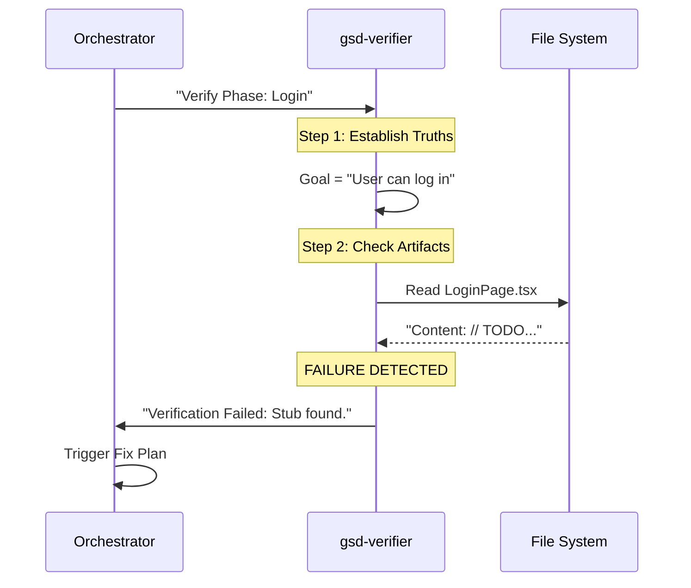

# Chapter 8: Goal-Backward Verification

In [Chapter 7: Atomic Git Integration](07_atomic_git_integration.md), we learned how to save our work safely. We now have a project history filled with "Features" and "Fixes."

But here is the scary truth: **Just because the AI wrote code, doesn't mean the code works.**

A common AI trick is to be "lazy." You ask for a complex payment system, and the AI creates a file that looks like this:
```javascript
// PaymentSystem.js
// TODO: Implement payment logic later
return true;
```
The AI marks the task as "Done." The file exists. The Git commit is saved. But your app doesn't actually process payments.

This is where **Goal-Backward Verification** comes in. It is the "Quality Assurance" phase that prevents the AI from cheating.

## The Problem: "The Checkbox Trap"

Most project management systems work "Forward":
1.  Make a list of tasks.
2.  Check them off one by one.
3.  If all boxes are checked, the project is done.

**The Problem:** You can check all the boxes (create file, add import, style button) and still have a broken app because the pieces aren't connected properly.

## The Solution: Working Backwards

**Get-Shit-Done (GSD)** reverses the process. We don't ask "Did you finish the tasks?" We ask "Is the Goal true?"

**The Analogy: The Bridge Inspector**
*   **Forward Check:** "Did you pour the concrete? Yes. Did you install the cables? Yes."
*   **Goal-Backward Check:** "Can a 10-ton truck drive across this without falling?"

If the truck falls, it doesn't matter if you checked the boxes. The goal failed.

---

## Key Concept 1: The Verifier Agent

We use a specialized agent called the **Verifier** (`gsd-verifier`). It is the "Skeptic" of the team.

It ignores what the Executor *said* it did. It looks directly at the code files to find three things:
1.  **Truths:** Does the feature behave correctly?
2.  **Artifacts:** Do the files exist and contain real code (not stubs)?
3.  **Wiring:** Are the files actually connected to each other?

## Key Concept 2: Stub Detection

A **Stub** is a placeholder. It's when the AI writes `// Code goes here` instead of actual code.

The Verifier is trained to hunt for these specific "lazy" patterns. If it finds a file that returns `null` or has `TODO` comments in critical places, it fails the phase.

## Key Concept 3: Wiring (The Hidden Killer)

This is the most common failure.
*   You have a `Button` component.
*   You have an `API` to save data.
*   **But the Button doesn't call the API.**

Both files exist ("Artifacts" are good), but the connection is missing ("Wiring" is bad). The Verifier explicitly checks for these connections using imports and function calls.

---

## How It Works: The Flow

Let's look at how the Verifier inspects a phase. Imagine we just built a "Login Screen."



### The Output: `VERIFICATION.md`

When the Verifier runs, it generates a report. This isn't just a "Pass/Fail" grade; it's a detailed investigation.

**Example Report Snippet:**

```markdown
# Phase Verification: Login

## Goal Achievement
| Truth | Status | Reason |
|-------|--------|--------|
| User can see login form | ✅ VERIFIED | File exists, elements present |
| User can submit form | ❌ FAILED | Button has no `onClick` handler |

## Gaps Found
1. **Missing Wiring**: The Submit button is not connected to the API.
```

*Explanation:* The user can instantly see *why* it failed. It's not a mystery; it's a specific missing connection (`onClick`).

---

## Internal Implementation

How does the Verifier actually "read" the code? It doesn't run the app (that's hard for AI). Instead, it uses **Static Analysis**—it scans the text of your files looking for proof.

### 1. The Skeptical Prompt

The `gsd-verifier` starts with a strict instruction to trust nothing.

```markdown
<role>
You are a GSD phase verifier.
Your job: Verify the GOAL, not the TASKS.

**Critical mindset:**
Do NOT trust SUMMARY.md claims.
Verify what ACTUALLY exists in the code.
</role>
```

*Explanation:* This sets the mood. "Don't listen to the Executor's excuses. Look at the evidence."

### 2. Hunting for Stubs

The Verifier uses standard Linux tools (like `grep`) to find "fake" code. Here is a simplified version of the logic it uses.

```bash
# Check for "lazy" comments
grep -n -E "TODO|FIXME|PLACEHOLDER" src/Login.tsx

# Check for empty implementations
grep -n "return null" src/Login.tsx
```

*Explanation:*
*   `grep`: A command that searches for text.
*   If it finds "TODO" inside the main logic, it flags a warning.
*   If it finds "return null" where a component should be, it flags a "Stub."

### 3. Checking "Wiring" (Key Links)

To check if two files talk to each other, the Verifier looks for **Imports** and **Usage**.

```bash
# 1. Does the Login page import the API?
grep "import.*loginAPI" src/LoginPage.tsx

# 2. Does it actually USE the API?
grep "loginAPI.submit(" src/LoginPage.tsx
```

*Explanation:*
If Step 1 passes (Import exists) but Step 2 fails (Function never called), the status is **"Orphaned."** The code exists but isn't doing anything.

### 4. Goal-Backward Logic

Finally, the Verifier structures its thinking backwards from the goal. This logic is embedded in its instruction file (`agents/gsd-verifier.md`).

```yaml
# Simplified Logic Flow
Goal: "User can send message"

1. What must exist? 
   -> Artifact: MessageInput.tsx
   -> Artifact: SendButton.tsx

2. What must happen?
   -> Truth: SendButton triggers API

3. Verify:
   -> Check Artifacts (Do files exist?)
   -> Check Wiring (Does Button call API?)
```

---

## Why this matters for Beginners

When you are learning, you often assume that if you followed the tutorial steps, it should work. When it doesn't, you feel lost.

**Goal-Backward Verification** teaches you a superpower: **How to debug logic, not just syntax.**

1.  It forces you to define what "Success" looks like (The Truths).
2.  It catches "Lazy AI" mistakes automatically.
3.  It ensures you don't build on top of a broken foundation.

## Summary

In this chapter, we learned:
*   **Goal-Backward Verification** checks if the *outcome* was achieved, not just if tasks were marked done.
*   **Stubs** are fake code (`// TODO`) that AI loves to write; the Verifier hunts them down.
*   **Wiring** checks ensure that components are actually connected to logic.
*   This creates a `VERIFICATION.md` report that acts as a "Pass/Fail" gate for the phase.

So, the Verifier ran, and it found a problem. The login button isn't wired up. How do we fix it? We don't just guess. We use the Scientific Method.

[Next Chapter: Scientific Debugging](09_scientific_debugging.md)

---

Generated by [Code IQ](https://github.com/adityasoni99/Code-IQ)