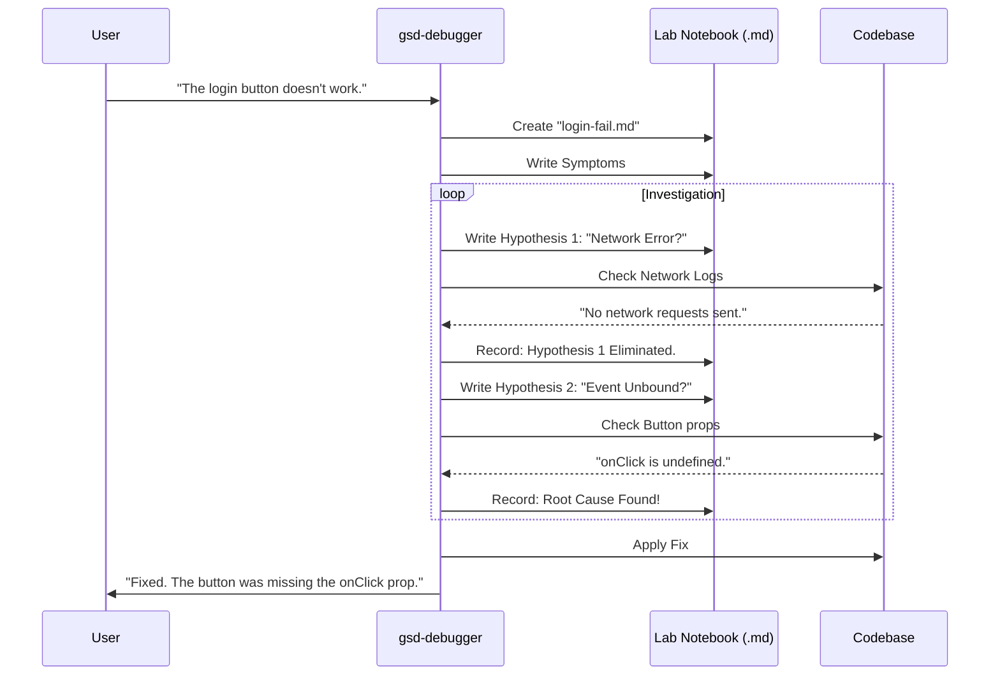

# Chapter 9: Scientific Debugging

In [Chapter 8: Goal-Backward Verification](08_goal_backward_verification.md), our Verifier agent acted like a strict building inspector. It looked at our "Login Screen" and slapped a big red **FAILED** sticker on it because the "Submit" button wasn't actually connected to the API.

Now we have a bug.

Most beginners (and many AIs) panic here. They start **"Shotgun Debugging"**: changing random lines of code, pasting error messages into Google, and praying something works. They spin in circles, often breaking more things than they fix.

In **Get-Shit-Done (GSD)**, we don't panic. We put on a lab coat. We use **Scientific Debugging**.

## The Problem: The "I Tried Everything" Loop

When you ask a standard AI to fix a bug, it usually guesses:
1.  "Maybe it's a syntax error?" (Changes code).
2.  "No? Maybe it's an import error?" (Changes code back).
3.  "No? Maybe I should rewrite the whole file?" (Destroys your work).

Because the AI has no long-term memory of what it just tried, it keeps testing the same wrong hypotheses over and over. It's like a scientist who refuses to write down their experiments.

## The Solution: The Debugger Agent

GSD introduces a specialized agent: `gsd-debugger`.

This agent is not allowed to guess. It must follow the **Scientific Method**:
1.  **Observe** the symptoms.
2.  **Form a Hypothesis** (a specific theory on why it's broken).
3.  **Experiment** (test that theory *without* changing code yet).
4.  **Record** the result in a "Lab Notebook."
5.  **Fix** only when the Root Cause is confirmed.

---

## Key Concept 1: The Lab Notebook (`.planning/debug/`)

The most important part of this system is **Persistence**.

When you start a debug session, the agent creates a file, for example: `.planning/debug/login-button-fail.md`. This is the **Lab Notebook**.

Every time the agent has an idea ("Maybe the API is down"), it writes it down. Every time it runs a test ("API is up, returning 200 OK"), it writes that down too.

**Why this matters:** If the AI crashes or you come back tomorrow, the notebook is still there. The new agent reads it and says, "Ah, we already ruled out the API being down. I won't waste time checking that again."

## Key Concept 2: Hypothesis Testing

The Debugger operates on a strict rule: **Don't fix what you don't understand.**

Before it writes a single line of fix code, it must prove what is wrong.

**Example:**
*   **Observation:** Clicking "Submit" does nothing.
*   **Bad Approach:** "I will rewrite the submit function."
*   **Scientific Approach (Hypothesis):** "I hypothesize the `onClick` handler is not attached to the button."
*   **Test:** Add `console.log("Clicked")` and click the button.
*   **Result:** No log appears.
*   **Conclusion:** Hypothesis Confirmed. *Now* we fix it.

---

## How It Works: The Flow

Here is how the Debugger interacts with your project. Notice how it loops between **Thinking** (Notebook) and **Testing** (Code).



---

## Internal Implementation

How do we force an AI to be this disciplined? We use a structured file format and a specific system prompt.

### 1. The Lab Notebook Template

The Debugger agent is trained to maintain a specific Markdown structure. It acts like a form it has to fill out.

```markdown
---
status: investigating
trigger: "Login button silent failure"
---

## Current Focus
hypothesis: The button component isn't passing props down.
test: Inspect src/components/Button.tsx
next_action: Read file content

## Eliminated (Things we checked)
- hypothesis: Network is down
  evidence: Checked wifi, other sites work.

## Evidence
- timestamp: 10:05 AM
  found: Button.tsx receives `onClick` but does not put it on the <button> tag.
```

*Explanation:*
*   **Current Focus:** Keeps the AI on track.
*   **Eliminated:** Prevents the AI from running in circles.
*   **Evidence:** Forces the AI to rely on facts, not hallucinations.

### 2. The System Prompt (`gsd-debugger.md`)

The instructions for this agent are very different from the "Builder" agents. It emphasizes **Skepticism**.

```markdown
<philosophy>
## Training Data = Hypothesis

**Discipline:**
1. **Change one variable at a time.**
2. **Treat your own code as foreign.** (You might have written the bug).
3. **"I don't know" is a valid answer.** (Better than guessing).
</philosophy>
```

*Explanation:* We explicitly tell the AI to doubt itself. This prevents the "Confidence Trap" where the AI insists the code is correct even when it's broken.

### 3. The Diagnosis Workflow (`diagnose-issues`)

In large projects, you might have 5 bugs at once. GSD uses a workflow to spawn **Parallel Detectives**.

If [Chapter 8](08_goal_backward_verification.md) found 3 gaps in the verification, the system does this:

```javascript
// Simplified Workflow Logic
for (gap in verification_gaps) {
  spawn_agent({
    role: "gsd-debugger",
    goal: "Find root cause only",
    symptom: gap.reason
  })
}
```

*Explanation:* It spawns three separate Debuggers. Each one creates its own Lab Notebook. They work at the same time without confusing each other.

### 4. The "Stop and Think" Protocol

The Debugger has a rule: **Update the file BEFORE taking action.**

```bash
# Wrong way (AI internal thought):
# I'll check the file and then maybe write it down.

# GSD Way (Enforced by Prompt):
# Step 1: Write to .planning/debug/session.md: "I am about to check file X"
# Step 2: Actually check file X.
```

*Explanation:* This ensures that if the "Check file" step crashes or times out, the next agent knows exactly what we were trying to do.

---

## Why this matters for Beginners

Debugging is the hardest part of learning to code. It feels like magic.

**Scientific Debugging demystifies it.**

1.  **It slows you down (in a good way):** You stop frantically changing code and start thinking.
2.  **It teaches you the codebase:** By investigating "Why," you learn how things actually work.
3.  **It saves your sanity:** The Lab Notebook proves you are making progress, even if you haven't fixed the bug yet. You can see the list of "Eliminated" hypotheses growing.

## Conclusion

We have reached the end of the **Get-Shit-Done** tutorial series.

We started with a simple idea: **AI needs memory and structure to build complex software.**

1.  We gave it a Brain (**Project State** - [Chapter 1](01_project_state__context_memory_.md)).
2.  We gave it Managers (**Orchestrators** - [Chapter 2](02_orchestrators__commands_.md)).
3.  We gave it a Team (**Specialized Agents** - [Chapter 3](03_specialized_agents.md)).
4.  We mapped the territory (**Research** - [Chapter 4](04_research___discovery.md)).
5.  We drew blueprints (**The Plan** - [Chapter 5](05_the_plan__executable_prompt_.md)).
6.  We built the code (**Execution** - [Chapter 6](06_execution_engine.md)).
7.  We saved our progress (**Git** - [Chapter 7](07_atomic_git_integration.md)).
8.  We checked our work (**Verification** - [Chapter 8](08_goal_backward_verification.md)).
9.  And finally, we learned to fix our mistakes (**Scientific Debugging** - Chapter 9).

You now have the framework to build not just "scripts," but real, robust applications with AI as your partner.

**Now, go Get Shit Done.**

---

Generated by [Code IQ](https://github.com/adityasoni99/Code-IQ)