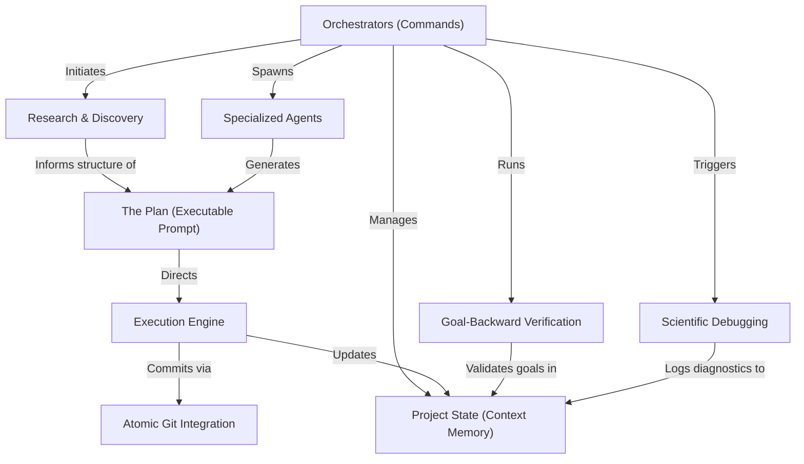

# Tutorial: get-shit-done

**get-shit-done** is an autonomous AI project management framework that uses high-level **Orchestrators** to drive the software development lifecycle. It persists context in a **Project State** memory to prevent hallucination and uses **Specialized Agents** to create structured **Plans**. These plans are executed by an **Execution Engine** that utilizes **Atomic Git Integration** and **Goal-Backward Verification** to ensure code is built, tested, and saved systematically.

**Source Repository:** [https://github.com/gsd-build/get-shit-done](https://github.com/gsd-build/get-shit-done)

## Chapters

1. [Project State (Context Memory)](01_project_state__context_memory_.md)
2. [Orchestrators (Commands)](02_orchestrators__commands_.md)
3. [Specialized Agents](03_specialized_agents.md)
4. [Research & Discovery](04_research___discovery.md)
5. [The Plan (Executable Prompt)](05_the_plan__executable_prompt_.md)
6. [Execution Engine](06_execution_engine.md)
7. [Atomic Git Integration](07_atomic_git_integration.md)
8. [Goal-Backward Verification](08_goal_backward_verification.md)
9. [Scientific Debugging](09_scientific_debugging.md)

---

Generated by [Code IQ](https://github.com/adityasoni99/Code-IQ)