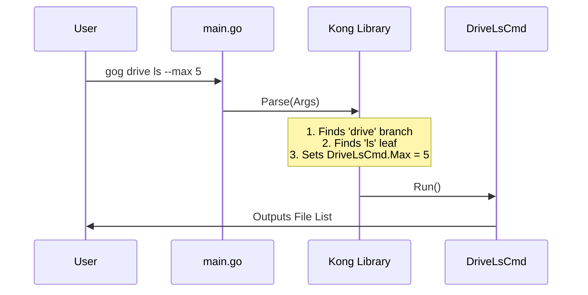

# Chapter 1: CLI Command Framework

Welcome to the first chapter of the **gogcli** development tutorial! 

Building a Command Line Interface (CLI) that handles dozens of complex actions (like sending emails, uploading files, or managing calendars) can quickly become a tangled mess of `if/else` statements.

In this chapter, we will look at how **gogcli** solves this problem using a **Command Framework**. Instead of writing code that manually checks "Did the user type 'gmail' or 'drive'?", we define the shape of our application using **Structs** and **Trees**.

## The Tree Analogy

Think of `gogcli` as a large tree.

1.  **The Trunk (`root.go`):** This is the entry point. It holds global settings (like `--verbose` or `--json`) and connects to the main branches.
2.  **The Branches (`gmail.go`, `drive.go`):** These represent major services.
3.  **The Leaves (The Commands):** These are the specific actions, like `send`, `list`, or `upload`.

When a user runs a command, the framework climbs this tree to find the correct "leaf" to execute.

```mermaid
graph TD
    Root[CLI (root.go)] --> Gmail[GmailCmd]
    Root --> Drive[DriveCmd]
    
    Gmail --> Send[Send Email]
    Gmail --> List[List Emails]
    
    Drive --> Upload[Upload File]
    Drive --> Ls[List Files]
```

## 1. The Trunk: The `CLI` Struct

The entire application is defined in a file called `internal/cmd/root.go`. We use a library called **kong** to map Go structs to CLI commands.

Here is a simplified look at the `CLI` struct, which acts as the root:

```go
// internal/cmd/root.go

type CLI struct {
    // Global flags available to all commands
    Verbose bool `help:"Enable verbose logging" short:"v"`

    // The Branches (Subcommands)
    Gmail GmailCmd `cmd:"" help:"Gmail commands"`
    Drive DriveCmd `cmd:"" help:"Google Drive commands"`
}
```

**What's happening here?**
*   **`type CLI struct`**: This defines the shape of our application.
*   **`Verbose bool`**: If the user types `--verbose`, this boolean automatically becomes `true`.
*   **`GmailCmd`**: This links to a struct defined in another file.
*   **`cmd:""` tag**: This tells the library, "Hey, `Gmail` isn't just a flag; it's a sub-command!"

## 2. The Branches: Grouping Commands

If we look at `internal/cmd/gmail.go`, we see how the `GmailCmd` branch is structured. It doesn't do the work itself; it just holds the specific actions.

```go
// internal/cmd/gmail.go

type GmailCmd struct {
    // Specific actions (Leaves)
    Send   GmailSendCmd   `cmd:"" help:"Send an email"`
    Search GmailSearchCmd `cmd:"" help:"Search threads"`
    Drafts GmailDraftsCmd `cmd:"" help:"Draft operations"`
}
```

**Key Concept:**
By organizing commands this way, `gmail.go` only needs to worry about Gmail things, keeping our code clean and separated from Drive or Calendar logic.

## 3. The Leaf: The `Run()` Method

Eventually, the user wants to *do* something. Let's look at a leaf, for example, the `DriveLsCmd` (Drive List) command in `internal/cmd/drive.go`.

A command struct does two things:
1.  **Defines Inputs:** Flags and arguments (like `--max=10`).
2.  **Implements `Run()`:** The code that executes when chosen.

```go
// internal/cmd/drive.go

type DriveLsCmd struct {
    Max   int64  `name:"max" default:"20" help:"Max results"`
    Query string `name:"query" help:"Filter files"`
}

// Run is called automatically when the user types: gog drive ls
func (c *DriveLsCmd) Run(ctx context.Context) error {
    fmt.Printf("Listing %d files...\n", c.Max)
    // Logic to call Google API goes here
    return nil
}
```

## How It All Works Together

When a user types a command in their terminal, `gogcli` doesn't manually parse string arrays. It hands that job over to the framework.

Let's say the user types:
`gog drive ls --max 5`

Here is the flow of execution:



### The Entry Point (`main.go`)

The actual entry point of the application is incredibly simple. It just passes the arguments to our command package.

```go
// cmd/gog/main.go
package main

import (
	"os"
	"github.com/steipete/gogcli/internal/cmd"
)

func main() {
    // Pass everything after the program name to the Execute function
	if err := cmd.Execute(os.Args[1:]); err != nil {
		os.Exit(cmd.ExitCode(err))
	}
}
```

### The Parser Logic (`root.go`)

Inside `internal/cmd/root.go`, the `Execute` function sets up the parser. This is the "brain" of the CLI.

```go
// internal/cmd/root.go

func Execute(args []string) error {
    // Create an instance of the CLI struct
    cli := &CLI{}

    // Create the parser (Kong) telling it to fill 'cli'
    parser, err := kong.New(cli)
    if err != nil {
        return err
    }

    // Parse arguments and find the correct context
    kctx, err := parser.Parse(args)
    
    // Execute the Run() method of the matched command
    return kctx.Run()
}
```

**Why is this better?**
*   **Validation:** If a user types `--maxx` instead of `--max`, the library throws an error automatically.
*   **Type Safety:** `Max` is an `int64`. The library ensures the user provides a number, not text.
*   **Help Generation:** The library reads the `help:""` tags and automatically generates `gog --help` output.

## Summary

In this chapter, we learned that `gogcli` isn't a messy script, but a structured hierarchy of Go structs.

*   **Root:** The main trunk (`CLI` struct).
*   **Branches:** Services like `GmailCmd` or `DriveCmd`.
*   **Leaves:** Action structs that implement a `Run()` method.
*   **Kong:** The library that glues user input to our structs.

This framework handles the "boring" parts of CLI development (parsing, validation, help text), allowing us to focus on the logic inside the `Run()` methods.

However, executing `Run()` is useless if we can't talk to Google's servers. To do that, we need to handle OAuth2, tokens, and secure connections.

In the next chapter, we will learn how to handle user logins securely.

[Authentication Flow & Server](02_authentication_flow___server.md)

---

Generated by [Code IQ](https://github.com/adityasoni99/Code-IQ)