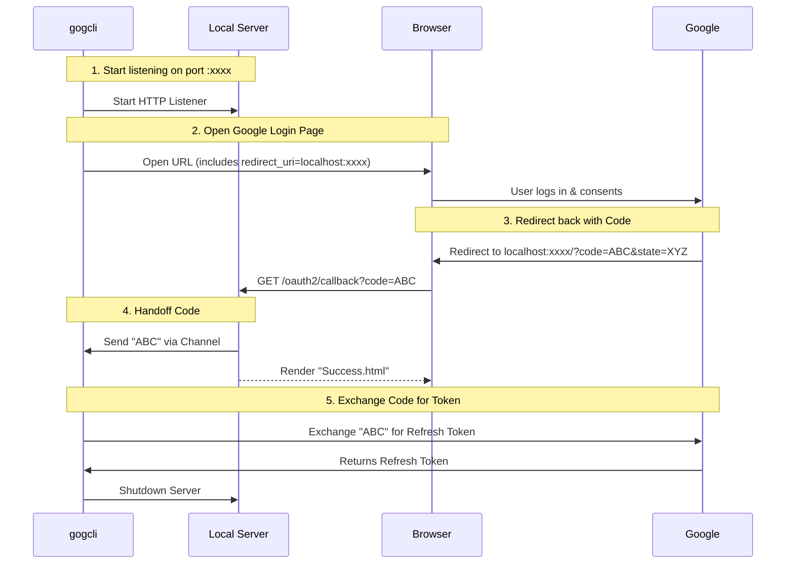

# Chapter 2: Authentication Flow & Server

In the previous chapter, [CLI Command Framework](01_cli_command_framework.md), we built the skeleton of our application—a tree of commands waiting to be executed.

But a command like `gog gmail list` is useless if it can't talk to Google. To do that, Google needs to know who you are.

In a web application, you just click "Login with Google." But **gogcli** is a text-based tool running in your terminal. It cannot display a login page. So, how do we log in?

We perform a "dance" called **OAuth2**.

## The Problem: The Terminal is Blind

Google will never let you type your password directly into `gogcli`. That would be insecure. Instead, Google requires you to log in via their official web page.

This creates a disconnect:
1.  **Terminal:** Wants the security token.
2.  **Browser:** Has the login page.

We need a bridge between the two.

## The Solution: A Temporary Web Server

To solve this, `gogcli` temporarily pretends to be a web server.

When you run `gog auth add`:
1.  The CLI starts a tiny web server on your computer (e.g., `localhost:54321`).
2.  It opens your default web browser to Google's login page.
3.  You log in and click "Allow."
4.  Google sends your browser *back* to `localhost:54321` with a secret code.
5.  The CLI catches this code and shuts down the server.

### The "Waiter" Analogy

Imagine `gogcli` is a **Waiter** at a restaurant.
1.  You (the User) ask for a special dish (Access Token).
2.  The Waiter can't cook it. They give you a ticket (URL) and say, "Go to the kitchen (Google) and show them this."
3.  The Waiter stands by a specific table (Localhost Port) and waits.
4.  You go to the kitchen, get the dish, and bring it back to that specific table.
5.  The Waiter picks it up and serves you.

## 1. Spinning Up the Listener

Let's look at how we implement this "Waiter" in `internal/googleauth/oauth_flow.go`.

First, we need to find a place to listen. We don't want to hardcode a port (like 8080) because another app might be using it.

```go
// internal/googleauth/oauth_flow.go

// "127.0.0.1:0" tells the OS: "Give me ANY available port"
ln, err := (&net.ListenConfig{}).Listen(ctx, "tcp", "127.0.0.1:0")

// We ask the listener which port it actually got (e.g., 54321)
port := ln.Addr().(*net.TCPAddr).Port

// We construct the URL where we expect Google to send the user back
redirectURI := fmt.Sprintf("http://127.0.0.1:%d/oauth2/callback", port)
```

**What is happening?**
*   **`net.Listen`**: This opens a "socket" on your computer. It's ready to accept network connections.
*   **`:0`**: This is a magic number. It asks the Operating System to pick a random free port for us, preventing conflicts.
*   **`redirectURI`**: This is the address we will tell Google to return to.

## 2. Opening the Browser

Now that the server is listening, we need to send the user to Google. We generate a URL containing our `redirectURI`.

```go
// internal/googleauth/oauth_flow.go

// Generate the Google Login URL
authURL := cfg.AuthCodeURL(state, authURLParams(opts.ForceConsent)...)

// Print instructions in case the automatic open fails
fmt.Fprintln(os.Stderr, "Opening browser for authorization…")
fmt.Fprintln(os.Stderr, authURL)

// Automatically open the user's default browser
_ = openBrowserFn(authURL)
```

At this point, the CLI effectively pauses. It is waiting for the browser to come back.

## 3. Catching the Callback

This is the most critical part. We need a function to handle the incoming connection when Google redirects the browser back to `localhost`.

We create an HTTP handler:

```go
// internal/googleauth/oauth_flow.go

handler := func(w http.ResponseWriter, r *http.Request) {
    // 1. Extract the "code" query parameter from the URL
    code := r.URL.Query().Get("code")

    if code == "" {
        // Handle error: Google didn't give us a code
        renderErrorPage(w, "Missing authorization code.")
        return
    }

    // 2. Send the code to the main program via a Go Channel
    codeCh <- code

    // 3. Show a nice "Success" HTML page to the user
    renderSuccessPage(w)
}
```

**Key Concept: Channels (`codeCh`)**
Since the web server runs in its own routine (concurrently), the main CLI program needs a way to get the data out. We use a **Go Channel** (`codeCh`) to pass the code from the web server back to the main application logic.

## 4. Exchanging the Code

The "Code" we received isn't the token yet. It's just a one-time proof that the user logged in. We must exchange it for the actual credentials (Refresh Token).

```go
// internal/googleauth/oauth_flow.go

// Wait for the code to arrive on the channel
case code := <-codeCh:
    fmt.Fprintln(os.Stderr, "Authorization received. Finishing…")

    // Exchange the temporary code for permanent tokens
    tok, err := cfg.Exchange(ctx, code)
    
    // We specifically want the Refresh Token (for long-term access)
    return tok.RefreshToken, nil
```

Once we have the `RefreshToken`, we can shut down the local server (`srv.Close()`). The dance is over!

## Security: The "State" Token

You might notice a variable called `state` in the code.

```go
// Check if the state matches what we sent
if q.Get("state") != state {
    renderErrorPage(w, "State mismatch - possible CSRF attack.")
    return
}
```

**Why do we need this?**
Imagine a hacker creates a malicious link. If you click it, it could trick your local CLI into logging into *their* Google account, or tricking you into granting permissions you didn't intend.

**The "Claim Check" Analogy:**
When we open the browser, we give the user a random ticket number (`state`). When the user comes back from Google, they must show us that same ticket number. If the numbers don't match, we know the request didn't originate from our CLI, and we block it.

## Visualization: The Sequence Diagram

Here is how the participants interact during `gog auth add`:



## Summary

In this chapter, we learned how **gogcli** handles the complex OAuth2 flow without a graphical interface:

1.  **Improvise:** It spins up a temporary `http.Server`.
2.  **Delegate:** It uses the system browser to handle the UI part of the login.
3.  **Listen:** It captures the callback on a random local port.
4.  **Exchange:** It swaps the authorization code for a long-lived Refresh Token.

Now we have a high-value secret: the **Refresh Token**. This token effectively gives anyone who possesses it access to your Google Data. We cannot just save this in a plain text file.

In the next chapter, we will learn how to store this token securely using the operating system's encrypted keychain.

[Secure Secret Storage (Keyring)](03_secure_secret_storage__keyring_.md)

---

Generated by [Code IQ](https://github.com/adityasoni99/Code-IQ)