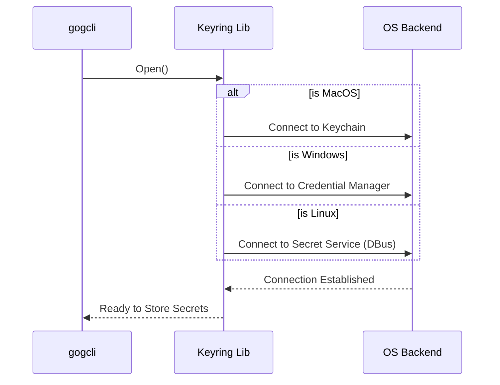

# Chapter 3: Secure Secret Storage (Keyring)

In the previous chapter, [Authentication Flow & Server](02_authentication_flow___server.md), we successfully performed the OAuth2 "dance" with Google. At the end of that process, we obtained a prize: the **Refresh Token**.

This token is the "Key to the Kingdom." It allows `gogcli` to generate new access tokens forever without asking the user to log in again.

**The Problem:** Where do we put this key?
*   **Plain text file?** If we save it in `config.json`, anyone who can read that file can steal your identity.
*   **Environment Variable?** Too cumbersome to set up every time you open a terminal.

**The Solution:** The **Keyring**.
Operating systems have built-in digital safes:
*   **macOS:** Keychain
*   **Windows:** Credential Manager
*   **Linux:** Secret Service (GNOME Keyring / KWallet)

In this chapter, we will build an abstraction that talks to these secure safes.

## The Interface: The "Store" Contract

We don't want our main code to worry about whether it is running on Windows or a Mac. We want a unified way to say "Save this secret."

We define this contract in `internal/secrets/store.go` using a Go **Interface**.

```go
// internal/secrets/store.go

type Store interface {
    // Save a token for a specific email
    SetToken(client string, email string, tok Token) error
    
    // Retrieve a token
    GetToken(client string, email string) (Token, error)
    
    // Delete a token (e.g., during logout)
    DeleteToken(client string, email string) error
}
```

**What is happening?**
This interface promises that whatever storage backend we use (Mac, Windows, or File), it will support these three basic operations.

## Storing Data: Serialization

Keychains usually store simple pairs: a **Key** (the name) and a **Secret** (a blob of text or bytes).

 However, our `Token` is a complex Go struct containing the refresh token, creation date, and scopes.

```go
// internal/secrets/store.go

type Token struct {
    Email        string    `json:"email"`
    RefreshToken string    `json:"-"` // The sensitive part!
    Scopes       []string  `json:"scopes"`
    CreatedAt    time.Time `json:"created_at"`
}
```

To fit this struct into the keychain, we must convert it into JSON (text) before saving it.

### The `SetToken` Implementation

Here is how we implement the logic to save a token. Note how we convert the data to JSON before handing it to the underlying ring.

```go
// internal/secrets/store.go

func (s *KeyringStore) SetToken(client, email string, tok Token) error {
    // 1. Convert the Go struct to JSON bytes
    payload, err := json.Marshal(tok)
    if err != nil {
        return err
    }

    // 2. Create a standardized item
    item := keyring.Item{
        Key:   fmt.Sprintf("token:%s:%s", client, email),
        Data:  payload,
        Label: "gogcli",
    }

    // 3. Save it to the OS Keychain
    return s.ring.Set(item)
}
```

**The Process:**
1.  **Marshal:** Squashes the `Token` struct into a JSON string.
2.  **Key Naming:** We create a unique name like `token:default:user@gmail.com` so we can find it later.
3.  **Label:** "gogcli" ensures that when the OS asks for permission ("gogcli wants to access your keychain"), the user knows who is asking.

## Under the Hood: The Universal Adapter

We use a library called `99designs/keyring`. It acts as a universal adapter.

When `gogcli` starts, it tries to open the keychain. It automatically detects the operating system.



### Opening the Ring

The `OpenDefault` function handles the connection logic. It's robust enough to handle servers that don't have a screen (headless).

```go
// internal/secrets/store.go

func OpenDefault() (Store, error) {
    // Define configuration
    cfg := keyring.Config{
        ServiceName: "gogcli",
        
        // Allowed backends (Mac, Windows, Linux, File)
        AllowedBackends: []keyring.BackendType{
            keyring.KeychainBackend,
            keyring.WinCredBackend, 
            keyring.FileBackend,
        },
    }

    // Open the ring
    ring, err := keyring.Open(cfg)
    return &KeyringStore{ring: ring}, err
}
```

## The Fallback: Headless Servers

What happens if you run `gogcli` on a Linux server without a graphical interface? There is no "GNOME Keyring" there.

If `gogcli` detects this, it falls back to the **File Backend**.

1.  It creates a file on the disk to store secrets.
2.  **Crucially**, it encrypts this file.
3.  It asks the user for a passphrase (or reads it from `GOG_KEYRING_PASSWORD`).

This ensures that even on a server, your tokens aren't just sitting in a plain text file.

```go
// Internal logic simplified

if isHeadlessLinux {
    // If we can't find a desktop keychain...
    cfg.AllowedBackends = []keyring.BackendType{keyring.FileBackend}
    
    // We need a password to encrypt the file
    cfg.FilePasswordFunc = func(s string) (string, error) {
        return "Please enter a password for the keyring file:", nil
    }
}
```

## Retrieving the Token

When the user runs `gog gmail list`, we need the token back to authenticate the request. We reverse the storage process.

```go
// internal/secrets/store.go

func (s *KeyringStore) GetToken(client, email string) (Token, error) {
    // 1. Ask the OS for the data
    key := fmt.Sprintf("token:%s:%s", client, email)
    item, err := s.ring.Get(key)
    if err != nil {
        return Token{}, err
    }

    // 2. Convert JSON back to Go struct
    var tok Token
    if err := json.Unmarshal(item.Data, &tok); err != nil {
        return Token{}, err
    }

    return tok, nil
}
```

**Why is this secure?**
If a malicious script runs on your computer, it cannot easily get this token. On macOS, for example, the OS will pop up a dialog: *"Terminal wants to access the key 'gogcli'. Allow?"*. Unless the user clicks Allow, the token remains hidden.

## Tying It Together

In the previous chapter's `AuthAddCmd`, we used this system in the final step.

1.  User logs in via Browser.
2.  We get `RefreshToken`.
3.  **We call `store.SetToken(...)`.**

Now, the token is safe in the OS vault.

## Summary

In this chapter, we learned how to move sensitive data out of our code and configuration files.

*   **Interface:** We used a `Store` interface to decouple our code from OS specifics.
*   **Keyring:** We leveraged the OS's native password manager (Keychain/CredMan).
*   **Serialization:** We stored complex structs as JSON blobs.
*   **Fallback:** We handled headless environments using encrypted files.

Now we have the **Command Framework** (Chapter 1), the **Authentication** (Chapter 2), and the **Secure Storage** (Chapter 3).

We have everything we need to actually talk to Google. In the next chapter, we will build the client that uses these tokens to make API requests, handling retries and rate limits automatically.

[Resilient API Client Layer](04_resilient_api_client_layer.md)

---

Generated by [Code IQ](https://github.com/adityasoni99/Code-IQ)