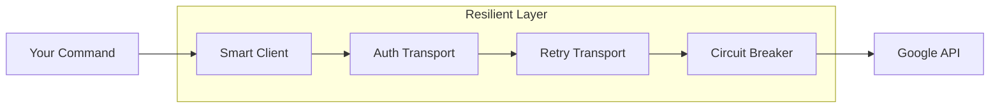
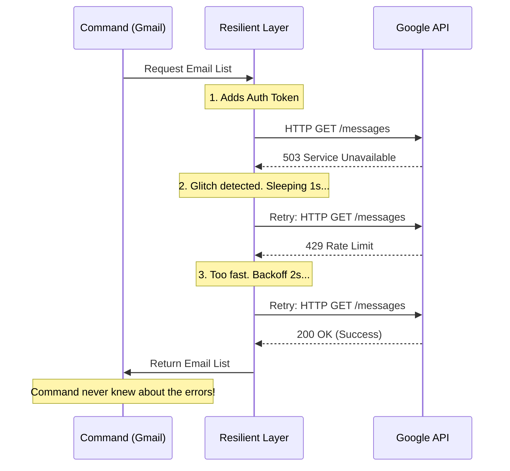

# Chapter 4: Resilient API Client Layer

In the previous chapter, [Secure Secret Storage (Keyring)](03_secure_secret_storage__keyring_.md), we learned how to safely store the "Key to the Kingdom" (the Refresh Token).

Now we have a token, and we are ready to talk to Google.

However, the internet is a chaotic place. Connections drop. Servers get overloaded. If you write a script to upload 1,000 files, Google might yell, "Stop! You are going too fast!" (Rate Limiting).

**The Problem:**
If we write a simple script, we have to handle these errors manually every single time:
```go
// Bad approach: Repeating this everywhere
if err == "Rate Limit" {
    sleep(1 second)
    try_again()
}
```

**The Solution:**
We build a **Resilient API Client Layer**.
Think of this layer as a **Smart Bodyguard** for your HTTP requests.
1.  **It prepares the VIP:** It fetches the token and authenticates the request.
2.  **It handles trouble:** If the server says "wait," it waits. If the server is down, it retries.
3.  **It protects you:** If the server is completely broken, it stops sending requests (Circuit Breaker) so your app doesn't hang.

## 1. The Architecture

Instead of creating a standard Go `http.Client`, `gogcli` uses a factory function that constructs a "super-client."



## 2. The Retry Transport (The Patient Courier)

The core of this layer is the **RetryTransport**. In Go, a `Transport` is the part of the client that actually sends data over the wire. We can wrap the default transport with our own logic.

Imagine a Courier trying to deliver a package.

### Handling "Too Many Requests" (429)

If Google responds with `429 Too Many Requests`, it means we need to slow down. Our transport intercepts this response *before* your command sees it.

```go
// internal/googleapi/transport.go

// Loop until we succeed or give up
for {
    resp, err := t.Base.RoundTrip(req)
    
    // Rate limit (429) logic
    if resp.StatusCode == http.StatusTooManyRequests {
        // Calculate how long to wait (Exponential Backoff)
        delay := t.calculateBackoff(retries429, resp)
        
        // Pause execution
        time.Sleep(delay)
        
        retries429++
        continue // Jump back to start of loop
    }
    // ... handle other codes ...
}
```

**What is happening?**
The code sees the `429`. It calculates a delay (e.g., 1 second, then 2 seconds, then 4 seconds). It sleeps, then tries the loop again. Your main command never knows this happened; it just sees a successful result eventually.

### Handling Server Errors (5xx)

Sometimes Google has a momentary glitch (Error 500, 502, 503). We handle this almost exactly the same way.

```go
// internal/googleapi/transport.go

// Server error (5xx) logic
if resp.StatusCode >= 500 {
    // Check if we hit the limit
    if retries5xx >= t.MaxRetries5xx {
        return resp, nil // Give up
    }

    // Sleep for a default time (e.g., 500ms)
    time.Sleep(ServerErrorRetryDelay)
    
    retries5xx++
    continue
}
```

## 3. The Circuit Breaker (The Fuse)

Retrying is good for temporary glitches. But what if Google is completely down for maintenance?

If we retry 1,000 requests 5 times each, we waste resources and time. We need a "Fuse" that blows to stop the flow of electricity.

We implement this in `internal/googleapi/circuitbreaker.go`.

### Checking the State

Before sending *any* request, we check if the circuit is open.

```go
// internal/googleapi/transport.go

func (t *RetryTransport) RoundTrip(req *http.Request) (*http.Response, error) {
    // 1. Check the fuse
    if t.CircuitBreaker.IsOpen() {
        return nil, errors.New("circuit breaker is open")
    }

    // 2. Proceed with request...
}
```

### Tripping the Switch

If we get too many failures in a row, we "trip" the breaker.

```go
// internal/googleapi/circuitbreaker.go

func (cb *CircuitBreaker) RecordFailure() bool {
    cb.failures++
    
    // If 5 failures happen in a row...
    if cb.failures >= CircuitBreakerThreshold {
        cb.open = true // STOP EVERYTHING
        return true
    }
    return false
}
```

Now, all future requests fail instantly without touching the network, saving time until the system resets (e.g., after 30 seconds).

## 4. The Factory: Assembling the Client

Now we need to glue all these pieces together:
1.  **The Keyring:** Get the token.
2.  **The Auth Layer:** Embed the token in headers.
3.  **The Retry Layer:** Wrap the transport.

We do this in `internal/googleapi/client.go`.

### Retrieving the Token

First, we use the storage mechanism we built in [Secure Secret Storage (Keyring)](03_secure_secret_storage__keyring_.md).

```go
// internal/googleapi/client.go

// Get the secure store
store, _ := secrets.OpenDefault()

// Retrieve the token for this user
tok, err := store.GetToken("default", "user@gmail.com")

if err != nil {
    // If missing, tell user to login
    return nil, fmt.Errorf("please run 'gog auth add' first")
}
```

### Wrapping the Layers

Here is the factory method that returns the final `http.Client`.

```go
// internal/googleapi/client.go

// Create the base transport (Standard HTTP)
baseTransport := &http.Transport{}

// Wrap it with OAuth2 (adds Authorization header)
authTransport := &oauth2.Transport{
    Source: tokenSource, // Handles token refreshing automatically
    Base:   baseTransport,
}

// Wrap THAT with our Retry Logic
retryTransport := NewRetryTransport(authTransport)

// Return the final client
return &http.Client{
    Transport: retryTransport,
    Timeout:   30 * time.Second,
}
```

## Visualizing the Flow

Let's see what happens when you run a command like `gog gmail list` and the network is acting up.



## Summary

In this chapter, we built a robust foundation for all our API interactions.

*   **RetryTransport:** Automatically handles hiccups (5xx) and speed limits (429) using exponential backoff.
*   **CircuitBreaker:** Prevents our app from wasting time when Google is down.
*   **Factory Pattern:** Hides all this complexity behind a simple function call.

We now have a CLI that is smart, secure, and resilient. It can authenticate, store secrets, and handle network errors.

It is time to actually **do something** with it.

In the next chapter, we will use this client to interact with the Gmail API to compose and send emails.

[Email Composition & Tracking](05_email_composition___tracking.md)

---

Generated by [Code IQ](https://github.com/adityasoni99/Code-IQ)