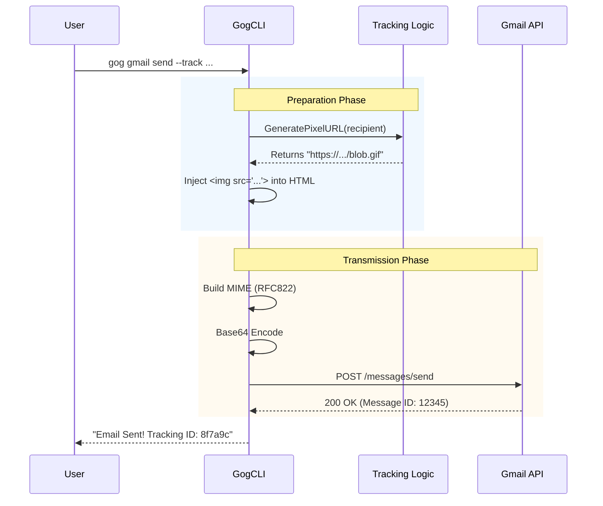

# Chapter 5: Email Composition & Tracking

In the previous chapter, [Resilient API Client Layer](04_resilient_api_client_layer.md), we built a "Smart Bodyguard" client that handles authentication and network errors. We now have a secure line to Google.

But what do we send through that line?

If you want to send a simple "Hello," it's easy. But modern emails are complex. They have **Attachments**, **Rich HTML**, **Reply Threads**, and **Tracking Pixels**.

In this chapter, we will build the **Email Composition Layer**. We will learn how to construct complex "MIME" packages and how to implement a "Open Tracking" feature using a hidden spy pixel.

## The Challenge: The "MIME" Sandwich

Google's API doesn't have a simple function like `Send(text, attachment)`. Instead, it expects you to upload a raw byte stream formatted according to the **MIME (Multipurpose Internet Mail Extensions)** standard.

Think of a complex email like a **Club Sandwich**:
1.  **Top Slice (Headers):** To, From, Subject, Date.
2.  **Layer 1 (Text):** The plain text version (for Apple Watch or old phones).
3.  **Layer 2 (HTML):** The colorful version (for Outlook/Gmail).
4.  **Side Dish (Attachment):** A PDF or Image file.

If we don't stack these layers perfectly, the email will look like garbage to the recipient.

## Use Case: The Tracked HTML Email

Let's focus on a specific, powerful use case: **Sending an HTML email that tells us when the recipient opens it.**

User command:
```bash
gog gmail send --to="client@example.com" \
    --subject="Proposal" \
    --body-html="<h1>Click here</h1>" \
    --track
```

To make this work, `gogcli` needs to:
1.  **Generate** a unique tracking ID.
2.  **Construct** a tracking URL.
3.  **Inject** an invisible image tag into the user's HTML.
4.  **Package** it all into a MIME message.
5.  **Send** it via the API.

## Concept 1: The "Spy Pixel" (Open Tracking)

How does email tracking work? It uses a clever trick from the 1990s.

We insert an image into the email.
``

However, this isn't a logo. It is a **1x1 transparent pixel**. The user cannot see it. But when their email client loads images, it must download this pixel from our server.

When our server receives the request, it logs: *"Someone just opened the email!"*

### 1. Generating the Tracking URL

We don't want the URL to look scary like `?user=client@example.com`. That is insecure. Instead, we encrypt the data into a random-looking blob.

Here is the logic from `internal/tracking/pixel.go`:

```go
// internal/tracking/pixel.go

// 1. Create a payload with the recipient and timestamp
payload := &PixelPayload{
    Recipient:   recipient,
    SentAt:      time.Now().Unix(),
}

// 2. Encrypt the payload into a secure string (blob)
// result: "8f7a9c..."
blob, err := Encrypt(payload, cfg.TrackingKey)

// 3. Construct the URL
// result: "https://api.gogcli.com/p/8f7a9c.gif"
pixelURL := fmt.Sprintf("%s/p/%s.gif", cfg.WorkerURL, blob)
```

**Why do we do this?**
If we just used plain text, anyone could fake an "open" event. By encrypting it, only valid emails sent by us can trigger the tracking system.

### 2. The Worker Response

The server that receives this request (the "Worker") must reply instantly with an image, or the user will see a "broken image" icon.

In `internal/tracking/worker/src/pixel.ts`, we serve a hardcoded array of bytes representing a transparent GIF.

```typescript
// internal/tracking/worker/src/pixel.ts

// This looks like gibberish, but it's the binary data for a GIF
export const TRANSPARENT_GIF = new Uint8Array([
  0x47, 0x49, 0x46, 0x38, 0x39, 0x61, ... // Magic GIF headers
]);

// Return it with the correct headers so the browser accepts it
return new Response(TRANSPARENT_GIF, {
  headers: { 'Content-Type': 'image/gif' },
});
```

## Concept 2: Composition & Injection

Now that we have our tracking URL, we need to sneak it into the email body.

### 1. Modifying the HTML

We treat the HTML body string like a simple text variable. We look for the closing `</body>` tag and paste our pixel right before it.

```go
// internal/cmd/gmail_send.go

func injectTrackingPixelHTML(htmlBody, pixelHTML string) string {
    // Convert to lowercase to find </body> easily
    lower := strings.ToLower(htmlBody)
    
    // Find the end of the body
    if i := strings.LastIndex(lower, "</body>"); i != -1 {
        // Insert the pixel before the tag
        return htmlBody[:i] + pixelHTML + htmlBody[i:]
    }
    
    // Fallback: just append it to the end
    return htmlBody + pixelHTML
}
```

### 2. Packaging the MIME Message

Now we take the modified HTML and package it for Google. We use a helper struct to organize the "Sandwich."

```go
// internal/cmd/gmail_send.go

// Create the raw MIME string (Headers + Body + Boundaries)
rawBytes, err := buildRFC822(mailOptions{
    To:          ["client@example.com"],
    Subject:     "Proposal",
    BodyHTML:    htmlBodyWithPixel, // The modified body
}, nil)

// Google requires the raw bytes to be Base64 Encoded
msg := &gmail.Message{
    Raw: base64.RawURLEncoding.EncodeToString(rawBytes),
}
```

**What is Base64?**
Email protocols are very old and sometimes choke on special characters. Base64 turns any data (images, text, emojis) into safe, standard letters and numbers (`A-Z`, `0-9`). It makes the message larger, but ensures it travels safely.

## Concept 3: The Reply Chain

Sending a new email is straightforward. **Replying** is harder.

To reply to an email, you can't just send a message with the same Subject. You must link the emails together so they appear as a "Thread" or "Conversation."

We use three specific headers to do this:
1.  **ThreadId:** Tells Gmail "This belongs in this visual folder."
2.  **In-Reply-To:** "I am replying specifically to Message ID X."
3.  **References:** "Here is the list of all previous Message IDs in this conversation."

### Fetching Context

Before we can reply, `gogcli` must fetch the original email to get these IDs.

```go
// internal/cmd/gmail_send.go

// 1. Get the original message the user wants to reply to
msg, _ := svc.Users.Messages.Get("me", replyToID).Do()

// 2. Extract the ID to link our new message
inReplyTo := msg.Header["Message-ID"]

// 3. Extract the Thread ID
threadID := msg.ThreadId
```

When we send the new message, we attach these values. If we skip this, the reply will break out into a new, separate email conversation, annoying the user.

## Putting It All Together: The Execution Flow

Here is what happens when the user presses Enter.



## The Implementation

The `Run` method in `GmailSendCmd` orchestrates this entire process. It is a long function, but it follows a logical path:

1.  **Validation:** Do we have a recipient? Do we have a body?
2.  **Resolution:** If `--track` is on, generate the pixel.
3.  **Expansion:** If sending to multiple people with `--track-split`, break it into individual emails (so each person gets a unique tracking pixel).
4.  **Sending:** Loop through the batches and send.

```go
// internal/cmd/gmail_send.go (Simplified)

func (c *GmailSendCmd) Run(ctx context.Context) error {
    // 1. Prepare the client (from Chapter 4)
    svc, _ := newGmailService(ctx, account)

    // 2. Loop through recipients (Simple or Batched)
    for _, batch := range batches {
        
        // 3. Generate Pixel if tracking is on
        if c.Track {
            url, _ := tracking.GeneratePixelURL(cfg, batch.Recipient, c.Subject)
            c.BodyHTML = injectTrackingPixelHTML(c.BodyHTML, tracking.GeneratePixelHTML(url))
        }

        // 4. Send the email
        // uses the buildRFC822 logic internally
        svc.Users.Messages.Send("me", message).Do()
    }
    
    return nil
}
```

## Summary

In this chapter, we learned that sending an email is a construction project.

*   **MIME:** We wrap text, HTML, and files into a standard package.
*   **Tracking:** We use a transparent 1x1 GIF and encrypted URLs to detect when an email is read.
*   **Injection:** We silently modify the HTML body to insert our tracker.
*   **Threading:** We use specific headers (`In-Reply-To`) to keep conversations together.

We have successfully sent the email! But the CLI just prints a boring ID like `message_id: 18ab39c`.

To make a truly great tool, we need to present this data beautifully. Maybe we want JSON output for scripts, or a nice table for humans.

In the next chapter, we will learn how to transform raw data into useful information.

[Output Formatting & Transformation](06_output_formatting___transformation.md)

---

Generated by [Code IQ](https://github.com/adityasoni99/Code-IQ)