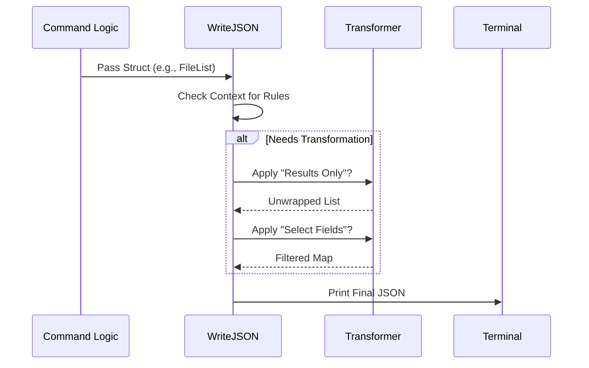

# Chapter 6: Output Formatting & Transformation

In the previous chapter, [Email Composition & Tracking](05_email_composition___tracking.md), we built a powerful email engine. When we sent an email, the CLI successfully talked to Google, but the output on your screen was likely just a raw ID or a simple success message.

**The Problem:**
Different users need different things:
1.  **Humans** want readable text, tables, and colors.
2.  **Scripts (Robots)** want strict, predictable JSON to pipe into other tools (like `jq`).

If we write `if json_mode { ... } else { ... }` inside every single command (Gmail, Drive, Calendar), our code becomes a mess.

**The Solution:**
We create a generic **Output Layer** (`outfmt`). This layer sits between your command's logic and the user's terminal. It acts as a "Universal Translator," automatically formatting data based on global flags like `--json`, `--select`, or `--results-only`.

## The Use Case: The "Bubble Wrap" Problem

Imagine running a command to list files: `gog drive ls`.

Google's API doesn't just give you the files. It wraps them in metadata "bubble wrap" (pagination tokens, request IDs, etc.):

```json
{
  "kind": "drive#fileList",
  "nextPageToken": "xa123...",
  "files": [
    { "id": "1", "name": "Resume.pdf" },
    { "id": "2", "name": "Budget.xls" }
  ]
}
```

If you are writing a script to delete all these files, that wrapper is annoying. You just want the list inside `"files"`.

With our `outfmt` layer, the user can type:
`gog drive ls --json --results-only --select=id`

And `gogcli` will automatically output:
```json
[
  { "id": "1" },
  { "id": "2" }
]
```

Let's build the engine that makes this possible.

## 1. The Context "Backpack"

In Go, `context.Context` is like a backpack that gets passed from the `main()` function down to every sub-command. We use this backpack to carry the user's "Display Preferences."

In `internal/cmd/root.go`, we check the flags and pack the bag.

```go
// internal/cmd/root.go

// 1. Determine the mode (JSON vs Plain)
mode, _ := outfmt.FromFlags(cli.JSON, cli.Plain)

// 2. Determine transformation rules (Select fields, Unwrap results)
transform := outfmt.JSONTransform{
    ResultsOnly: cli.ResultsOnly,
    Select:      splitCommaList(cli.Select),
}

// 3. Put them in the Context "Backpack"
ctx = outfmt.WithMode(ctx, mode)
ctx = outfmt.WithJSONTransform(ctx, transform)
```

**Why do we do this?**
Now, deep down in the `GmailSendCmd`, the code doesn't need to know *how* to print. It just returns data, and the printing layer checks the backpack to decide how to format it.

## 2. The Implementation: `WriteJSON`

The core logic lives in `internal/outfmt/outfmt.go`. When a command wants to print data, it calls `outfmt.WriteJSON`.

Here is the high-level flow:



### The Code: Transforming Data

The trickiest part is modifying a Go Struct (which is rigid) at runtime based on user flags. To do this, we convert the struct into a generic map (`map[string]any`).

```go
// internal/outfmt/outfmt.go

func applyJSONTransform(v any, t JSONTransform) (any, error) {
    // 1. Turn strict Go Struct into generic JSON bytes
    b, _ := json.Marshal(v)

    // 2. Turn bytes into a flexible Map
    var anyV any
    json.Unmarshal(b, &anyV)

    // 3. Apply the filters
    if t.ResultsOnly {
        anyV = unwrapPrimary(anyV) // Strip the bubble wrap
    }
    if len(t.Select) > 0 {
        anyV = selectFields(anyV, t.Select) // Pick specific fields
    }

    return anyV, nil
}
```

**Explanation:**
1.  **Marshal/Unmarshal:** This might seem redundant, but it's the easiest way to turn a strict struct (like `DriveFile`) into a generic map that we can easily delete keys from.
2.  **`unwrapPrimary`**: Locates the actual data.
3.  **`selectFields`**: Deletes every key *except* the ones the user asked for.

## 3. The Heuristic: "Guessing" the Result

How does `gogcli` know that inside a Drive response, the data is in `"files"`, but in Gmail, it is in `"messages"`?

We use a **Heuristic** (an educated guess). We look at the keys in the map and compare them against a "Known List."

```go
// internal/outfmt/outfmt.go

func unwrapPrimary(v any) any {
    m := v.(map[string]any) // Assume it's a map

    // List of common API keys that hold the real data
    known := []string{"files", "messages", "events", "contacts"}

    for _, k := range known {
        if val, ok := m[k]; ok {
            return val // Found it! Return just the list.
        }
    }
    
    return v // Couldn't guess, return original
}
```

**Beginner Note:**
This allows us to support dozens of Google APIs without manually writing a "Unwrapper" for every single one. If Google adds a new API that returns `"unicorns": [...]`, we just add `"unicorns"` to this list, and it works everywhere.

## 4. Selecting Fields (Dot Notation)

Users often want nested data. For example, getting a file's ID and its owner's email:
`--select="id,owners.0.email"`

We implement a path traverser to handle this.

```go
// internal/outfmt/outfmt.go

func getAtPath(v any, path string) (any, bool) {
    // Split "owners.0.email" into ["owners", "0", "email"]
    segs := strings.Split(path, ".")
    current := v

    for _, seg := range segs {
        // ... logic to dig deeper into maps or arrays ...
        // If current is array, treat 'seg' as an index number
        // If current is map, treat 'seg' as a key
    }

    return current, true
}
```

This simple loop allows users to surgicaly extract exactly the data they need, making `gogcli` a powerful tool for piping data into other scripts.

## 5. Integrating with Commands

How does a command use this? It's incredibly simple. The command simply returns the full struct.

**Before (Manual printing - Bad):**
```go
// Bad: Hardcoded printing logic
func Run() {
    files := api.GetFiles()
    if jsonMode {
        fmt.Println(toJson(files))
    } else {
        fmt.Println(files[0].Name)
    }
}
```

**After (Using our Abstraction - Good):**
```go
// Good: Decoupled logic
func Run(ctx context.Context) error {
    files := api.GetFiles()
    
    // The abstraction handles JSON, Plain, Color, and Filtering automatically
    return outfmt.WriteJSON(ctx, os.Stdout, files)
}
```

This keeps our command files clean and focused purely on business logic (talking to Google), rather than presentation logic.

## Summary

In this chapter, we learned how to separate **Data** from **Presentation**.

*   **Context:** We use the `context` to store global user preferences (`--json`, `--plain`).
*   **Transformation:** We convert strict structs into generic maps to perform dynamic filtering.
*   **Heuristics:** We use "smart guessing" to unwrap API envelopes automatically via `--results-only`.
*   **Selection:** We allow users to pick specific fields using dot-notation traversal (`users.0.name`).

### Conclusion of the Tutorial Series

Congratulations! You have navigated through the architecture of a modern, production-grade CLI tool written in Go.

Let's recap what we built:
1.  [**CLI Command Framework:**](01_cli_command_framework.md) Organized commands into a tree structure.
2.  [**Authentication Flow:**](02_authentication_flow___server.md) Implemented OAuth2 with a local web server.
3.  [**Secure Storage:**](03_secure_secret_storage__keyring_.md) Saved secrets in the OS Keychain.
4.  [**Resilient Client:**](04_resilient_api_client_layer.md) Handled retries, rate limits, and circuit breaking.
5.  [**Business Logic:**](05_email_composition___tracking.md) Constructed complex MIME emails and tracking pixels.
6.  [**Output Transformation:**](06_output_formatting___transformation.md) (This chapter) Decoupled data fetching from user presentation.

You now possess the knowledge to build robust command-line tools that are secure, resilient, and user-friendly. Happy coding!

---

Generated by [Code IQ](https://github.com/adityasoni99/Code-IQ)