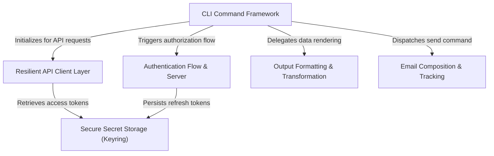

# Tutorial: gogcli

`gogcli` is a robust command-line interface designed to interact with Google Workspace services like Gmail and Drive. It employs a **structured command framework** to separate argument parsing from business logic and delegates data presentation to a flexible **output formatting** layer that supports both human-readable tables and JSON. To ensure reliability and security, the tool utilizes a **resilient API client** with built-in retry mechanisms and manages user credentials via a local **authentication server** backed by the operating system's native **secure keyring**.

**Source Repository:** [https://github.com/steipete/gogcli](https://github.com/steipete/gogcli)

## Chapters

1. [CLI Command Framework](01_cli_command_framework.md)
2. [Authentication Flow & Server](02_authentication_flow___server.md)
3. [Secure Secret Storage (Keyring)](03_secure_secret_storage__keyring_.md)
4. [Resilient API Client Layer](04_resilient_api_client_layer.md)
5. [Email Composition & Tracking](05_email_composition___tracking.md)
6. [Output Formatting & Transformation](06_output_formatting___transformation.md)

---

Generated by [Code IQ](https://github.com/adityasoni99/Code-IQ)