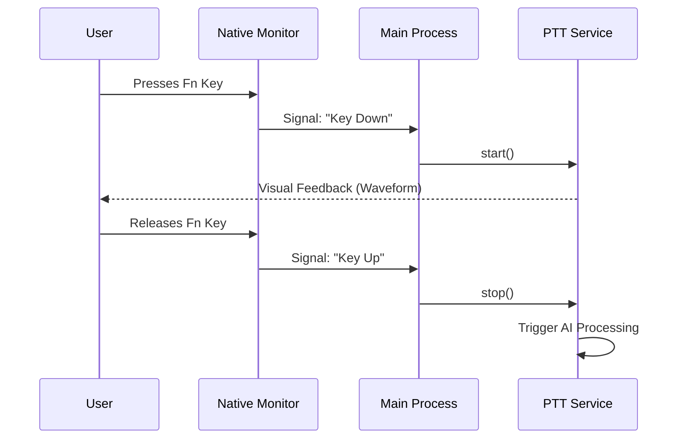

# Chapter 1: Push-to-Talk Orchestration

Welcome to the **Jarvis AI Assistant** project!

In this first chapter, we are going to build the "Director" of our application. Before we worry about complex AI models or transcribing audio, we need a system that knows **when** to listen and **when** to act.

## The Motivation

Imagine using a standard AI tool (like ChatGPT):
1. You switch windows.
2. You click a text box.
3. You type your query.
4. You hit enter.
5. You copy the result.
6. You paste it back into your work.

**That is too slow.**

Our goal is **Push-to-Talk Orchestration**. You press a key (like a Walkie-Talkie), speak, and when you release the key, the AI instantly types the answer into your active window.

To achieve this, we need a "Director"—a central piece of code that orchestrates the flow:
1.  **"Action!"** (Key Down) → Start Recording.
2.  **"Cut!"** (Key Up) → Stop Recording.
3.  **"Edit & Publish"** → Send audio to AI and paste text.

## Key Concepts

### 1. The Global Hotkey
This is the trigger. Unlike a normal website key press (which only works when the browser is open), our app needs to detect the **Fn** (Function) key even when the app is minimized or in the background.

### 2. The State Machine
The application needs to know what "mode" it is in. It acts like a traffic light:
*   **Idle:** Waiting for input.
*   **Recording:** The user is holding the key; capture audio.
*   **Processing:** The user released the key; transcribe and think.
*   **Hands-Free:** The user double-tapped the key; stay recording until told to stop.

### 3. The Orchestrator
This is the code that connects the input (Key Press) to the service (Audio Recorder). It ensures that if you release the key too quickly (a tap), it might do one thing, but if you hold it, it does another.

---

## How It Works: The High-Level Flow

Before looking at code, let's visualize the "Director" in action.



## Internal Implementation

Let's look at how we build this, starting from the lowest level (the keyboard) up to the high-level orchestration.

### Step 1: The Native Ear (C++)
Standard JavaScript cannot listen to global keys on your computer for security reasons. We use a small piece of C++/Objective-C code to "hook" into the operating system.

We will cover the deep details of this in [Native System Bridges](02_native_system_bridges.md), but here is the logic used in `src/native/fn_key_monitor.mm`.

```cpp
// src/native/fn_key_monitor.mm
// A simplified look at how we catch the key press
CGEventRef eventCallback(...) {
    // Check if the flags (like Fn, Ctrl, Alt) changed
    if (type == kCGEventFlagsChanged) {
        // Did the Fn key state change?
        if (isFnKeyPressed != wasFnKeyPressed) {
             // Send signal to JavaScript world!
             sendToMainProcess("FN_KEY_CHANGE");
        }
    }
    return event;
}
```
*Explanation:* This code runs deep in the system. When it detects the specific "flag" (the specific electronic signal of the Fn key), it wakes up our JavaScript app.

### Step 2: The Decision Maker (Main Process)
In `src/main.ts`, our application receives that signal. This is where the "Director" decides what to do. It handles logic like: "Is this a double tap?" or "Should I start recording?"

```typescript
// src/main.ts
async function handleHotkeyDown() {
  // 1. Check if we are already recording (prevent glitches)
  if (pushToTalkService.active) return;

  // 2. Start the visual feedback (show the waveform window)
  waveformWindow.webContents.send('push-to-talk-start');

  // 3. Tell the service to start listening
  await pushToTalkService.start();
}
```

When the user releases the key, the Director shouts "Cut!":

```typescript
// src/main.ts
async function handleHotkeyUp() {
  // 1. Only stop if we were actually recording
  if (pushToTalkService.active) {
    
    // 2. Stop the service
    // The service handles the "magic" (transcription) automatically after stop
    await pushToTalkService.stop();
    
    // 3. Hide the visual feedback
    waveformWindow.webContents.send('push-to-talk-stop');
  }
}
```

### Step 3: The Service (The Orchestrator)
Finally, we have the `PushToTalkService` in `src/input/push-to-talk-refactored.ts`. This class hides the complexity. When `main.ts` calls `.start()`, this service warms up the microphone, prepares the AI, and manages errors.

```typescript
// src/input/push-to-talk-refactored.ts
export class PushToTalkService {
  private orchestrator: PushToTalkOrchestrator;

  // The Main process calls this
  async start(): Promise<void> {
    // We delegate the heavy lifting to the internal orchestrator
    // This ensures thread safety and state management
    await this.orchestrator.start();
  }

  async stop(): Promise<void> {
    // When stopped, the orchestrator automatically triggers
    // the Transcription -> AI -> Paste pipeline
    await this.orchestrator.stop();
  }
}
```

## Summary
In this chapter, we established the **Push-to-Talk Orchestration**:

1.  We have a **Native Bridge** listening for the Fn key.
2.  We have a **Main Process** acting as the Director (Handle Key Down/Up).
3.  We have a **Service** that executes the Start/Stop commands.

This architecture decouples the *input* (the key press) from the *action* (recording). This allows us to easily change the hotkey later or add features like "Hands-Free Mode" (double-tap) without rewriting the recording logic.

In the next chapter, we will dive deeper into how that C++ code actually communicates with our TypeScript application to make the global hotkey possible.

[Next Chapter: Native System Bridges](02_native_system_bridges.md)

---

Generated by [Code IQ](https://github.com/adityasoni99/Code-IQ)