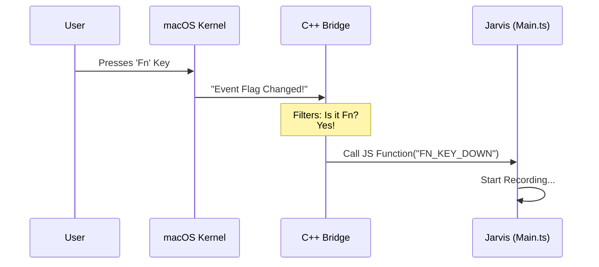

# Chapter 2: Native System Bridges

In the previous chapter, [Push-to-Talk Orchestration](01_push_to_talk_orchestration.md), we built the "Director" of our application—the logic that decides *when* to record.

However, the Director has a problem: **It lives in a browser.**

Electron apps are essentially web pages. For security reasons, a web page cannot listen to your keyboard when you are using a different application (like Word or Chrome), nor can it easily access raw, low-level microphone data without complex permissions.

In this chapter, we will build the **Physical Body** of Jarvis. We will create "Native Bridges" that allow our high-level JavaScript code to talk directly to the low-level macOS operating system.

## The Motivation

Imagine you are a CEO (JavaScript) who only speaks English. You need to give instructions to a factory worker (macOS Hardware) who only speaks a specific local dialect (C++/Objective-C).

You cannot shout instructions directly. You need a **Translator**.

1.  **The Keyboard Problem:** We need to detect the `Fn` key even if Jarvis is minimized.
2.  **The Audio Problem:** We need raw audio data instantly, without the overhead of a web browser's audio processing.
3.  **The Paste Problem:** We need to simulate the user pressing `Cmd+V` to paste text into any window.

The **Native System Bridge** is that translator.

## Key Concepts

### 1. Node Native Add-ons (N-API)
Node.js allows us to write C++ code and compile it so it looks like a standard JavaScript module.
*   **C++ Side:** Hooks into the Operating System (macOS Carbon or AVFoundation APIs).
*   **N-API:** A special library that lets C++ values (like a boolean `true`) become JavaScript values.
*   **JS Side:** Imports the C++ file as if it were a normal `.js` file.

### 2. The Event Loop vs. The System Loop
JavaScript is single-threaded (does one thing at a time). The Operating System is multi-threaded.
Our bridge must run on a background thread listening for keys/audio, and then safely "interrupt" the JavaScript thread to say, "Hey! The user pressed the key!"

### 3. The Blueprint (`binding.gyp`)
Before we write code, we need a recipe file called `binding.gyp`. This tells the compiler how to turn our C++ code into a module our app can use. It links standard Apple frameworks like `Carbon` (Keyboard) and `AVFoundation` (Audio).

---

## The High-Level Flow

Here is how the "Translator" works when you press a key.



## Implementation: The "Ears" (Global Hotkey)

Let's look at how we listen for the `Fn` key. We use a file named `src/native/fn_key_monitor.mm`.

### The C++ Hook
We use a macOS function called `CGEventTapCreate`. Think of this as putting a "wiretap" on the keyboard line.

```cpp
// src/native/fn_key_monitor.mm
// 1. The Callback: This runs every time a key flag changes anywhere in macOS
CGEventRef eventCallback(...) {
    // Get the current flags (Shift, Ctrl, Alt, Fn...)
    CGEventFlags flags = CGEventGetFlags(event);
    
    // Check specifically for the 'SecondaryFn' (Fn key) flag
    bool isFnDown = (flags & kCGEventFlagMaskSecondaryFn) != 0;

    // If the state changed, notify JavaScript
    if (isFnDown != wasPressed) {
        callJavaScript(isFnDown ? "FN_KEY_DOWN" : "FN_KEY_UP");
    }
    return event;
}
```
*Beginner Note:* This C++ code runs constantly in the background. It filters out millions of system events to find the *one* specific signal that the Fn key was pressed.

### Connecting to JavaScript
How does JavaScript start this listener? It's surprisingly simple.

```typescript
// src/input/global-hotkey.ts
const fnMonitor = require('fn_key_monitor.node');

export function startListening() {
    // We pass a function to the C++ module
    fnMonitor.startMonitoring((eventString) => {
        console.log("C++ sent us a message:", eventString);
        
        if (eventString === "FN_KEY_DOWN") {
            // Tell the Orchestrator to start
        }
    });
}
```

## Implementation: The "Mouth" (Audio Capture)

Web browsers process audio heavily (echo cancellation, noise suppression). For AI, we often want the raw, pure sound, or we want to access it faster than the browser allows.

We use `src/native/audio_capture.mm` to talk to the microphone hardware directly using Apple's `AVFoundation`.

### The Audio Recorder
We set up a capture session that grabs audio in small chunks.

```objectivec
// src/native/audio_capture.mm
// This runs whenever the microphone buffer is full
- (void)captureOutput:(...) didOutputSampleBuffer:(CMSampleBufferRef)buffer {
    // 1. Get raw bytes from the hardware buffer
    NSData *data = ExtractAudioData(buffer);
    
    // 2. Send these bytes directly to JavaScript
    // N-API allows us to send a 'Buffer' object
    callJavaScriptAudioCallback(data);
}
```

### Receiving Audio in TypeScript
Back in our TypeScript world (`src/audio/native-audio-recorder.ts`), we receive these raw buffers.

```typescript
// src/audio/native-audio-recorder.ts
const audioModule = require('audio_capture.node');

class NativeAudioRecorder {
  start() {
    // Start the C++ recorder and handle the data stream
    audioModule.startCapture((audioChunk: Buffer) => {
       // We now have raw audio data!
       // We can send this to Deepgram or OpenAI immediately.
       this.audioChunks.push(audioChunk);
    });
  }
}
```
*Why this matters:* By doing this natively, we bypass the browser's lag. The audio goes from Microphone -> C++ -> JavaScript memory almost instantly.

## Implementation: The "Hands" (Text Paster)

Once the AI has generated text, we need to paste it into the user's active application.

Electron cannot easily "type" keys globally. To solve this, we cheat slightly. We don't write C++ for this; instead, we use the Native Bridge to spawn system commands (`osascript` and `pbcopy`).

### The Logic (`src/input/text-paster.ts`)
The fastest way to paste text isn't to type it letter-by-letter, but to put it on the clipboard and simulate `Cmd+V`.

```typescript
// src/input/text-paster.ts
private async pasteTextDirectly(text: string): Promise<void> {
    // 1. Put text into macOS clipboard using 'pbcopy'
    const copyProcess = spawn('pbcopy');
    copyProcess.stdin.write(text);
    
    // 2. Tell macOS to press "Cmd+V" using AppleScript
    // This is much faster than typing simulated keystrokes
    const pasteScript = 'tell application "System Events" to keystroke "v" using command down';
    spawn('osascript', ['-e', pasteScript]);
}
```

## Summary

In this chapter, we built the **Native System Bridges**:

1.  **The Monitor (`fn_key_monitor`):** A C++ hook that listens for the Fn key globally.
2.  **The Ears (`audio_capture`):** An Objective-C module that pulls raw audio from the hardware.
3.  **The Hands (`text-paster`):** A utility that manipulates the system clipboard and simulates keystrokes.

Now that we have the "Director" (Chapter 1) and the "Body" (Chapter 2), we can capture inputs effectively. But what do we do with that audio?

In the next chapter, we will build the brain that converts those raw audio buffers into text.

[Next Chapter: Hybrid Transcription Engine](03_hybrid_transcription_engine.md)

---

Generated by [Code IQ](https://github.com/adityasoni99/Code-IQ)