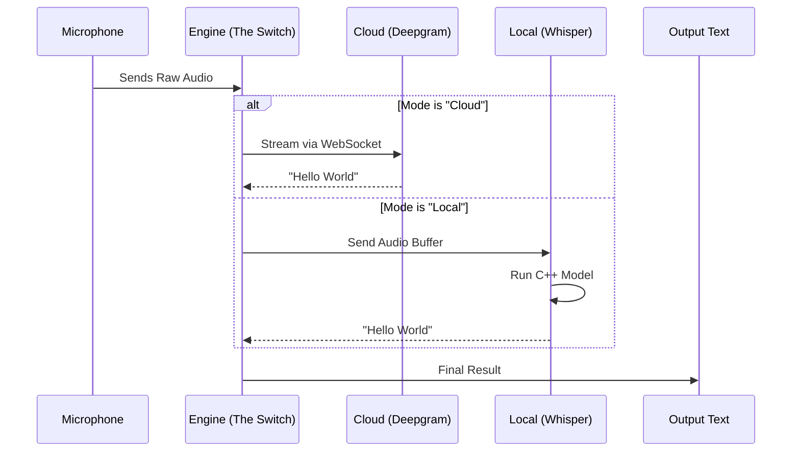

# Chapter 3: Hybrid Transcription Engine

In the previous chapter, [Native System Bridges](02_native_system_bridges.md), we gave Jarvis a "Physical Body." We built the ears (native microphone access) and the nervous system (global hotkeys).

Now, we have a stream of raw audio data coming in. But to a computer, raw audio is just a meaningless list of numbers. To make Jarvis intelligent, we need to turn those numbers into **Words**.

Welcome to the **Hybrid Transcription Engine**.

## The Motivation

Imagine you are a reporter. You have two stenographers (people who type what is spoken) available to you:

1.  **Cloudia:** She lives in a massive data center. She is incredibly fast and understands 30 languages, but you have to call her on the phone (Internet) to dictate.
2.  **Loco:** He sits right next to you in your room. He is a bit slower and uses a lot of your room's oxygen (CPU/RAM), but he works offline, and **nobody else hears what you say**.

A good assistant shouldn't force you to pick just one.
*   When you are dictating a public tweet, you want **Speed** (Cloudia/Deepgram).
*   When you are dictating a private password or analyzing sensitive documents, you want **Privacy** (Loco/Whisper).

This chapter builds the engine that manages these two stenographers.

## Key Concepts

### 1. Hybrid Architecture
This is the ability to switch between an online service and an offline model instantly. Our app abstracts this so the rest of the code simply asks: `getText(audio)` and doesn't care which stenographer does the work.

### 2. WebSockets (The Cloud Tunnel)
For Cloud transcription (Deepgram), we can't just upload a file; that's too slow. We use **WebSockets**. Think of this as opening a permanent tunnel between your computer and the cloud. We throw audio chunks into the tunnel as you speak, and text flies back out instantly.

### 3. The Local Worker (Whisper)
Running a powerful AI model like Whisper on your own computer is heavy work. If we ran this in the main interface, your buttons would freeze while it thinks. We solve this by running Whisper in a **Worker Process**—a separate, invisible window that does the heavy lifting without slowing down the app.

---

## How It Works: The High-Level Flow

Let's visualize how audio turns into text depending on your settings.



## Implementation: The Cloud Engine (Deepgram)

We use `src/transcription/deepgram-streaming-transcriber.ts`. This class manages the WebSocket connection.

### Opening the Tunnel
First, we must establish the connection. We use the specific API key to prove who we are.

```typescript
// src/transcription/deepgram-streaming-transcriber.ts
async connect(): Promise<boolean> {
    // 1. Build the URL with options (e.g., smart_formatting for punctuation)
    const wsUrl = `wss://api.deepgram.com/v1/listen?smart_format=true`;

    // 2. Open the WebSocket
    this.ws = new WebSocket(wsUrl, {
        headers: { 'Authorization': `Token ${this.apiKey}` }
    });

    // 3. Wait for the "Open" signal
    return new Promise(resolve => this.ws.on('open', () => resolve(true)));
}
```

### Sending Audio & Receiving Text
Once the tunnel is open, we just pass data through.

```typescript
// Sending audio
sendAudioData(audioBuffer: Buffer): boolean {
    if (this.ws.readyState === WebSocket.OPEN) {
        this.ws.send(audioBuffer); // Throw audio into the tunnel
        return true;
    }
    return false;
}

// Listening for text
this.ws.on('message', (data) => {
    const response = JSON.parse(data);
    // Deepgram sends "is_final" when it's sure about a sentence
    if (response.is_final) {
        console.log("Transcription:", response.channel.alternatives[0].transcript);
    }
});
```

## Implementation: The Local Engine (Whisper)

Local transcription is more complex because we are running the AI ourselves using C++. We use `src/addon.cpp` (The Muscle) and `src/transcription/whisper-worker.ts` (The Manager).

### The C++ Muscle
We use a Node.js Native Addon (just like in Chapter 2) to wrap the `whisper.cpp` library. This allows JavaScript to command the C++ code.

*Beginner Note: You don't need to write this C++, but understanding it helps. It loads the model file into RAM once, so it's ready to go instantly.*

```cpp
// src/addon.cpp (Simplified)
// This C++ function is callable from JavaScript!
Napi::Value transcribe_audio(const Napi::CallbackInfo& info) {
    // 1. Get audio numbers from JavaScript
    auto audio_array = info[0].As<Napi::Float32Array>();
    
    // 2. Run the Whisper AI Model
    whisper_full(context, params, audio_array.Data(), length);
    
    // 3. Return the text string
    return Napi::String::New(env, resulting_text);
}
```

### The Worker Manager
Because C++ operations can block the computer, we wrap this in a separate Node.js process (`whisper-worker.ts`).

```typescript
// src/transcription/whisper-worker.ts
// This code runs in a background process
import * as whisperAddon from 'whisper-node-addon';

process.on('message', async (msg) => {
    if (msg.type === 'transcribe') {
        // 1. Call the C++ addon
        const result = await whisperAddon.transcribe({
            model: msg.payload.modelPath,
            audio: msg.payload.audioFilePath
        });

        // 2. Send text back to main process
        process.send({ type: 'result', text: result.text });
    }
});
```

## The Unification Layer

Finally, we need a service to handle the result, regardless of where it came from. This is handled in `src/services/transcription-service.ts`.

This service receives the text and decides what to do next (like pasting it into your active window).

```typescript
// src/services/transcription-service.ts
export class TranscriptionService {
  
  // This is called by either Deepgram OR Whisper when they finish
  public handleTranscriptionReady(text: string): void {
    
    // 1. Save it to history
    this.transcripts.push({ text, timestamp: new Date() });

    // 2. Send to the UI (Dashboard)
    windowManager.sendToAllWindows('new-transcription', text);

    // 3. Paste it into the user's active app!
    this.pasteTranscription(text);
  }
}
```

## Summary

In this chapter, we built the **Hybrid Transcription Engine**.

1.  We created a **Cloud Path** using WebSockets and Deepgram for high-speed, streaming text.
2.  We created a **Local Path** using a C++ Addon and Whisper for private, offline capability.
3.  We saw how the **Transcription Service** acts as the final destination, taking the text and preparing it for use.

At this point, you can speak to your computer, and it will type what you say into any window. But Jarvis is supposed to be an *Assistant*, not just a Dictaphone.

If you say **"Write an email to my boss about the delay,"** right now, the app will just type that sentence out. We want it to actually *write the email*.

To do that, we need an AI Brain (LLM) to understand intent.

[Next Chapter: Unified AI Agent & LLM Providers](04_unified_ai_agent___llm_providers.md)

---

Generated by [Code IQ](https://github.com/adityasoni99/Code-IQ)