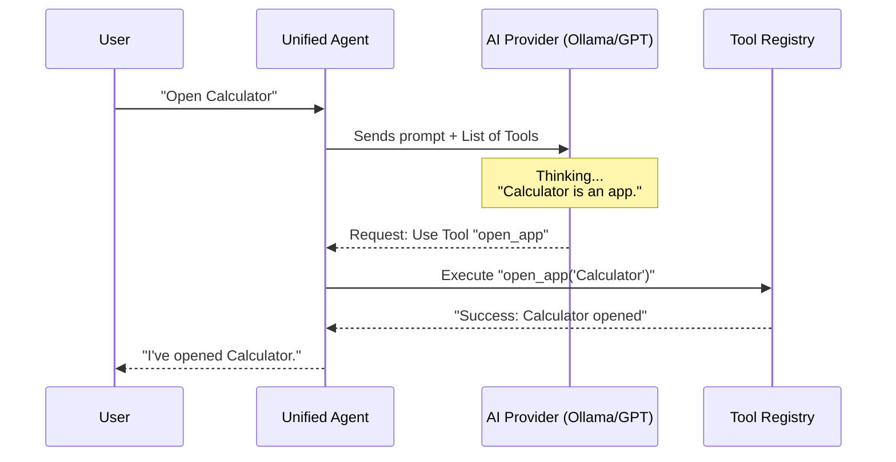

# Chapter 4: Unified AI Agent & LLM Providers

Welcome to the "Brain" of Jarvis!

In the previous chapter, [Hybrid Transcription Engine](03_hybrid_transcription_engine.md), we successfully turned your voice into text. Whether you use the cloud or a local model, Jarvis now receives a string of text like: *"Open Spotify and play my discovery weekly."*

But right now, that is just text. Jarvis doesn't know that "Open" is a command or that "Spotify" is an app. It's just a string of characters.

In this chapter, we will build the **Unified AI Agent**. This is the intelligence layer that takes that text, thinks about it, and decides whether to simply talk back to you or to **perform an action** on your computer.

## The Motivation

Imagine you have a Smart Home with devices from different brands: a Samsung TV, Philips lights, and a Sony speaker.
You do not want three different remote controls. You want one **Universal Remote**.

We face a similar challenge with AI models:
1.  **OpenAI (GPT-4o)** is great for complex logic.
2.  **Ollama (Llama 3)** runs locally on your computer (free and private).
3.  **Anthropic (Claude)** is excellent at coding.

We don't want to rewrite our app every time we switch models. We want a "Universal Remote" architecture.

Furthermore, we need to distinguish between **Chatting** and **Doing**.
*   **User:** "Write a poem about rain." -> **Action:** Just generate text.
*   **User:** "Open the calculator." -> **Action:** Don't write about calculators; actually launch the app.

## Key Concepts

### 1. The LLM Provider Interface
In programming, an "Interface" is like a contract. We create a strict rule that says: "Any AI model we use MUST have a function called `generateText`."
This means the rest of our app doesn't care if it's talking to Google Gemini or a local Llama model; it just calls the function defined in the contract.

### 2. The Unified Agent
This is the manager. It sits between the user and the raw AI models. It holds the "Memory" of the conversation and manages the "Tools" available to the system.

### 3. Function Calling (The Hands)
Standard AI just predicts the next word. "Function Calling" is a special feature where the AI can respond with a structured data packet (JSON) saying: *"I want to use the 'open_app' tool with the argument 'Spotify'."*

---

## How It Works: The High-Level Flow

Here is how the Agent decides what to do:



## Internal Implementation

Let's build this system from the bottom up.

### Step 1: The Universal Contract
We define what an AI Provider looks like. This code lives in `src/core/llm-provider.ts`.

```typescript
// src/core/llm-provider.ts
// The "Universal Remote" definition
export interface LLMProvider {
    readonly name: string;

    // 1. Simple chat
    generateText(prompt: string): Promise<string>;

    // 2. Smart thinking (Decision making)
    callWithTools(prompt: string, tools: ToolDefinition[]): Promise<LLMResponse>;
}
```
*Explanation:* Every AI service we add later (OpenAI, Gemini, Ollama) must implement these two methods. If they do, they can plug into Jarvis immediately.

### Step 2: The Local Provider (Ollama)
Now let's implement the contract for our local model using **Ollama**. This allows us to run intelligence offline.
This creates `src/core/providers/ollama-provider.ts`.

```typescript
// src/core/providers/ollama-provider.ts
export class OllamaProvider implements LLMProvider {
    readonly name = 'Ollama';

    async generateText(prompt: string): Promise<string> {
        // We talk to the local Ollama server via HTTP
        const response = await fetch('http://127.0.0.1:11434/api/chat', {
            method: 'POST',
            body: JSON.stringify({ 
                model: 'llama3.2', 
                messages: [{ role: 'user', content: prompt }] 
            })
        });

        const data = await response.json();
        return data.message.content; // The AI's reply
    }
    
    // callWithTools implementation is handled similarly, sending tool definitions to Ollama
}
```
*Beginner Note:* `fetch` is the standard way JavaScript sends data to servers. Even though Ollama is on your computer, it acts like a mini-web-server listening on port 11434.

### Step 3: Teaching Jarvis Skills (The Tool Registry)
Before the AI can use tools, we need to define them. We use a **Registry**. Think of this as a toolbox where we label every tool so the AI knows what they do.
Located in `src/tools/tool-registry.ts`.

```typescript
// src/tools/tool-registry.ts
export class ToolRegistry {
    private tools = new Map();

    register(name: string, description: string, func: Function) {
        this.tools.set(name, { description, func });
    }

    async execute(name: string, args: any) {
        const tool = this.tools.get(name);
        return await tool.func(args); // Actually run the code
    }
}
```

We populate this registry with actual code:

```typescript
// src/tools/tool-registry.ts (Example Usage)
const registry = new ToolRegistry();

// Teach Jarvis how to open apps
registry.register(
    'open_app', 
    'Opens an application on the computer', 
    async ({ target }) => {
        // This is the actual system command to open an app
        require('child_process').exec(`open -a "${target}"`);
        return `Opened ${target}`;
    }
);
```

### Step 4: The Brain (Unified Agent)
Finally, we combine everything in `src/agents/unified-agent.ts`. This is the code that orchestrates the flow.

```typescript
// src/agents/unified-agent.ts
export class UnifiedAgent {
    constructor(private provider: LLMProvider, private tools: ToolRegistry) {}

    async processQuery(userInput: string): Promise<string> {
        // 1. Ask the AI: "Here is what the user said, and here are my tools. What should I do?"
        const response = await this.provider.callWithTools(
            userInput, 
            this.tools.getDefinitions()
        );

        // 2. Did the AI decide to use a tool?
        if (response.type === 'tool_call') {
            // 3. Yes! Execute the tool (e.g., Open Calculator)
            const result = await this.tools.execute(
                response.toolName, 
                response.toolArgs
            );
            return result;
        }

        // 4. No, it's just a chat. Return the text.
        return response.text;
    }
}
```

## Putting It All Together

Let's look at a concrete example of how data flows when you speak to Jarvis now.

1.  **Transcription (Chapter 3):** "Check system memory."
2.  **Unified Agent:** Receives string "Check system memory."
3.  **Ollama Provider:** Receives prompt + Tool List (["open_app", "get_system_info"]).
4.  **Ollama AI:** Analyzes... "This matches the tool `get_system_info`."
5.  **Unified Agent:** Sees the AI wants to use a tool.
6.  **Tool Registry:** Runs the system command to check RAM.
7.  **Output:** "You are using 12GB of 16GB RAM."

## Summary

In this chapter, we built the **Unified AI Agent**.

1.  We created a **Provider Interface** so we can swap AI models (Ollama, OpenAI, Gemini) easily.
2.  We built a **Tool Registry** to teach the AI actual coding skills (like opening apps).
3.  We implemented the **Unified Agent** logic to automatically decide between chatting and acting.

Now Jarvis has Ears (Chapter 2), Voice-to-Text (Chapter 3), and a Brain (Chapter 4).

However, we have different parts of the app running in different places (native C++ threads, background Node.js processes, and the frontend window). How do we keep them all in sync?

In the next chapter, we will learn how to send messages between these separate parts without the app freezing.

[Next Chapter: IPC & State Management](05_ipc___state_management.md)

---

Generated by [Code IQ](https://github.com/adityasoni99/Code-IQ)