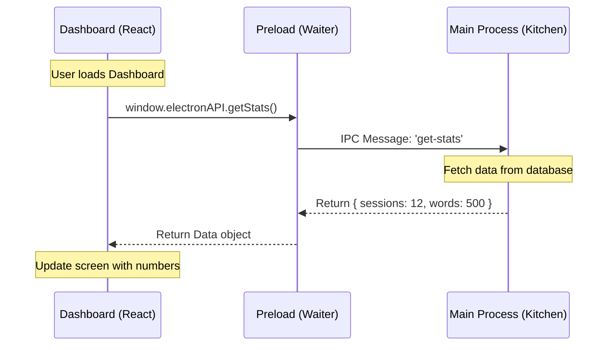

# Chapter 5: IPC & State Management

In the previous chapter, [Unified AI Agent & LLM Providers](04_unified_ai_agent___llm_providers.md), we gave Jarvis a brain. It can think, make decisions, and use tools.

However, we have a disconnect. The "Brain" (AI Logic) lives in a background Node.js process, but the "Face" (The Dashboard, Settings, and Popups) lives in a separate React window.

If the Brain decides to open an app, the Face doesn't know about it. If you change a setting in the Face, the Brain doesn't know the rule changed.

In this chapter, we will build the **Nervous System** that connects these two parts using **IPC (Inter-Process Communication)**.

## The Motivation

Imagine a busy restaurant:
1.  **The Dining Room (Renderer Process):** This is where the customers (Users) sit. It looks nice, has menus (Buttons), and is safe.
2.  **The Kitchen (Main Process):** This is where the Chefs (Node.js/AI) work with sharp knives and fire.

**The Problem:** For safety reasons, customers are not allowed to walk into the kitchen to grab food, and chefs don't come out to tables to cook.

**The Solution:** You need a **Waiter** (IPC).
*   The Customer tells the Waiter: "I want a steak" (Request).
*   The Waiter writes it on a ticket and gives it to the Kitchen (IPC Message).
*   The Kitchen cooks the steak (Logic).
*   The Waiter brings the plate back to the Customer (Response).

In Electron, this "Waiter" system is how we keep the UI and the Logic in sync.

## Key Concepts

### 1. The Two Worlds
*   **Main Process:** Runs full Node.js. Can access files, microphones, and spawn python scripts.
*   **Renderer Process:** Runs React. It is just a web page. It cannot access the computer directly for security reasons.

### 2. The Preload Script (`preload.ts`)
This is the **Service Window**. It is a special security bridge. It is the *only* place where we allow the UI to send specific messages to the Main process.

### 3. IPC Channels
Think of these as "Subject Lines" in an email.
*   `invoke` / `handle`: "Please get me the data" (Request/Response).
*   `send` / `on`: "Hey, just letting you know..." (One-way notification).

---

## How It Works: The High-Level Flow

Let's visualize the flow when the Dashboard asks for User Statistics.



## Internal Implementation

We will implement this "Waiter" system in three steps: The Kitchen (Handler), The Bridge (Preload), and The Customer (UI).

### Step 1: The Kitchen (Main Process)
First, we define what the backend *can* do. We use `ipcMain.handle` to listen for requests.

We organize all our handlers in `src/ipc/ipc-handlers.ts`.

```typescript
// src/ipc/ipc-handlers.ts
import { ipcMain } from 'electron';

// This is the Chef waiting for an order
ipcMain.handle('get-stats', async () => {
    console.log('Kitchen: Receiving order for stats...');
    
    // 1. Get the data from our analytics manager
    const stats = await analyticsManager.getStats();
    
    // 2. Send it back to the waiter
    return stats; 
});
```

### Step 2: The Bridge (Preload Script)
Now we need to expose this capability to the frontend safely. We use `contextBridge` in `src/preload.ts`.

```typescript
// src/preload.ts
import { contextBridge, ipcRenderer } from 'electron';

// We expose a secure API called 'electronAPI'
contextBridge.exposeInMainWorld('electronAPI', {
  
  // The UI calls this function
  getStats: () => {
      // The bridge passes the message to the Main Process
      return ipcRenderer.invoke('get-stats');
  }

});
```
*Beginner Note:* We never expose `ipcRenderer` directly to the UI. We only expose specific functions (`getStats`). This prevents a malicious website from taking over your computer.

### Step 3: The Customer (React UI)
Finally, in our React component (`src/components/Dashboard.tsx`), we call this function just like any other API.

```typescript
// src/components/Dashboard.tsx
const Dashboard = () => {
  const [stats, setStats] = useState(null);

  useEffect(() => {
    const fetchData = async () => {
      // Call the bridge!
      // 'window.electronAPI' exists because of the preload script
      const data = await window.electronAPI.getStats();
      setStats(data);
    };
    
    fetchData();
  }, []);

  if (!stats) return <div>Loading...</div>;
  return <div>Total Words Spoken: {stats.totalWords}</div>;
};
```

## Real-Time Updates (Pushing Data)

Sometimes, the Kitchen needs to tell the Customer something without being asked (e.g., "Your table is ready!" or "Transcription Complete!").

For this, we use a **Listener**.

### 1. The Main Process Sends
When a transcription finishes in `src/main.ts` (or the transcription service):

```typescript
// src/main.ts
// Send a message to the specific window
mainWindow.webContents.send('transcription-complete', 'Hello World');
```

### 2. The Bridge Listens
We update `src/preload.ts` to allow the UI to register a callback function.

```typescript
// src/preload.ts
contextBridge.exposeInMainWorld('electronAPI', {
  // ... previous code ...

  // Allow UI to provide a function to run when data arrives
  onTranscription: (callback) => {
      ipcRenderer.on('transcription-complete', (event, text) => {
          callback(text);
      });
  }
});
```

### 3. The UI Reacts
In `src/App.tsx`, we set up the listener.

```typescript
// src/App.tsx
useEffect(() => {
  // Define what to do when the message arrives
  window.electronAPI.onTranscription((text) => {
     console.log("New text arrived:", text);
     showNotification(text);
  });

  // Cleanup: In a real app, we would remove the listener here
}, []);
```

## State Management: The "Single Source of Truth"

A common bug in these apps is when the UI thinks one thing (e.g., "I am recording") but the Backend thinks another (e.g., "I am idle").

To solve this, we treat the **Main Process as the Source of Truth**. The UI is just a reflection of the Main Process.

In `src/App.tsx`, we see this pattern used for **Onboarding**:

```typescript
// src/App.tsx (Simplified)
useEffect(() => {
  const checkStatus = async () => {
    // 1. Ask Main Process: "Is the user new?"
    const isCompleted = await window.electronAPI.checkOnboardingStatus();
    
    // 2. Update React State based ONLY on Main Process answer
    setHasCompletedOnboarding(isCompleted);
  };
  
  checkStatus();
}, [user]);
```

By forcing the UI to ask the Backend, we ensure that if you restart the app, the state remains consistent.

## Summary

In this chapter, we built the **IPC & State Management** system:

1.  We established the **Kitchen/Customer** analogy to understand the security separation.
2.  We used `ipcMain.handle` in the backend to answer requests.
3.  We used `contextBridge` in the **Preload Script** to safely expose these features.
4.  We connected the **React UI** to these triggers to display live data.

Now Jarvis is a complete desktop application. It listens, thinks, acts, and updates the user interface seamlessly.

But what happens when you step away from your computer? You can't carry your desktop with you. To make Jarvis truly ubiquitous, we need to extend it to your phone.

In the final chapter, we will look at how we connect a mobile companion app to this system.

[Next Chapter: iOS Companion Architecture](06_ios_companion_architecture.md)

---

Generated by [Code IQ](https://github.com/adityasoni99/Code-IQ)