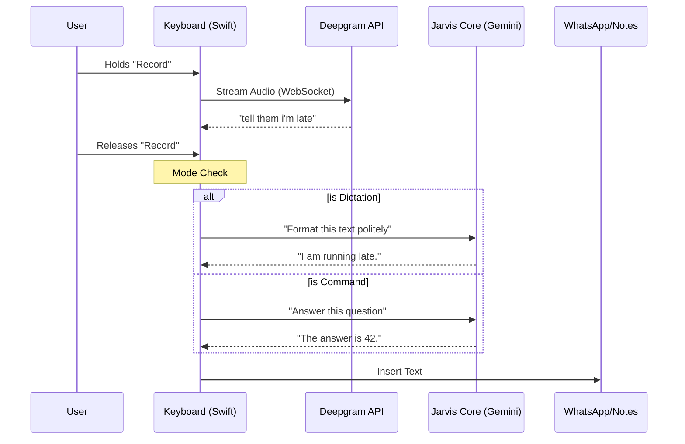

# Chapter 6: iOS Companion Architecture

Welcome to the final chapter of the **Jarvis AI Assistant** tutorial!

In the previous chapter, [IPC & State Management](05_ipc___state_management.md), we built the nervous system for our desktop application. We ensured that the "Brain" (Node.js) and the "Face" (React) stayed perfectly in sync.

But there is one major limitation to a desktop app: **You cannot put it in your pocket.**

If you are walking down the street and want to send a complex email, or if you are cooking and want to ask a question, your desktop computer is useless to you.

In this chapter, we will build the **iOS Companion**. We won't just build a standalone app; we will build a **Custom Keyboard**. This allows Jarvis to live inside WhatsApp, Notes, Slack, or any app on your iPhone.

## The Motivation

Imagine you are using WhatsApp. You want to send a message that says:
*"I'm running 10 minutes late, start the meeting without me."*

With a standard keyboard:
1. You type it out manually (slow).
2. Or you use Siri dictation (which might mishear "meeting" as "eating").

With **Jarvis iOS**:
1. You switch to the Jarvis Keyboard.
2. You hold the record button.
3. You speak naturally: *"Tell them I'm running late and they should start."*
4. Jarvis **thinks**, reformats it to be polite, and types: *"I am running about 10 minutes late. Please go ahead and start the meeting without me."*

This is the **Mobile Twin**. It mimics the desktop architecture but is adapted for the constraints of a phone.

## Key Concepts

### 1. The Custom Keyboard Extension
On iOS, a keyboard is not a normal app. It is an "Extension." It runs inside other apps.
*   **Constraint:** It has very limited memory.
*   **Constraint:** It must launch instantly.
*   **Power:** It can insert text into *any* text field on the phone.

### 2. The "Mobile Twin" Architecture
We cannot run a full Node.js server on an iPhone. Instead, we rewrite the core logic in **Swift**.
It mirrors the flow we built in [Hybrid Transcription Engine](03_hybrid_transcription_engine.md) and [Unified AI Agent & LLM Providers](04_unified_ai_agent___llm_providers.md):
1.  **Listen:** Capture Audio.
2.  **Transcribe:** Send to Deepgram (Cloud).
3.  **Process:** Send to Gemini (LLM).

### 3. App Groups (Shared Memory)
Your "Container App" (where you change settings) and your "Keyboard" (where you type) are two different programs. They cannot talk to each other normally.
We use **App Groups** to share data (like your API Key) between them.

---

## How It Works: The High-Level Flow

Here is the data flow when you press the microphone button on your iPhone keyboard.



## Internal Implementation

We will break this down into three parts: The Ears, The Brain, and The Controller.

### Step 1: The Ears (Deepgram Service)
Just like in [Hybrid Transcription Engine](03_hybrid_transcription_engine.md), we use WebSockets to stream audio for instant results.

We define this in `ios/JarvisAI/Shared/DeepgramService.swift`.

```swift
// ios/JarvisAI/Shared/DeepgramService.swift
func startStreaming() {
    // 1. Prepare the WebSocket URL with options (nova-2 model)
    let urlString = "wss://api.deepgram.com/v1/listen?model=nova-2&smart_format=true"
    
    // 2. Open the connection using URLSession
    let url = URL(string: urlString)!
    var request = URLRequest(url: url)
    request.setValue("Token \(apiKey)", forHTTPHeaderField: "Authorization")

    // 3. Start the task
    webSocketTask = urlSession.webSocketTask(with: request)
    webSocketTask?.resume()
}
```
*Explanation:* This opens the tunnel. Once open, we throw audio data into it.

```swift
// ios/JarvisAI/Shared/DeepgramService.swift
func sendAudioData(_ data: Data) {
    // Only send if we are currently streaming
    guard isStreaming, let task = webSocketTask else { return }

    // Wrap audio bytes in a message and send
    let message = URLSessionWebSocketTask.Message.data(data)
    task.send(message) { error in
        if let error = error { print("Send Error: \(error)") }
    }
}
```

### Step 2: The Brain (Jarvis Core)
Once we have the text, we need intelligence. In the desktop app, we used `UnifiedAgent`. On iOS, we use `JarvisCore` to talk to Google Gemini (or OpenAI).

We define this in `ios/JarvisAI/Shared/JarvisCore.swift`.

```swift
// ios/JarvisAI/Shared/JarvisCore.swift
class JarvisCore {
    // We define a "System Prompt" that tells the AI how to behave
    private let defaultDictationPrompt = """
    You are a speech-to-text formatter. 
    Fix grammar, punctuation, and remove filler words (um, uh).
    Do NOT summarize. Keep all content.
    """

    func processText(_ text: String, completion: @escaping (Result<String, Error>) -> Void) {
        // 1. Prepare the request to Gemini API
        let urlString = "https://generativelanguage.googleapis.com/.../generateContent?key=\(apiKey)"
        
        // 2. Send the user's text + our system prompt
        // (Implementation details of JSON construction hidden for brevity)
        
        // 3. Perform the network request
        URLSession.shared.dataTask(with: request) { data, _, _ in
             // Return the formatted text
             completion(.success(formattedText))
        }.resume()
    }
}
```
*Why this matters:* This is what makes Jarvis "Smart." Without this, it's just a dictation tool. With this, it becomes an editor that fixes your mistakes instantly.

### Step 3: The Controller (Keyboard View Controller)
This is the main file `ios/JarvisAI/JarvisKeyboard/KeyboardViewController.swift`. It connects the UI, the Ears, and the Brain.

It decides: **"Is this a command, or is this dictation?"**

```swift
// ios/JarvisAI/JarvisKeyboard/KeyboardViewController.swift
private func formatAndInsert(_ text: String) {
    // 1. Check for the "Wake Word"
    // "Hey Jarvis, what is the weather?" -> Command
    // "I am running late" -> Dictation
    let isCommand = text.lowercased().contains("jarvis")
    
    // 2. Ask the Brain to process it
    jarvisCore?.processText(text) { result in
        
        // 3. Insert the result into the text field (WhatsApp/Notes)
        switch result {
        case .success(let formatted):
            self.textDocumentProxy.insertText(formatted)
        case .failure:
            // If AI fails, just insert what was heard
            self.textDocumentProxy.insertText(text)
        }
    }
}
```
*Beginner Note:* `textDocumentProxy.insertText` is the magic command provided by Apple that lets our code type into whatever app is currently open.

### Step 4: Secure Data Sharing
We can't hardcode API keys. We need to fetch them from the secure group storage that connects the Settings App to the Keyboard.

```swift
// ios/JarvisAI/Shared/JarvisCore.swift
class JarvisCore {
    // Access the shared "App Group" folder
    private let sharedDefaults = UserDefaults(suiteName: "group.com.akshay.JarvisAI")
    
    // Read the custom prompt the user set in the main app
    private var dictationPrompt: String {
        return sharedDefaults?.string(forKey: "custom_dictation_prompt") 
               ?? defaultDictationPrompt
    }
}
```

## Summary of the Project

Congratulations! You have navigated through the entire architecture of the Jarvis AI Assistant. Let's look at what you have built:

1.  **Chapter 1:** You built the **Director**, capable of orchestrating Push-to-Talk actions.
2.  **Chapter 2:** You built the **Body** (C++), giving the app native ears and global hotkeys.
3.  **Chapter 3:** You built the **Ears**, creating a hybrid engine for Cloud and Local transcription.
4.  **Chapter 4:** You built the **Brain**, a Unified Agent that can use tools and control your computer.
5.  **Chapter 5:** You built the **Nervous System** (IPC), keeping the UI and Backend in sync.
6.  **Chapter 6:** You extended Jarvis to the **Mobile World**, creating a synchronized AI keyboard.

You now have a fully functional, cross-platform AI assistant that listens, thinks, and acts on your behalf—whether you are at your desk or on the go.

**End of Tutorial.**

---

Generated by [Code IQ](https://github.com/adityasoni99/Code-IQ)