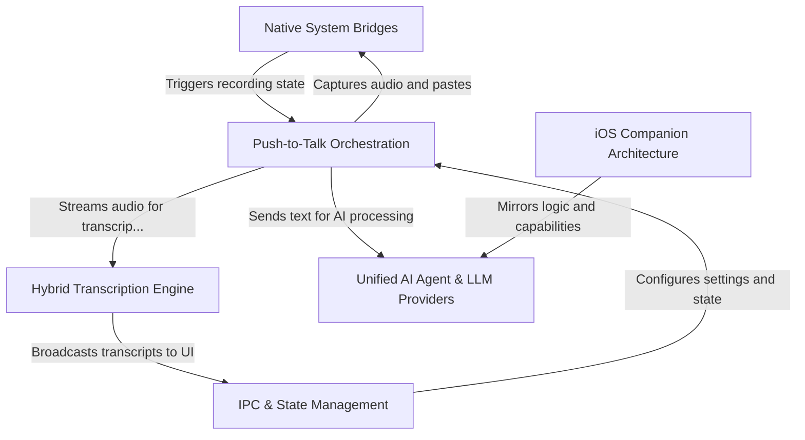

# Tutorial: jarvis-ai-assistant

A robust **desktop AI assistant** built with Electron that bridges **native system inputs** (like global hotkeys and microphone access) with a powerful **hybrid transcription engine** capable of switching between local (Whisper) and cloud (Deepgram) processing. The system orchestrates these inputs to feed a **unified AI agent** that can execute commands or dictation, managed via a React-based dashboard, while maintaining a parallel **iOS companion app** architecture for mobile continuity.

**Source Repository:** [https://github.com/akshayaggarwal99/jarvis-ai-assistant](https://github.com/akshayaggarwal99/jarvis-ai-assistant)

## Chapters

1. [Push-to-Talk Orchestration](01_push_to_talk_orchestration.md)
2. [Native System Bridges](02_native_system_bridges.md)
3. [Hybrid Transcription Engine](03_hybrid_transcription_engine.md)
4. [Unified AI Agent & LLM Providers](04_unified_ai_agent___llm_providers.md)
5. [IPC & State Management](05_ipc___state_management.md)
6. [iOS Companion Architecture](06_ios_companion_architecture.md)

---

Generated by [Code IQ](https://github.com/adityasoni99/Code-IQ)