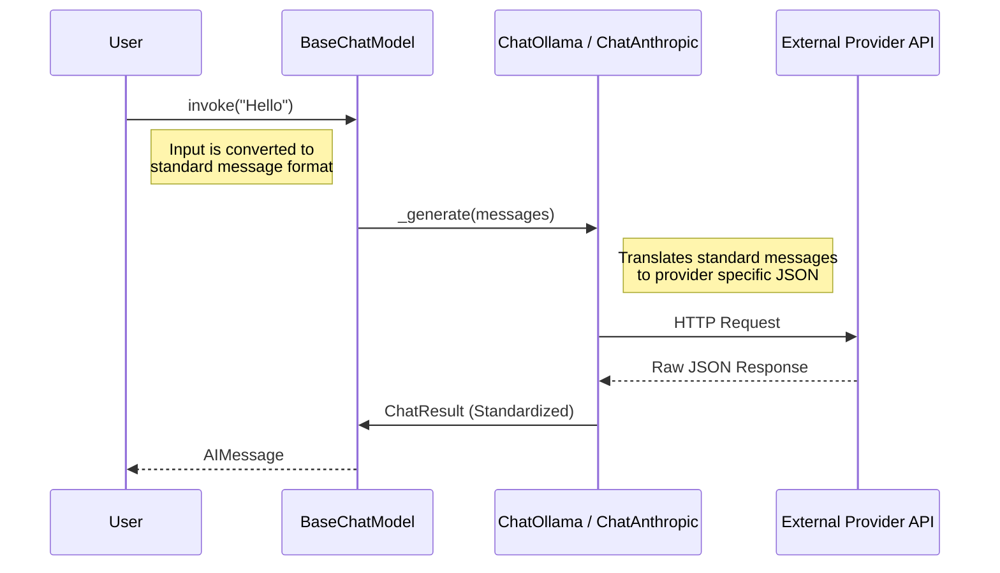

# Chapter 1: Language Models (Chat Models & LLMs)

Welcome to the world of LangChain! In this first chapter, we are going to explore the absolute core of any AI application: the **Language Model**.

## 1. The "Brain" of the Application

Imagine you are building an application that needs to understand or generate text. You might want to use OpenAI's GPT-4, or Anthropic's Claude, or maybe a local model running on your laptop using Ollama.

**The Problem:**
Every model provider speaks a slightly different "language" in code.
*   Provider A might want a JSON object with `{"prompt": "..."}`.
*   Provider B might want `{"messages": [...]}`.
*   Provider C might return the answer in `response.data.text`.

If you decide to switch models, you usually have to rewrite your code.

**The Solution:**
LangChain acts as a **Universal Adapter**. It provides a standard interface (a set of rules) that all models follow. You send instructions in a standard format, and you get a response in a standard format, regardless of which "brain" you are using.

### Two Types of Models
While they are often grouped together, LangChain distinguishes between two main types:

1.  **LLMs (Legacy):** Pure text-in, text-out. You give it a string, it completes it. (Like advanced autocomplete).
2.  **Chat Models (Modern):** These are powered by LLMs but are designed for conversation. They accept a list of **Messages** (like "System", "User", "AI") and return an **AI Message**.

*In this tutorial, we will focus on **Chat Models**, as they are the standard for modern development.*

## 2. Using a Chat Model

Let's solve a simple use case: **Translation**. We want to ask an AI to translate a sentence.

To use LangChain, you don't talk to the API directly. You talk to a **Wrapper** class. Let's look at how to use `ChatOllama` (for local models) or `ChatAnthropic` (for Claude).

### Step 1: Initialization
First, we import the model wrapper and configure it.

```python
# Example using a local model with Ollama
from langchain_ollama import ChatOllama

# We instantiate the "brain"
model = ChatOllama(model="llama3")
```

*Explanation:* We create an instance of `ChatOllama`. This object doesn't connect to the AI yet; it just stores your configuration (which model to use, temperature, etc.).

### Step 2: Sending a String (The Easy Way)
The simplest way to interact is passing a plain string. LangChain converts this into a message for you automatically.

```python
# The standard method to call a model is .invoke()
response = model.invoke("Translate 'Hello World' to French.")

print(response.content)
# Output: "Bonjour le monde"
```

*Explanation:* `invoke` is the universal button in LangChain. You press it to start the work. The result isn't just a string; it's an `AIMessage` object containing the `.content` (the text) and metadata.

### Step 3: Swapping the "Brain"
If we wanted to use Anthropic's Claude instead, we change **only** the setup lines. The rest of our code (`model.invoke`) remains exactly the same!

```python
from langchain_anthropic import ChatAnthropic

# Switch the brain!
model = ChatAnthropic(model="claude-3-sonnet-20240229")

# This line stays exactly the same
response = model.invoke("Translate 'Hello World' to French.")
```

## 3. Internal Implementation: Under the Hood

How does LangChain achieve this universality? Let's look at what happens when you run `model.invoke("Hello")`.

### The Flow
When you call `invoke`, LangChain acts as a translator between your code and the API.



### 1. The Standard Interface (`BaseChatModel`)
All chat models inherit from a common parent class called `BaseChatModel`. This class defines the `invoke` method so it behaves the same for everyone.

*File: `libs/core/langchain_core/language_models/chat_models.py`*

```python
class BaseChatModel(BaseLanguageModel[AIMessage], ABC):
    # This is the entry point for all chat models
    def invoke(self, input, ...):
        # 1. Standardize input to list of messages
        # 2. Call the specific implementation
        # 3. Return the result as AIMessage
        ...
```

### 2. The Provider Implementation (`_generate`)
Each specific integration (like Ollama or Anthropic) must implement a method called `_generate`. This is where the specific logic lives.

*File: `libs/partners/ollama/langchain_ollama/chat_models.py`*

```python
class ChatOllama(BaseChatModel):
    def _generate(self, messages, ...):
        # Convert LangChain messages to Ollama format
        ollama_msgs = self._convert_messages_to_ollama_messages(messages)
        
        # Call the actual Ollama Client
        response = self._client.chat(messages=ollama_msgs, ...)
        
        # Convert raw response back to LangChain format
        return self._create_chat_result(response)
```

### 3. Message Conversion
The "magic" often happens in converting the messages. LangChain uses `HumanMessage`, `SystemMessage`, and `AIMessage`.
*   **Anthropic** needs these formatted as specific dictionaries with `role: 'user'` or `role: 'assistant'`.
*   **Ollama** needs a slightly different JSON structure.

The specific class handles this conversion so you never have to worry about API documentation for parameters.

## Summary

In this chapter, we learned:
1.  **Language Models** are the "brains" of our application.
2.  **Chat Models** are the preferred abstraction, dealing with input messages and output messages.
3.  **LangChain** allows us to swap model providers (like switching from Ollama to Anthropic) without rewriting our execution logic.
4.  The `invoke()` method is the standard way to trigger a model.

But wait, simply sending strings is limiting. To build real chatbots, we need to understand how to structure conversations using specific roles like "System" and "User".

Next, we will learn exactly how to construct these inputs in [Chapter 2: Prompts & Messages](02_prompts___messages.md).

---

Generated by [Code IQ](https://github.com/adityasoni99/Code-IQ)