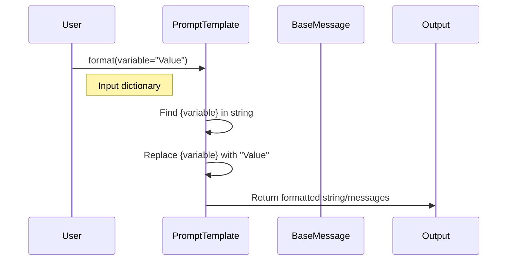

# Chapter 2: Prompts & Messages

Welcome back! in [Chapter 1: Language Models (Chat Models & LLMs)](01_language_models__chat_models___llms_.md), we learned how to send a simple string to a Chat Model and get a response.

## 1. The Problem with Hardcoding

In the previous chapter, we did this:

```python
model.invoke("Translate 'Hello' to French.")
```

**The Problem:**
In a real application, you don't want to hardcode the input. You want to accept user input. You might be tempted to do this using Python f-strings:

```python
user_input = "Hello"
# Don't do this! messy and hard to manage complex prompts
response = model.invoke(f"Translate '{user_input}' to French.") 
```

**The Solution:**
LangChain provides **Prompts** and **Messages**.
1.  **PromptTemplates:** Act like a form or a "Mad Libs" game where you define the structure once and fill in the blanks later.
2.  **Messages:** Structure the conversation so the AI knows who is talking (You, the System, or the AI).

## 2. PromptTemplates: The "Form"

Think of a `PromptTemplate` as a recipe. The recipe stays the same, but the ingredients (variables) can change.

Let's create a template for our translation app.

### Creating a Template
We use `{curly_brackets}` to mark where variable data goes.

```python
from langchain_core.prompts import PromptTemplate

# Define the "recipe"
template = PromptTemplate.from_template(
    "Translate the following word to {language}: {word}"
)
```

*Explanation:* We created a reusable template. It knows it needs two variables: `language` and `word`.

### Using the Template
To use it, we "format" it by providing the missing ingredients.

```python
# Fill in the blanks
formatted_prompt = template.format(language="French", word="Hello")

print(formatted_prompt)
# Output: "Translate the following word to French: Hello"
```

*Explanation:* The `.format()` method replaces the `{variables}` with the actual values. The result is a plain string ready for an LLM.

## 3. Messages: The "Script"

Modern Chat Models (like GPT-4 or Claude) don't just see a single string of text. They see a **list of messages**, similar to a chat history on your phone.

LangChain provides three main message types (`BaseMessage`):

1.  **SystemMessage:** Instructions for the AI (e.g., "You are a helpful assistant").
2.  **HumanMessage:** What the user types.
3.  **AIMessage:** What the model replies.

### Structuring a Conversation
Instead of sending a raw string, we can send a structured list.

```python
from langchain_core.messages import SystemMessage, HumanMessage

messages = [
    SystemMessage(content="You are a sarcastic translator."),
    HumanMessage(content="Translate 'I love programming' to Spanish.")
]
```

*Explanation:* By adding a `SystemMessage`, we set the behavior of the AI. If we sent this list to a model, it would respond sarcastically in Spanish.

## 4. ChatPromptTemplate: Combining Both

In most LangChain apps, you will combine the two concepts above using a `ChatPromptTemplate`. This allows you to create a dynamic template that produces a list of messages.

### The Best Practice Setup

```python
from langchain_core.prompts import ChatPromptTemplate

# Create a template consisting of roles and variables
chat_template = ChatPromptTemplate.from_messages([
    ("system", "You are a helpful assistant that translates to {language}."),
    ("human", "{text}")
])
```

*Explanation:* We define a System message that takes a variable `{language}` and a Human message that takes a variable `{text}`.

### Generating the Output
Now we can generate the final prompt value.

```python
# Fill in the variables
messages = chat_template.invoke({"language": "French", "text": "I love AI"})

print(messages)
```

*Explanation:* The output is not a string, but a **list of message objects** (`SystemMessage` and `HumanMessage`) with the variables filled in, ready to be sent to the Chat Model.

## 5. Internal Implementation: Under the Hood

What happens when you call `.format()` or `.invoke()` on a prompt template?

### The Flow



### 1. String Replacement (`PromptTemplate`)
At its core, `PromptTemplate` is a wrapper around Python's string formatting.

*File Reference: `libs/core/langchain_core/prompts/prompt.py`*

```python
class PromptTemplate(StringPromptTemplate):
    template: str  # The string with {curly_braces}
    
    def format(self, **kwargs):
        # Simplified logic:
        # 1. Merge user variables (kwargs)
        # 2. Use python f-string style formatting
        return self.template.format(**kwargs)
```

It validates that you provided all the required variables (like `language` and `word`) before attempting to format, preventing errors later in the pipeline.

### 2. Message Construction (`BaseMessage`)
When you use `ChatPromptTemplate`, it constructs `BaseMessage` objects. These objects are simple data containers holding the `content` (text) and the `type` (role).

*File Reference: `libs/core/langchain_core/messages/base.py`*

```python
class BaseMessage(Serializable):
    content: str    # The actual text
    type: str       # 'human', 'ai', 'system', etc.

    def __init__(self, content, **kwargs):
        self.content = content
        # ... sets up internal IDs and metadata
```

This standardization is crucial. Whether you are using OpenAI, Anthropic, or Ollama, LangChain ensures the messages are stored in this exact format internally.

## Summary

In this chapter, we learned:
1.  **PromptTemplates** act as reusable forms where we fill in variables (ingredients).
2.  **Messages** (`System`, `Human`, `AI`) structure the inputs so the model understands roles.
3.  **ChatPromptTemplate** combines these to create dynamic conversations.

**Why this matters:**
We have the **Model** (Chapter 1) and the **Instructions** (Chapter 2). Now we need a way to glue them together so the output of the Prompt automatically goes into the Model.

In the next chapter, we will learn how to connect these pieces using **Runnables**, the piping system of LangChain.

[Next Chapter: Runnables & Chains](03_runnables___chains.md)

---

Generated by [Code IQ](https://github.com/adityasoni99/Code-IQ)