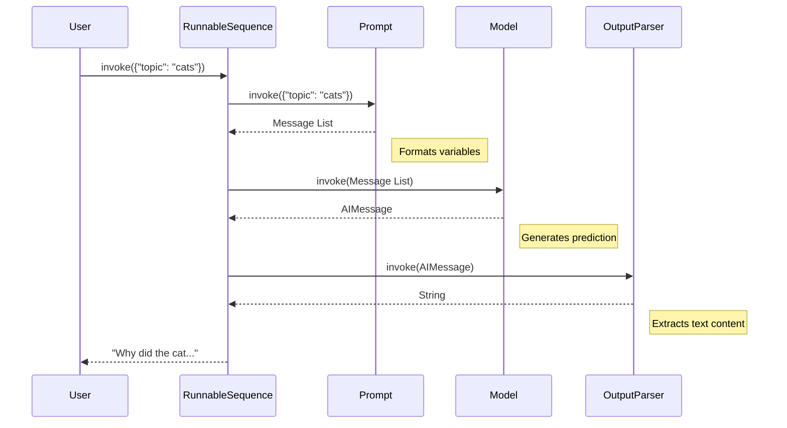

# Chapter 3: Runnables & Chains

Welcome back! 

In [Chapter 1: Language Models (Chat Models & LLMs)](01_language_models__chat_models___llms_.md), we learned how to use the "Brain" (the Model).
In [Chapter 2: Prompts & Messages](02_prompts___messages.md), we learned how to create the "Instructions" (the Prompt).

Now, we face a logistics problem.

## 1. The "Glue" Problem

Right now, if we want to build an app, we have to manually carry the data from the Prompt to the Model.

**The Manual Way (Tedious):**

```python
# 1. We create the prompt
prompt_val = prompt_template.invoke({"topic": "cats"})

# 2. We pass the output of step 1 to the model
response = model.invoke(prompt_val)

# 3. We print the content
print(response.content)
```

**The Solution:**
We want an **Assembly Line**. We want to set up a pipeline where we pour the ingredients (variables) into the top, and the finished dish comes out the bottom.

In LangChain, this assembly line is called a **Chain** (legacy concept) or a **Runnable Sequence** (modern LCEL concept).

## 2. The Modern Way: LCEL (LangChain Expression Language)

LangChain introduces a special syntax to glue components together: the **Pipe Operator (`|`)**.

If you have used Unix or Linux, this will look familiar. It simply means: *"Take the output of the thing on the left, and pass it as input to the thing on the right."*

### A Simple Pipeline

Let's build a "Joke Generator".

```python
from langchain_core.prompts import ChatPromptTemplate
from langchain_openai import ChatOpenAI

# 1. The Prompt
prompt = ChatPromptTemplate.from_template("Tell me a joke about {topic}")

# 2. The Model
model = ChatOpenAI()

# 3. The Chain (The Magic happens here)
chain = prompt | model
```

Now, instead of calling the prompt and model separately, we just call the **chain**.

```python
# We treat the chain as one single object
response = chain.invoke({"topic": "ice cream"})

print(response.content)
# Output: "Why did the ice cream truck break down? ..."
```

## 3. Adding More Links to the Chain

The beauty of this assembly line is that you can add as many steps as you need.

A common issue with Chat Models is that they return an `AIMessage` object. Usually, we just want the text string. We can add an **Output Parser** to the end of our chain to handle this.

```python
from langchain_core.output_parsers import StrOutputParser

# Initialize the parser
parser = StrOutputParser()

# Update the chain: Prompt -> Model -> Parser
chain = prompt | model | parser
```

Now, let's run it:

```python
# The result is now a pure string, not a Message object!
result = chain.invoke({"topic": "bears"})

print(result) 
# Output: "Why do bears have hairy coats? ..."
```

This is the essence of **Runnables**: Modular components that can be snapped together.

## 4. What is a "Runnable"?

You might be wondering, "Why can I pipe these specific objects together?"

It is because they all follow the **Runnable Protocol**. Think of a Runnable as a standard connector (like USB). If a class is a "Runnable", it guarantees it has standard methods, primarily:

1.  `.invoke(input)`: Run the logic synchronously.
2.  `.batch([inputs])`: Run a list of inputs efficiently.
3.  `.stream(input)`: Stream the output chunks as they arrive.

Because `Prompt`, `Model`, and `OutputParser` are all Runnables, they speak the same language and can be chained freely.

## 5. Internal Implementation: Under the Hood

How does this "gluing" actually work? Let's look at the flow when you run a Chain.

### The Flow



### The Legacy "Chain" Class

Before the modern `|` syntax, LangChain used a specific class called `Chain` (and subclasses like `LLMChain`). While modern apps use the pipe syntax, understanding the `Chain` class helps explain *why* orchestration is useful (it handles setup and teardown automatically).

Let's look at the base `Chain` class in `libs/langchain/langchain_classic/chains/base.py`.

When you call `invoke` on a Chain, it doesn't just run the model. It follows a strict lifecycle:

```python
# Simplified logic from chains/base.py

def invoke(self, input, ...):
    # 1. Prepare Inputs (Load from Memory)
    inputs = self.prep_inputs(input)
    
    # 2. Start Callbacks (Logging)
    run_manager = callback_manager.on_chain_start(...)
    
    # 3. The Actual Work (The "Call")
    outputs = self._call(inputs, run_manager=run_manager)
    
    # 4. Prepare Outputs (Save to Memory)
    final_outputs = self.prep_outputs(inputs, outputs)
    
    return final_outputs
```

### Key Method: `prep_inputs`
This method checks if you have a **Memory** module attached. If you do, it automatically fetches conversation history and adds it to your inputs before the prompt sees them.

### Key Method: `_call`
This is an abstract method. In the legacy `LLMChain` (in `libs/langchain/langchain_classic/chains/llm.py`), `_call` looked like this:

```python
# Simplified from LLMChain._call
def _call(self, inputs, ...):
    # 1. Format the prompt
    prompts, stop = self.prep_prompts(inputs)
    
    # 2. Call the LLM
    response = self.llm.generate_prompt(prompts, ...)
    
    # 3. Create outputs
    return self.create_outputs(response)
```

**Why this matters:**
Modern Runnables (using `|`) abstract this away even further, but the concept remains: **Chain Inputs -> Process 1 -> Process 2 -> Chain Outputs**.

## Summary

In this chapter, we learned:
1.  **Runnables** are standard units of work (Prompt, Model, Parser) that share a common interface (`.invoke`).
2.  **Chains** (or Sequences) allow us to glue these units together.
3.  The **Pipe Operator (`|`)** is the modern way to construct chains: `chain = prompt | model | parser`.
4.  Chains handle the flow of data, ensuring the output of one step becomes the input of the next.

Now that we have a working assembly line, we have a new problem: **Amnesia**.
Every time we run our chain, it starts fresh. It doesn't remember that we just told it our name is Bob.

To fix this, we need to give our chain a brain. We need **Memory**.

[Next Chapter: Memory](04_memory.md)

---

Generated by [Code IQ](https://github.com/adityasoni99/Code-IQ)