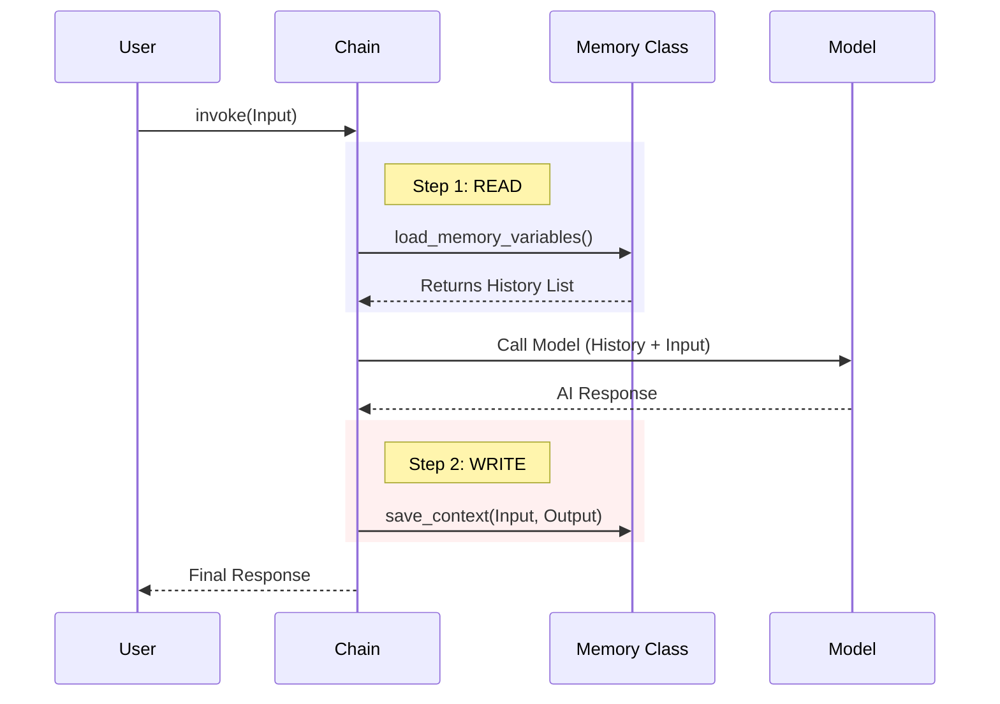

# Chapter 4: Memory

Welcome back! 

In [Chapter 3: Runnables & Chains](03_runnables___chains.md), we built an assembly line (a Chain) that processes input and produces output.

However, we have a major problem. Our AI has **Amnesia**.

## 1. The "Goldfish" Problem

By default, Language Models are stateless. They treat every incoming query as a brand-new interaction. They don't remember what you said 10 seconds ago.

Let's look at this "Goldfish" behavior in action:

```python
from langchain_openai import ChatOpenAI

model = ChatOpenAI()

# Interaction 1
model.invoke("Hi, my name is Bob.")

# Interaction 2
response = model.invoke("What is my name?")
print(response.content)
# Output: "I'm sorry, I don't know your name."
```

**The Solution:**
We need **Memory**. 
Memory is simply the process of:
1.  **Storing** previous messages.
2.  **Injecting** those messages into the *start* of the next prompt.

## 2. Managing History Manually

To understand how Memory works, let's do it manually first. We simply need a list to hold our conversation.

### Step 1: Create the List
We use the `BaseMessage` types we learned about in [Chapter 2: Prompts & Messages](02_prompts___messages.md).

```python
from langchain_core.messages import HumanMessage, AIMessage

# This list represents our "Memory"
chat_history = []
```

### Step 2: The Loop
Every time we talk to the model, we must send the **entire** history, not just the new message.

```python
# 1. Add User Input to History
user_input = "Hi, my name is Bob."
chat_history.append(HumanMessage(content=user_input))

# 2. Pass the WHOLE history to the model
response = model.invoke(chat_history)

# 3. Add AI Response to History
chat_history.append(response)
```

*Explanation:* We act as the scribe. We write down what the Human said, pass the notebook to the AI, and then write down what the AI said.

### Step 3: Recall
Now, if we ask the question again, the model sees the history.

```python
# New question
chat_history.append(HumanMessage(content="What is my name?"))

# Model sees: [Human: Hi I'm Bob, AI: Hello!, Human: What is my name?]
response = model.invoke(chat_history)

print(response.content)
# Output: "Your name is Bob."
```

## 3. Integrating Memory into a Prompt

Sending a raw list works, but usually, we want a structured Prompt Template (as seen in [Chapter 2](02_prompts___messages.md)).

To add memory to a template, we use a **MessagesPlaceholder**. This tells LangChain: *"Reserve this spot in the prompt for a list of messages that I will provide later."*

```python
from langchain_core.prompts import ChatPromptTemplate, MessagesPlaceholder

prompt = ChatPromptTemplate.from_messages([
    ("system", "You are a helpful assistant."),
    MessagesPlaceholder(variable_name="history"), # <--- The placeholder
    ("human", "{input}")
])
```

Now, when we invoke the chain, we pass the history into that variable.

```python
chain = prompt | model

# We pass 'history' (the list) and 'input' (the new text)
response = chain.invoke({
    "history": chat_history,
    "input": "What is my name?"
})
```

## 4. Internal Implementation: Under the Hood

While managing a list manually is easy for small scripts, LangChain provides classes to handle this automatically.

Even though modern LangChain uses `RunnableWithMessageHistory`, it is vital to understand the classic **Memory** classes to understand the lifecycle of a conversation.

### The Memory Lifecycle
When a Chain with Memory runs, it performs two hidden steps: **Load** and **Save**.



### 1. The Storage (`ConversationBufferMemory`)
The most basic memory class is `ConversationBufferMemory`. It just keeps a list in a variable.

*File Reference: `libs/langchain/langchain_classic/memory/buffer.py`*

```python
class ConversationBufferMemory(BaseChatMemory):
    # This acts as the storage list
    chat_memory: BaseChatMessageHistory 

    def load_memory_variables(self, inputs):
        # Return the current list of messages
        return {self.memory_key: self.buffer}
```

*Explanation:* When the chain starts, it calls `load_memory_variables`. This method grabs the list of messages so they can be inserted into the Prompt.

### 2. Saving the Context (`BaseChatMemory`)
After the model replies, we need to save the interaction. This logic lives in the base class.

*File Reference: `libs/langchain/langchain_classic/memory/chat_memory.py`*

```python
class BaseChatMemory(BaseMemory):
    def save_context(self, inputs, outputs):
        # 1. Identify what the human said
        input_str = inputs[self.input_key]
        
        # 2. Identify what the AI said
        output_str = outputs[self.output_key]
        
        # 3. Add both to the storage list
        self.chat_memory.add_messages([
            HumanMessage(content=input_str),
            AIMessage(content=output_str)
        ])
```

*Explanation:* 
1.  The method receives the User's input and the AI's output.
2.  It converts them into `HumanMessage` and `AIMessage` objects.
3.  It appends them to the history list (`chat_memory`).

## Summary

In this chapter, we learned:
1.  LLMs are "stateless" (Goldfish) and need **Memory** to hold a conversation.
2.  Memory is essentially a **List of Messages** passed back and forth.
3.  **MessagesPlaceholder** allows us to insert this history into a PromptTemplate.
4.  Under the hood, memory components automate two steps: `load_memory_variables` (Read) and `save_context` (Write).

**A Note on Complexity:**
As your chat history grows, you can't send *everything* to the model (it becomes too expensive or exceeds the size limit). You might need to **Summarize** old memories or find only the relevant ones.

To find relevant information from the past (or from external documents), we need a system for searching. This leads us to **Retrieval**.

[Next Chapter: Retrieval (Documents & VectorStores)](05_retrieval__documents___vectorstores_.md)

---

Generated by [Code IQ](https://github.com/adityasoni99/Code-IQ)