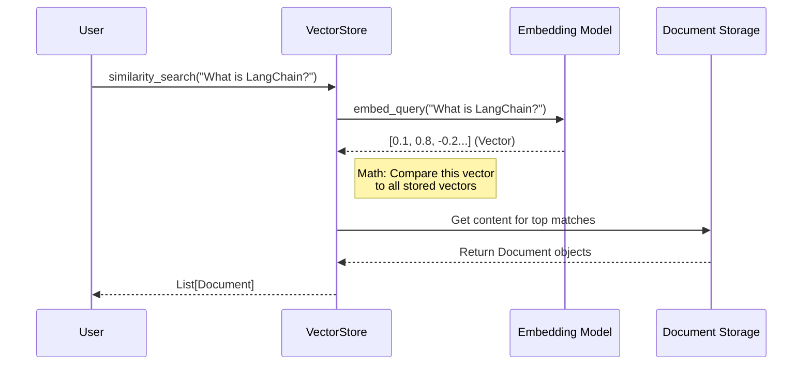

# Chapter 5: Retrieval (Documents & VectorStores)

Welcome back! 

In [Chapter 4: Memory](04_memory.md), we taught our AI to remember the **conversation history**. It can now remember your name or what you asked five minutes ago.

However, there is still a massive limitation: **The Knowledge Cutoff.**
If you ask the model about a news event from yesterday, or the contents of your private company PDF, it will hallucinate or say "I don't know."

## 1. The "Library" Problem

Imagine the LLM is a brilliant student taking an exam.
*   **Without Retrieval:** The student must rely only on what they memorized years ago (Training Data).
*   **With Retrieval:** The student is allowed to run to the library, grab a specific book (Your Data), and use it to answer the question.

This technique is called **RAG (Retrieval-Augmented Generation)**.

To build this "Library," we need four components:
1.  **Documents:** The books (data).
2.  **Splitters:** Cutting books into pages (chunks).
3.  **VectorStore:** The filing system (index).
4.  **Retriever:** The librarian (fetching data).

## 2. Documents: The Raw Material

LangChain doesn't read PDF or Word files directly in the chain. It converts everything into a standard format called a `Document`.

A `Document` is a simple container with two fields:
1.  `page_content`: The text itself.
2.  `metadata`: Info about the text (source, page number, author).

```python
from langchain_core.documents import Document

# Create a "book" manually
doc = Document(
    page_content="LangChain was released in late 2022.",
    metadata={"source": "history_book.txt", "author": "Harrison"}
)

print(doc.page_content)
# Output: "LangChain was released in late 2022."
```

In a real app, you would use a **Loader** (like `PyPDFLoader`) to create these automatically, but they all result in this exact object.

## 3. TextSplitters: Making it Bite-Sized

You cannot feed an entire 300-page book into an LLM prompt. It's too expensive and exceeds the context window. We need to cut the document into smaller chunks.

We use a `TextSplitter`. The most common one is `RecursiveCharacterTextSplitter`.

```python
from langchain_text_splitters import RecursiveCharacterTextSplitter

# Create the splitter
splitter = RecursiveCharacterTextSplitter(
    chunk_size=100,    # Max characters per chunk
    chunk_overlap=20   # Overlap to keep context between chunks
)

# Example long text
text = "LangChain is a framework for developing applications powered by language models."

# Split it
docs = splitter.create_documents([text])

print(docs[0].page_content) 
# Output: "LangChain is a framework for developing applications"
print(docs[1].page_content)
# Output: "applications powered by language models."
```

*Explanation:* Notice the word "applications" appears in both chunks? That is the **overlap**. It ensures we don't cut a sentence in half and lose the meaning.

## 4. VectorStores: The Semantic Search

Now we have hundreds of small chunks. How do we find the right one? 
We can't just use `Ctrl+F` (Keyword Search) because if you search for "pet," you also want results for "dog" or "cat."

We need **Semantic Search**.
1.  **Embeddings:** We turn text into a list of numbers (vectors). Text with similar meanings will have similar numbers.
2.  **VectorStore:** A database optimized to store and compare these numbers.

Let's use a simple in-memory store called `Chroma`.

```python
from langchain_chroma import Chroma
from langchain_openai import OpenAIEmbeddings

# 1. Create the database from our documents
# Note: You need an OpenAI API Key for the embeddings to work
db = Chroma.from_documents(
    documents=docs, 
    embedding=OpenAIEmbeddings()
)

# 2. Search for relevant info
results = db.similarity_search("What is LangChain?")

print(results[0].page_content)
# Output: "LangChain is a framework for developing applications"
```

*Explanation:* We didn't search for exact words. We searched for the *meaning*. The VectorStore found the chunk most similar to our question.

## 5. Connecting it to a Chain

Now we connect this to what we learned in [Chapter 3: Runnables & Chains](03_runnables___chains.md).

We convert the VectorStore into a **Retriever**. A Retriever is a standard interface that takes a string (query) and returns a list of Documents.

```python
# Create the interface
retriever = db.as_retriever()

# Create a prompt that expects context
from langchain_core.prompts import ChatPromptTemplate

prompt = ChatPromptTemplate.from_template(
    "Answer based on this context: {context}. Question: {question}"
)

# ... (Assume we have a 'model' defined from Chapter 1) ...
```

To run this, we fetch the documents first, then pass them to the chain.

```python
# 1. Retrieve data manually
docs = retriever.invoke("What is LangChain?")

# 2. Run the chain
response = prompt.pipe(model).invoke({
    "context": docs, 
    "question": "What is LangChain?"
})

print(response.content)
```

## 6. Internal Implementation: Under the Hood

How does LangChain manage splitting text and wrapping it in objects?

### The Retrieval Flow
When you search for documents, a mathematical comparison happens.



### 1. The Document Class
As we saw in `libs/core/langchain_core/documents/base.py`, the `Document` class is intentionally simple. It inherits from `BaseMedia` (which handles IDs) and is serializable (can be saved to JSON).

```python
class Document(BaseMedia):
    page_content: str
    metadata: dict

    def __init__(self, page_content, **kwargs):
        # Validation happens here to ensure content is a string
        super().__init__(page_content=page_content, **kwargs)
```

### 2. The TextSplitter Logic
The splitting logic is fascinating. It doesn't just hack text apart; it tries to keep it meaningful.

In `libs/text-splitters/langchain_text_splitters/base.py`, the `create_documents` method orchestrates the process:

```python
# Simplified logic from TextSplitter.create_documents
def create_documents(self, texts, metadatas=None):
    documents = []
    
    # Loop through every original text (e.g., every file)
    for i, text in enumerate(texts):
        
        # 1. Call the specific splitting logic (abstract method)
        chunks = self.split_text(text)
        
        # 2. Wrap each chunk into a Document object
        for chunk in chunks:
            new_doc = Document(
                page_content=chunk, 
                metadata=copy.deepcopy(metadatas[i])
            )
            documents.append(new_doc)
            
    return documents
```

The specific logic for *how* to split (by character, by token, or by newlines) is defined in the subclass method `split_text`.

## Summary

In this chapter, we learned:
1.  **Documents** are the wrappers for our data (`page_content` + `metadata`).
2.  **TextSplitters** chop long documents into smaller chunks with overlap to preserve context.
3.  **VectorStores** use Embeddings to perform "Semantic Search" (finding data by meaning).
4.  **Retrievers** are the standard Runnable interface to fetch documents for our chains.

**Why this matters:**
We now have a "Brain" (Model), "Memory" (History), and a "Library" (VectorStore).

But our AI is still passive. It waits for us to ask questions. What if we want the AI to *do* things? What if we want it to check the weather, calculate numbers, or book a flight?

For that, we need to give it hands. We need **Tools**.

[Next Chapter: Agents & Tools](06_agents___tools.md)

---

Generated by [Code IQ](https://github.com/adityasoni99/Code-IQ)