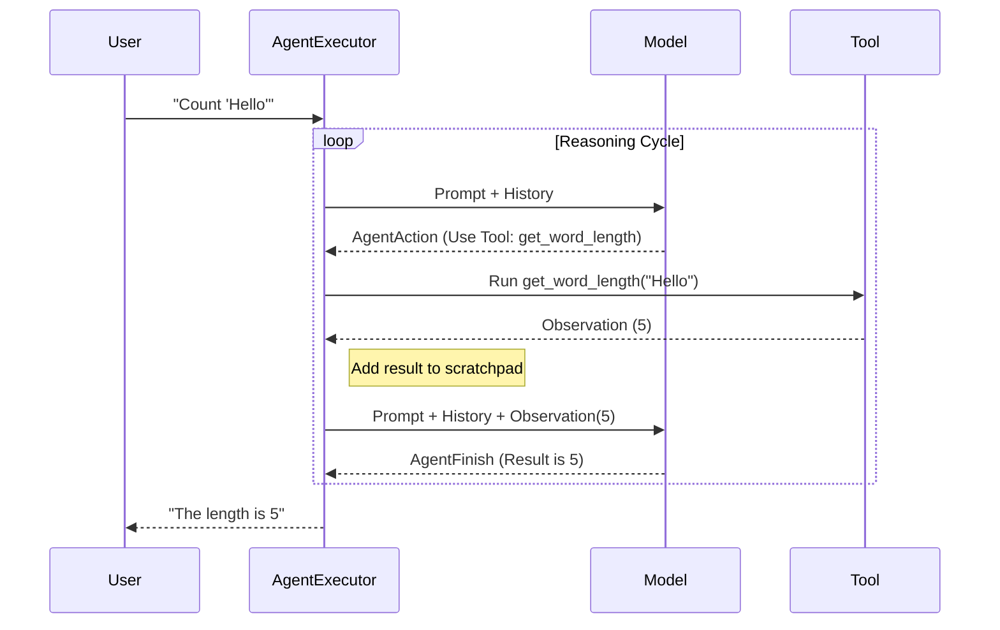

# Chapter 6: Agents & Tools

Welcome back! 

In [Chapter 3: Runnables & Chains](03_runnables___chains.md), we learned to build **Chains**. A Chain is like a train on a track: it goes from Station A to Station B to Station C. It always does the same steps in the same order.

In [Chapter 5: Retrieval (Documents & VectorStores)](05_retrieval__documents___vectorstores_.md), we gave our application access to external data ("Reading a book").

But what if we don't know the path ahead of time? 
What if the user asks: *"What is the weather in NY?"* (Requires a weather API)
Vs. *"What is 5 times 5?"* (Requires a calculator)

A hardcoded Chain cannot handle both. We need a "Decision Maker." We need an **Agent**.

## 1. The "Decision Maker"

An **Agent** uses the Language Model as a reasoning engine. Instead of just generating text, the model generates **Actions**.

Think of it like this:
*   **Chain:** A recipe. Follow step 1, then step 2.
*   **Agent:** An autonomous assistant. You give it a goal, and *it* decides which tools to use and in what order to achieve that goal.

To build an Agent, we need two main parts:
1.  **Tools:** The functions the Agent can call (e.g., Calculator, Google Search, Weather API).
2.  **The Agent Loop:** The process of asking the model "What now?", doing it, and repeating.

## 2. Creating Tools

A **Tool** is just a Python function that connects to the real world. LangChain provides a simple decorator `@tool` to convert any function into a tool the AI can understand.

Let's create a simple tool that calculates the length of a word.

```python
from langchain_core.tools import tool

# The docstring ("Calculates...") is CRITICAL. 
# The AI reads it to know WHEN to use this tool.
@tool
def get_word_length(word: str) -> int:
    """Calculates the length of a word."""
    return len(word)
```

*Explanation:* 
*   We use `@tool`.
*   We include a type hint (`word: str`) so the AI knows what data to send.
*   We write a docstring describing what the tool does.

Let's test the tool manually:

```python
# We can use it like a normal function
print(get_word_length.invoke("LangChain"))
# Output: 9
```

## 3. Giving Tools to the Model

Now that we have a tool, we need to tell our Chat Model about it. We use the `.bind_tools()` method.

*Note: This requires a model that supports Tool Calling (like OpenAI GPT-3.5/4, Anthropic Claude, etc.).*

```python
from langchain_openai import ChatOpenAI

model = ChatOpenAI()
tools = [get_word_length]

# This creates a new version of the model that "knows" about the tools
model_with_tools = model.bind_tools(tools)
```

*Explanation:* The model now has a "virtual manual" of the tools available to it. It hasn't called them yet; it just knows they exist.

## 4. The Agent Executor

We have the Brain (Model) and the Hands (Tools). Now we need the **Runtime** to coordinate them.

If the model says, *"I need to run `get_word_length` with input 'Hello'"*, something needs to actually run that Python function and feed the result back to the model. This is the job of the **AgentExecutor**.

LangChain provides pre-built functions to set this up.

```python
from langchain.agents import AgentExecutor, create_tool_calling_agent
from langchain_core.prompts import ChatPromptTemplate

# 1. Define the Prompt (Standard format for agents)
prompt = ChatPromptTemplate.from_messages([
    ("system", "You are a helpful assistant."),
    ("human", "{input}"),
    ("placeholder", "{agent_scratchpad}"), # Important! Memory for intermediate steps
])

# 2. Create the Agent (The logic)
agent = create_tool_calling_agent(model, tools, prompt)

# 3. Create the Executor (The runtime)
agent_executor = AgentExecutor(agent=agent, tools=tools, verbose=True)
```

*Explanation:* 
*   `{agent_scratchpad}`: This is a special area in the prompt where the Agent writes down its previous actions (e.g., "I tried step 1, and the result was X. Now I need step 2").
*   `verbose=True`: This lets us see the Agent's "thought process" in the console.

## 5. Running the Agent

Let's ask a question that requires the tool.

```python
response = agent_executor.invoke({"input": "How many letters in the word 'Supercalifragilistic'?"})

print(response["output"])
```

**What happens in the console (Verbose mode):**

1.  **Thought:** The User wants to count letters. I have a tool `get_word_length`. I should call it.
2.  **Action:** Calls `get_word_length("Supercalifragilistic")`.
3.  **Observation:** The tool returns `20` (hidden from user, seen by AI).
4.  **Final Answer:** "The word 'Supercalifragilistic' has 20 letters."

If we ask a question *without* needing tools:

```python
agent_executor.invoke({"input": "Hi, how are you?"})
# The Agent skips the tools and answers directly.
```

## 6. Internal Implementation: Under the Hood

How does the Agent know when to stop? How does it move between "Thinking" and "Acting"?

### The Agent Loop (The "While" Loop)

The `AgentExecutor` runs a continuous loop until the Agent produces a "Final Answer".



### 1. The Decision (`AgentAction`)
When the model decides to do something, it doesn't execute code immediately. It returns an object representing its *intent*.

*File Reference: `libs/core/langchain_core/agents.py`*

```python
class AgentAction(Serializable):
    tool: str           # Name of tool to use (e.g., "get_word_length")
    tool_input: str     # Input arguments (e.g., "Hello")
    log: str            # The LLM's reasoning text
```

### 2. The Result (`AgentFinish`)
When the model has gathered enough information, it returns an `AgentFinish` object instead of an Action.

*File Reference: `libs/core/langchain_core/agents.py`*

```python
class AgentFinish(Serializable):
    return_values: dict # The final answer for the user
    log: str            # Final reasoning log
```

### 3. The Execution Loop (`AgentExecutor`)
The heart of the system is the `_take_next_step` method inside the executor. It checks if the model returned an Action or a Finish.

*File Reference: `libs/langchain/langchain_classic/agents/agent.py`*

```python
# Simplified logic of AgentExecutor
def _iter_next_step(self, ...):
    # 1. Ask the agent/model what to do next
    output = self._action_agent.plan(intermediate_steps, ...)
    
    # 2. If it's a Final Answer, stop.
    if isinstance(output, AgentFinish):
        yield output
        return

    # 3. If it's an Action, execute the tool
    if isinstance(output, AgentAction):
        # Find the tool in our list
        tool = name_to_tool_map[output.tool]
        
        # Run it!
        observation = tool.run(output.tool_input)
        
        # Yield the result so it can be added to the next prompt
        yield AgentStep(action=output, observation=observation)
```

This loop allows the agent to be dynamic. It might take 1 step, or it might take 5 steps (e.g., "Search Google" -> "Read Link" -> "Summarize" -> "Translate" -> "Final Answer").

## Summary

In this chapter, we learned:
1.  **Agents** use an LLM as a reasoning engine to decide *what* to do, rather than just following a hardcoded Chain.
2.  **Tools** are functions (like `get_word_length`) that we give to the Agent to interact with the world.
3.  **AgentExecutor** is the runtime loop that performs the: **Thought -> Action -> Observation** cycle.
4.  Under the hood, the system uses `AgentAction` (to request a tool run) and `AgentFinish` (to return the final answer).

**The Missing Piece:**
We have built powerful applications now. But when an Agent is running a complex loop, or a Chain is processing thousands of documents, how do we know what is happening inside? How do we debug errors or stream tokens to the user in real-time?

We need a monitoring system. We need **Callbacks**.

[Next Chapter: Callbacks](07_callbacks.md)

---

Generated by [Code IQ](https://github.com/adityasoni99/Code-IQ)