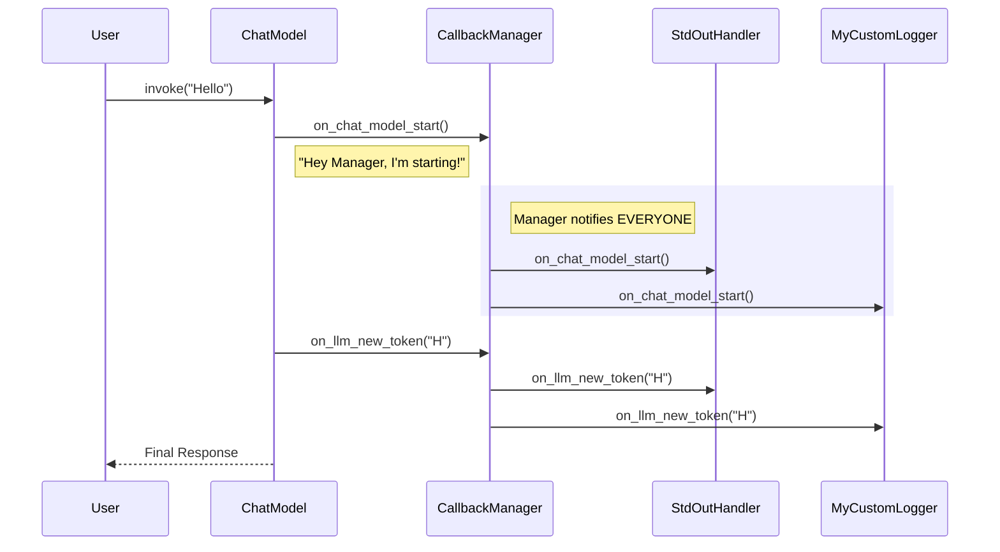

# Chapter 7: Callbacks

Welcome to the final chapter of our beginner's guide!

In [Chapter 6: Agents & Tools](06_agents___tools.md), we built an autonomous agent that can use tools to solve complex problems. However, as our applications get more complex, they start to feel like "Black Boxes."

## 1. The "Black Box" Problem

When you run a complex Chain or Agent, you often type an input, hit Enter, and then... wait.
And wait.

*   Is the model thinking?
*   Is it stuck in a loop?
*   Did it crash?
*   What is it actually doing right now?

**The Solution:**
**Callbacks**.

Think of Callbacks as a **Subscription System** or a "Baby Monitor." You can subscribe to specific events happening inside the application. When those events happen (like "The model started," "The model finished," or "A new word was generated"), LangChain will notify you immediately.

## 2. Use Case 1: Streaming (The "ChatGPT Effect")

Have you noticed how ChatGPT types out the answer word-by-word? It doesn't wait for the whole essay to be finished before showing it to you. This is called **Streaming**.

By default, Python waits for the function to finish. We can use a **CallbackHandler** to change this.

### Using the Standard Handler
LangChain comes with a built-in handler that prints tokens to the console as soon as they arrive.

```python
from langchain_openai import ChatOpenAI
from langchain_core.callbacks import StreamingStdOutCallbackHandler

# 1. Initialize the handler
handler = StreamingStdOutCallbackHandler()

# 2. Pass it to the model
# We MUST set streaming=True so the API sends chunks
chat = ChatOpenAI(streaming=True, callbacks=[handler])
```

Now, let's run it. Notice we don't even need to `print()` the result. The handler does it for us!

```python
# The text will appear in your console one token at a time
chat.invoke("Tell me a long story about a happy puppy.")
```

*Explanation:* 
1.  The model generates the token "Once".
2.  It triggers the callback.
3.  The handler prints "Once" immediately.
4.  Repeat for every word.

## 3. Use Case 2: Custom Logging (The "Spy")

What if you want to know exactly when a chain starts and ends for debugging purposes? We can write our own **Custom Callback Handler**.

To do this, we inherit from `BaseCallbackHandler` and overwrite the specific methods we care about.

```python
from langchain_core.callbacks import BaseCallbackHandler

class MyCustomLogger(BaseCallbackHandler):
    
    # Triggered when a Chain starts running
    def on_chain_start(self, serialized, inputs, **kwargs):
        print("🏁 CHAIN STARTED! Inputs:", inputs)

    # Triggered when a Chain finishes successfully
    def on_chain_end(self, outputs, **kwargs):
        print("✅ CHAIN ENDED! Result:", outputs)
```

Now we attach this logger to our chain.

```python
from langchain_core.prompts import ChatPromptTemplate

prompt = ChatPromptTemplate.from_template("Reverse this word: {word}")
chain = prompt | chat

# Pass the custom handler at runtime
chain.invoke(
    {"word": "stressed"},
    config={"callbacks": [MyCustomLogger()]}
)
```

**Console Output:**
```text
🏁 CHAIN STARTED! Inputs: {'word': 'stressed'}
desserts
✅ CHAIN ENDED! Result: AIMessage(content='desserts'...)
```

## 4. Use Case 3: Token Counting (The "Bill")

LLMs usually cost money per "token" (roughly per syllable). If you are running a business, you need to know how much each query costs.

LangChain provides a specialized context manager for this.

```python
from langchain_community.callbacks.manager import get_openai_callback

model = ChatOpenAI()

# We wrap our execution in this "with" block
with get_openai_callback() as cb:
    result = model.invoke("What is 2 + 2?")
    
    # The callback object 'cb' captures the usage stats
    print(f"Total Tokens: {cb.total_tokens}")
    print(f"Total Cost (USD): ${cb.total_cost}")
```

*Explanation:* The `get_openai_callback` works silently in the background, counting every token processed inside the `with` block and doing the math for you.

## 5. Internal Implementation: Under the Hood

How does the Model know to call your specific function `on_chain_start`?

It uses a concept called a **Callback Manager**.

### The Flow



### 1. The Manager (`CallbackManager`)
Every runnable (Model, Chain, Tool) has a `CallbackManager` inside it. This manager holds a list of all the handlers you provided (the logger, the streamer, etc.).

When the model reaches a milestone (like starting), it doesn't call the handlers directly. It tells the Manager.

*File Reference: `libs/langchain/langchain_classic/callbacks/manager.py`*

```python
class CallbackManager(BaseCallbackManager):
    def on_llm_start(self, ...):
        # Loop through every handler you added
        for handler in self.handlers:
            if not handler.ignore_llm:
                # Call the specific method on that handler
                handler.on_llm_start(...)
```

*Explanation:* The code iterates (loops) through `self.handlers`. If you added 5 different loggers, the Manager ensures all 5 of them get the message.

### 2. The Handler (`StreamingStdOutCallbackHandler`)
The handlers themselves are simple. They just define what to do when the method is called.

*File Reference: `libs/langchain/langchain_classic/callbacks/streaming_stdout.py`*

```python
class StreamingStdOutCallbackHandler(BaseCallbackHandler):
    # This specifically listens for "new token" events
    def on_llm_new_token(self, token: str, **kwargs) -> None:
        # It simply writes to the standard output (console)
        sys.stdout.write(token)
        sys.stdout.flush()
```

This modular design is powerful. The Model doesn't need to know *how* to print to the console or *how* to save to a database. It just broadcasts "I made a token!", and the registered Callbacks handle the rest.

## Summary

In this chapter, we learned:
1.  **Callbacks** act as observers that listen for events inside your application.
2.  **Streaming** allows us to see the AI's output in real-time using `StreamingStdOutCallbackHandler`.
3.  **Custom Handlers** allow us to log specifically what we need (Start, End, Errors).
4.  **CallbackManagers** exist internally to route these events to all your active handlers.

## Conclusion

Congratulations! You have completed the **Beginner's Guide to LangChain**.

You have gone from sending simple strings to a Model, to building intelligent Agents that can remember conversations, read documents, use tools, and stream their thoughts in real-time.

Here is a recap of your journey:
1.  **[Models](01_language_models__chat_models___llms_.md):** The Brain.
2.  **[Prompts](02_prompts___messages.md):** The Instructions.
3.  **[Chains](03_runnables___chains.md):** The Workflow.
4.  **[Memory](04_memory.md):** The Context.
5.  **[Retrieval](05_retrieval__documents___vectorstores_.md):** The Library.
6.  **[Agents](06_agents___tools.md):** The Decision Maker.
7.  **Callbacks:** The Monitoring System.

You now have all the building blocks to create powerful AI applications. Happy coding!

---

Generated by [Code IQ](https://github.com/adityasoni99/Code-IQ)