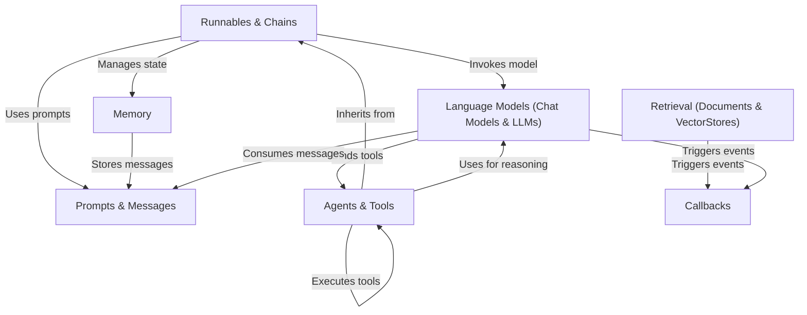

# Tutorial: langchain

**LangChain** is a framework for building applications powered by **Language Models** (LLMs and Chat Models). It provides a structure where **Runnables & Chains** orchestrate sequences of calls, **Agents** use models to decide on actions using **Tools**, and **Memory** persists conversational state. The framework also abstracts **Retrieval** for accessing external data and uses **Callbacks** for monitoring execution.

**Source Repository:** [https://github.com/langchain-ai/langchain](https://github.com/langchain-ai/langchain)

## Chapters

1. [Language Models (Chat Models & LLMs)](01_language_models__chat_models___llms_.md)
2. [Prompts & Messages](02_prompts___messages.md)
3. [Runnables & Chains](03_runnables___chains.md)
4. [Memory](04_memory.md)
5. [Retrieval (Documents & VectorStores)](05_retrieval__documents___vectorstores_.md)
6. [Agents & Tools](06_agents___tools.md)
7. [Callbacks](07_callbacks.md)

---

Generated by [Code IQ](https://github.com/adityasoni99/Code-IQ)