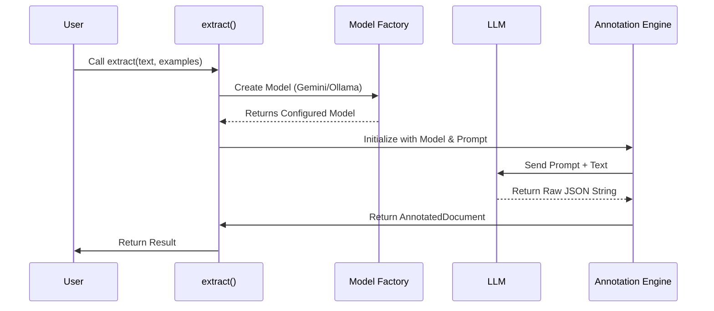

# Chapter 1: Extraction Orchestrator

Welcome to the `langextract` tutorial! If you have raw text and you need structured data, you are in the right place.

## The Problem: Chaos in the Pipeline

Imagine you want to extract medical conditions from a doctor's notes. To do this with a Large Language Model (LLM) manually, you have to:
1.  Connect to an API (like Gemini or OpenAI).
2.  Write a prompt telling the model to behave like a data extractor.
3.  Feed it examples so it knows the format.
4.  Split long text into small chunks so it fits the context window.
5.  Parse the text output back into Python dictionaries.
6.  Handle errors if the model hallucinates valid JSON.

That is a lot of work.

## The Solution: The Conductor

In `langextract`, the **Extraction Orchestrator** handles all of this for you. Think of it as the conductor of an orchestra. You simply hand it the sheet music (your data and rules), and it coordinates the musicians (the Tokenizer, the Model, the Parser) to create the symphony (structured data).

The entry point for this orchestrator is a single function: `extract()`.

### A Simple Use Case

Let's say we have this sentence:
> "Patient has diabetes."

We want to extract it into a structured format like this:
```json
{"condition": "diabetes", "severity": "moderate"}
```

Here is how we tell the Orchestrator to do that.

### Step 1: Define Examples

First, we need to teach the orchestrator what we want. We do this using `ExampleData`. This acts as a guide for the model.

```python
import langextract as lx
from langextract.core import data

# Define one example to teach the model
examples = [
    data.ExampleData(
        text="Patient has diabetes",
        extractions=[
            data.Extraction(
                extraction_class="condition",
                extraction_text="diabetes",
                attributes={"severity": "moderate"},
            )
        ],
    )
]
```
*Explanation: We provide a raw text input and the exact output we expect. This helps the model understand the schema automatically.*

### Step 2: Call the Orchestrator

Now, we call the `extract` function. This single line of code kicks off the entire pipeline.

```python
result = lx.extract(
    text_or_documents="Patient has hypertension",
    prompt_description="Extract conditions",
    examples=examples,
    model_id="gemini-2.5-flash",
    use_schema_constraints=True
)

print(result.extractions)
```

*Explanation: We pass our new text ("Patient has hypertension"), a description of the task, and the examples we defined. The Orchestrator handles the rest.*

## What Just Happened?

When you ran that code, the Orchestrator performed several complex tasks in the background.

1.  **Preparation**: It analyzed your examples to understand the data structure (Schema).
2.  **Routing**: It connected to the specific provider (Gemini).
3.  **Prompting**: It built a specialized prompt containing your instructions.
4.  **Inference**: It sent the data to the LLM.
5.  **Parsing**: It took the LLM's string output and converted it into a Python object.

### Visualizing the Flow

Here is what happens inside the `extract` function:



## Under the Hood: Implementation

Let's look at how `langextract` implements this orchestration in `langextract/extraction.py`.

### 1. Validating Inputs
The Orchestrator protects you from bad inputs. It ensures you have provided examples, as "zero-shot" extraction (no examples) is often unreliable for structured tasks.

```python
# From langextract/extraction.py
if not examples:
  raise ValueError(
      "Examples are required for reliable extraction. Please provide at least"
      " one ExampleData object with sample extractions."
  )
```

### 2. Creating the Model
The Orchestrator doesn't know *how* to talk to every API directly. It delegates that task. It uses a Factory to create the correct model object based on your `model_id`.

```python
# From langextract/extraction.py
# It uses the Factory to abstract away provider differences
language_model = factory.create_model(
    config=config,
    examples=prompt_template.examples if use_schema_constraints else None,
    use_schema_constraints=use_schema_constraints,
    fence_output=fence_output,
)
```
*Note: We will cover how this works in [Provider Routing & Factory](03_provider_routing___factory.md).*

### 3. Handling Formats
Different models prefer different formats (JSON vs YAML). The orchestrator sets up a `FormatHandler` to manage this.

```python
# From langextract/extraction.py
format_handler, remaining_params = fh.FormatHandler.from_resolver_params(
    resolver_params=resolver_params,
    base_format_type=format_type,
    base_use_fences=language_model.requires_fence_output,
    # ... defaults ...
)
```
*Note: Learn more about this in [Format Handling](02_format_handling.md).*

### 4. The Annotator
Finally, the Orchestrator hands everything over to the `Annotator`. This is the engine that actually processes the text, splits it if it is too long, and manages the loop.

```python
# From langextract/extraction.py
annotator = annotation.Annotator(
    language_model=language_model,
    prompt_template=prompt_template,
    format_handler=format_handler,
)

# The result is returned to you
result = annotator.annotate_text(
    text=text_or_documents,
    # ... params ...
)
```

## Advanced Orchestration

The `extract` function accepts many arguments to fine-tune the process.

*   **`max_workers`**: If you have a list of documents, the Orchestrator can process them in parallel. See [Batch Inference](07_batch_inference.md).
*   **`use_schema_constraints`**: When `True`, the Orchestrator forces the LLM to follow your JSON structure strictly.
*   **`extraction_passes`**: If you set this to 2 or 3, the Orchestrator will run the model multiple times on the same text to catch entities it might have missed the first time.

## Conclusion

The Extraction Orchestrator is your high-level interface. It hides the complexity of API connections, prompt formatting, and parsing, allowing you to focus purely on **what** you want to extract, rather than **how** to extract it.

However, the Orchestrator relies on knowing whether the model should output JSON, YAML, or fenced code blocks. How does it know that?

[Next Chapter: Format Handling](02_format_handling.md)

---

Generated by [Code IQ](https://github.com/adityasoni99/Code-IQ)