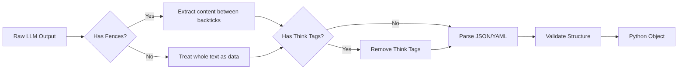

# Chapter 2: Format Handling

In the [Extraction Orchestrator](01_extraction_orchestrator.md) chapter, we saw how to magically turn text into data using `extract()`. But have you ever wondered how the computer understands the text generated by an AI?

Language Models (LLMs) are designed to chat. They like to say things like *"Here is the data you asked for"* or *"I found the following information."*

## The Problem: The "Chatty" Model

Imagine you ask a model for JSON data. You expect this:

```json
[{"name": "Alice", "age": 30}]
```

But the model actually returns this:

```markdown
Sure! Here is the extracted data in JSON format:

```json
[
  {
    "name": "Alice",
    "age": 30
  }
]
```

<think>I should probably double-check that age...</think>
Hope this helps!
```

If you try to feed that messy string directly into Python's `json.loads()`, your program will crash.

## The Solution: The Format Handler

In `langextract`, the **Format Handler** is the cleanup crew. It acts as a bridge between the messy text output of an LLM and the strict structured objects Python needs.

 It performs two main jobs:
1.  **Prompting:** It tells the model exactly how to format the data (e.g., "Please use JSON inside code fences").
2.  **Parsing:** It hunts through the model's response, discards the chatter, extracts the code block, and converts it into a Python dictionary.

## Concept: Fences and Formats

### 1. Code Fences
To make extraction reliable, we usually ask models to wrap data in **Markdown Code Fences**. These look like triple backticks:

```markdown
```json
... data ...
```
```

The Format Handler looks for these specific markers. It ignores everything outside of them.

### 2. JSON vs. YAML
While JSON is the most common format, `langextract` also supports **YAML**.
*   **JSON**: Standard, widely supported, strict syntax.
*   **YAML**: Uses fewer tokens (cheaper), handles multi-line strings better, less strict with commas.

## Using the Format Handler

By default, the Orchestrator sets up a standard JSON handler for you. However, you can customize it.

### Basic Configuration

You don't usually instantiate the handler yourself. You pass configuration parameters to `extract`.

Here is how you might tell `langextract` to use YAML instead of JSON (which can be faster/cheaper):

```python
import langextract as lx
from langextract.core import data

# We want YAML output instead of JSON
result = lx.extract(
    text_or_documents="Buy milk and eggs",
    prompt_description="Extract shopping list",
    examples=examples, # Assume examples are defined
    model_id="gemini-2.0-flash",
    resolver_params={"format_type": "yaml"} 
)
```
*Explanation: We added `resolver_params`. This tells the Orchestrator to configure the internal FormatHandler to look for YAML syntax.*

### Handling "Think" Tags

Some modern "Reasoning Models" (like DeepSeek-R1 or QwQ) "think" out loud before answering. They output tags like `<think>... reasoning ...</think>` followed by the JSON.

The `FormatHandler` in `langextract` automatically detects these tags and strips them out before parsing, so you don't have to write complex Regex patterns yourself.

## Under the Hood: How Parsing Works

When the LLM returns a string, the `FormatHandler` goes through a specific pipeline to clean it up.



### 1. Extracting Content (`_extract_content`)

Let's look at `langextract/core/format_handler.py`. The handler uses Regular Expressions (Regex) to find the data.

```python
# Inside FormatHandler._extract_content
# _FENCE_RE looks for ```json ... ``` blocks
matches = list(_FENCE_RE.finditer(text))

if len(matches) == 1:
    # Found exactly one block? Great! Return the body.
    return matches[0].group("body").strip()
```
*Explanation: It scans the text for patterns starting with ``` and ending with ```. If it finds the right block, it grabs the content inside.*

### 2. The Parsing Logic (`parse_output`)

Once we have the clean string (e.g., `[{"item": "milk"}]`), we need to turn it into a Python object.

```python
# Inside FormatHandler.parse_output
try:
    # Try to parse the cleaned string
    parsed = self._parse_with_fallback(content, strict)
except (yaml.YAMLError, json.JSONDecodeError) as e:
    # If it fails, throw a specific FormatParseError
    raise exceptions.FormatParseError(f"Failed to parse: {e}")
```

### 3. Handling Wrappers

Sometimes, models return a list: `[...]`.
Other times, they return an object: `{"extractions": [...]}`.

The handler standardizes this.

```python
# Inside FormatHandler.parse_output
if isinstance(parsed, list):
    # If the model returned a raw list, we use it directly
    items = parsed
elif isinstance(parsed, dict):
    # If the model returned a dict, we look for the "extractions" key
    items = parsed.get("extractions", [parsed])
```
*Explanation: This ensures that no matter how the model wraps the data, your code always gets a clean list of items back.*

## Validation and Strictness

You can control how strict the parser is.

*   **`strict_fences=True`**: The output *must* contain markdown code blocks. If the model forgets them, the extraction fails.
*   **`strict_fences=False`** (Default): If the model forgets the code blocks but returns valid JSON, `langextract` will still accept it.

You can set this in your `resolver_params`:

```python
lx.extract(
    # ... inputs ...
    resolver_params={
        "strict_fences": True, # Fail if no ```json block found
        "format_type": "json"
    }
)
```

## Conclusion

The **Format Handling** system allows `langextract` to be robust against the unpredictability of LLMs. It handles the "boring" work of:
1.  Stripping out conversational filler.
2.  Removing reasoning tags (`<think>`).
3.  Normalizing lists vs. dictionaries.
4.  Switching between JSON and YAML.

Now that we know *how* we parse the data, we need to understand *who* generates the data. How does `langextract` switch between OpenAI, Gemini, or Ollama?

[Next Chapter: Provider Routing & Factory](03_provider_routing___factory.md)

---

Generated by [Code IQ](https://github.com/adityasoni99/Code-IQ)