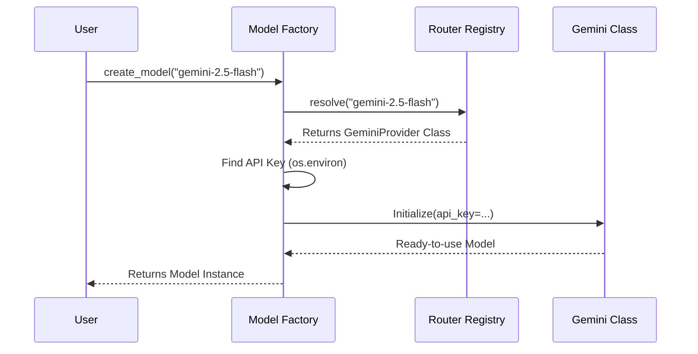

# Chapter 3: Provider Routing & Factory

In [Format Handling](02_format_handling.md), we learned how `langextract` cleans up the messy output from a Language Model (LLM) to give us nice, structured data. But before we can parse the output, we need to send the input to the right AI model.

## The Problem: The "Universal Remote" Dilemma

Every AI provider works differently.
*   **OpenAI** requires you to call `client.chat.completions.create()`.
*   **Google Gemini** requires `model.generate_content()`.
*   **Ollama** (local models) has its own specific API endpoint.

If you were writing this from scratch, your code would look like a messy pile of `if/else` statements:

```python
# The "Messy" Way (Don't do this!)
if model_name == "gpt-4":
    import openai
    # ... call OpenAI ...
elif model_name == "gemini-1.5":
    import google.generativeai
    # ... call Google ...
```

This is hard to maintain. If you want to switch from GPT-4 to Gemini to save money, you have to rewrite your code.

## The Solution: The Factory and The Router

`langextract` solves this with two concepts:
1.  **The Router:** A "receptionist" that looks at the string you provided (e.g., `"gemini-2.5-flash"`) and decides which code handles it.
2.  **The Factory:** A generic builder that creates the model connection for you, handling things like API keys automatically.

### A Simple Use Case

You want to test if your prompt works better on a local model (Ollama) or a cloud model (Gemini).

With `langextract`, you just change **one string**:

```python
import langextract as lx

# Use a local model
lx.extract(
    text="Hello",
    examples=examples, # Assume examples exist
    model_id="ollama/llama3" 
)

# Switch to Google Cloud instantly
lx.extract(
    text="Hello",
    examples=examples,
    model_id="gemini-2.5-flash"
)
```

*Explanation: You didn't change any logic. You didn't import different libraries. The Factory handled the switch.*

## Key Concepts

### 1. The Model ID
The `model_id` is a string identifier. It usually looks like `"provider-model_name"` or just `"model_name"`.
*   `"gpt-4o"`
*   `"gemini-2.0-flash"`
*   `"ollama/mistral"`

### 2. The Router (The Receptionist)
The router holds a registry of **Regex Patterns**. When you pass `"gemini-2.5-flash"`, the router checks its list:
*   Does it match `^gpt.*`? No.
*   Does it match `^gemini.*`? **Yes!** -> Route to the `GeminiProvider` class.

### 3. The Factory (The Builder)
Once the router picks the class, the Factory instantiates it. It creates the object and finds your API keys in your environment variables so you don't have to pass them around.

## Visualizing the Flow

Here is what happens when you request a specific model ID:



## Under the Hood: Implementation

Let's look at how `langextract` implements this magic.

### 1. The Router (`langextract/providers/router.py`)

The router uses **Lazy Loading**. It doesn't import the heavy libraries (like `google-generativeai` or `openai`) until you actually ask for them. This keeps your application startup fast.

Here is a simplified look at how the router finds the right class:

```python
# From langextract/providers/router.py
def resolve(model_id: str):
    # Loop through all registered patterns
    for entry in _entries:
        # If the regex matches the model_id string...
        if any(pattern.search(model_id) for pattern in entry.patterns):
            # ... load and return the specific Provider Class
            return entry.loader()
```

### 2. The Factory (`langextract/factory.py`)

The Factory's job is to make things easy for you. One of its best features is **Auto-Configuration**.

If you use Gemini, it automatically looks for `GEMINI_API_KEY` or `LANGEXTRACT_API_KEY` in your environment variables.

```python
# From langextract/factory.py
def _kwargs_with_environment_defaults(model_id, kwargs):
    # If the user didn't provide an explicit API key...
    if "api_key" not in resolved:
        # Check standard environment variables
        if "gemini" in model_id.lower():
             resolved["api_key"] = os.getenv("GEMINI_API_KEY")
    return resolved
```
*Explanation: This means you rarely need to pass `api_key="..."` in your code. Just set it in your terminal, and the Factory finds it.*

## Advanced: Plugins and Custom Models

What if you want to use a model provider that `langextract` doesn't support yet? Or a custom internal API?

The system is designed as a **Plugin Architecture**. You can register your own providers without changing the core library code.

### The Plugin Generator Script

`langextract` comes with a powerful script to create your own provider plugin in seconds.

```bash
# In your terminal
python scripts/create_provider_plugin.py MyCustomLLM --patterns "^custom-.*"
```

This script generates a full Python package folder structure for you!

1.  It creates `provider.py` (where you write your API logic).
2.  It creates `tests`.
3.  It sets up `pyproject.toml` so `langextract` can automatically discover your plugin when it is installed.

### Explicit Configuration

Sometimes, you might have two providers that claim the same model ID, or you want to pass very specific settings. You can bypass the string magic using `ModelConfig`.

```python
from langextract import factory

# Precise control over creation
config = factory.ModelConfig(
    model_id="my-custom-model",
    provider="MyCustomProvider", # Force this specific class
    provider_kwargs={"temperature": 0.7}
)

model = factory.create_model(config)
```

## Conclusion

The **Provider Routing & Factory** system acts as a universal adapter. It decouples *what* you want to do (extract data) from *who* is doing it (OpenAI, Google, etc.).

*   **Router:** Matches strings to code.
*   **Factory:** Handles setup and API keys.
*   **Plugins:** Allows infinite extensibility.

Now that we have a configured model and we know how to talk to it, we face a new problem: **Limit Constraints**. What happens if the text you want to analyze is larger than the model's context window?

[Next Chapter: Smart Chunking](04_smart_chunking.md)

---

Generated by [Code IQ](https://github.com/adityasoni99/Code-IQ)