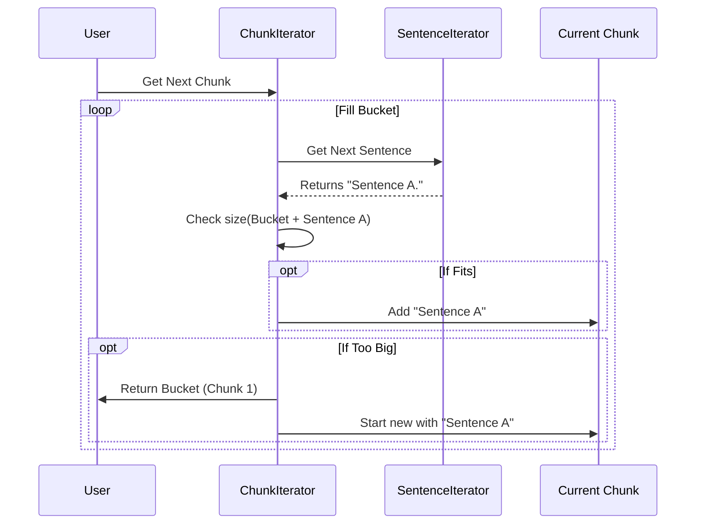

# Chapter 4: Smart Chunking

In the previous chapter, [Provider Routing & Factory](03_provider_routing___factory.md), we learned how to connect to any AI model (like Gemini or OpenAI).

However, even the best models have a limit: the **Context Window**. If you try to feed a 500-page medical record into a model that can only read 10 pages at a time, it will crash or truncate your data.

## The Problem: Cutting Without Breaking

Imagine you have a long string of text and you need to cut it into pieces to feed the AI.

**The Naive Approach:**
You simply cut the text every 1,000 characters.
> "...the patient suffers from severe dia" | "betes and requires immediate..."

**The Result:**
The AI sees "severe dia" in the first chunk and "betes" in the second. It loses the meaning completely.

## The Solution: Smart Chunking

`langextract` uses **Smart Chunking**. Instead of counting characters blindly, it looks for **sentence boundaries**. It tries to fill the "bucket" (the chunk) with as many complete sentences as possible. If a sentence pushes the chunk over the limit, it stops *before* that sentence and starts a new chunk.

### A Simple Use Case

You have a paragraph with three sentences. Your limit (buffer) is very small. You want `langextract` to figure out how to split them so no sentence is cut in half.

## How to Use It

The core tool here is the `ChunkIterator`. It takes your long text and yields safe, bite-sized `TextChunk` objects.

### Step 1: Setup

You need the chunking module and a tokenizer (the tool that recognizes words and punctuation).

```python
from langextract import chunking
from langextract.core import tokenizer

# Our long text
text = "Sentence one. Sentence two is longer. Sentence three."

# We need a tokenizer to identify sentence boundaries
my_tokenizer = tokenizer.RegexTokenizer()
```

### Step 2: Create the Iterator

We initialize the iterator. We set `max_char_buffer` to a small number (e.g., 25) to force it to split the text for this demonstration.

```python
# Create the iterator
iterator = chunking.ChunkIterator(
    text=text,
    max_char_buffer=25,  # Very small buffer to force splits!
    tokenizer_impl=my_tokenizer
)
```
*Explanation: We tell the iterator, "Do not create any chunk larger than 25 characters."*

### Step 3: Iterate

Now we just loop through it.

```python
for i, chunk in enumerate(iterator):
    print(f"Chunk {i}: '{chunk.chunk_text}'")
```

**Output:**
```text
Chunk 0: 'Sentence one.'
Chunk 1: 'Sentence two is longer.'
Chunk 2: 'Sentence three.'
```

*Note: Even though "Sentence two" combined with "Sentence one" would be ~40 characters (too big), the chunker was smart enough to send them separately.*

## Key Concepts

### 1. The Tokenizer
Before chunking, the text is converted into **Tokens**. A token is roughly a word or a punctuation mark. `langextract` uses these tokens to find periods (`.`), question marks (`?`), and newlines to determine where sentences end.

### 2. The Buffer
The `max_char_buffer` is your safety limit. If you are using an LLM with a 4,000 token limit, you might set this buffer to roughly 12,000 characters (since 1 token $\approx$ 4 characters) to be safe.

### 3. The Fallback (Hard Breaks)
What if a *single sentence* is longer than your buffer?
> "This is a sentence that goes on for 5,000 characters..."

In this rare case, `langextract` acts as a fail-safe. It performs a hard cut to ensure the code doesn't crash, but it tries to do so at a newline if possible.

## Visualizing the Flow

How does the `ChunkIterator` decide when to cut?



## Under the Hood: Implementation

Let's look at `langextract/chunking.py` to see how this logic is implemented.

### 1. Identifying Sentences

The logic relies on `SentenceIterator`. This class scans the tokens and looks for sentence terminators.

```python
# From langextract/chunking.py
class SentenceIterator:
    def __next__(self) -> tokenizer_lib.TokenInterval:
        # Locates the sentence containing the current token
        sentence_range = tokenizer_lib.find_sentence_range(
            self.tokenized_text.text,
            self.tokenized_text.tokens,
            self.curr_token_pos,
        )
        return sentence_range
```
*Explanation: This helper class abstracts away the complex logic of finding where a sentence ends.*

### 2. Filling the Chunk

The `ChunkIterator` consumes sentences until the buffer is full.

```python
# From langextract/chunking.py (Simplified)
def __next__(self) -> TextChunk:
    sentence = next(self.sentence_iter)

    # 1. Check if adding this sentence exceeds the limit
    test_chunk = create_token_interval(
        curr_chunk.start_index, sentence.end_index
    )
    
    if self._tokens_exceed_buffer(test_chunk):
        # 2. If it exceeds, return what we have so far
        return TextChunk(token_interval=curr_chunk, ...)
    else:
        # 3. If it fits, expand the current chunk
        curr_chunk = test_chunk
```

### 3. The `TextChunk` Object

The iterator returns a `TextChunk` object, not just a string. This object tracks where in the original document this piece came from.

```python
@dataclasses.dataclass
class TextChunk:
    token_interval: tokenizer_lib.TokenInterval
    document: data.Document | None = None
    
    @property
    def chunk_text(self) -> str:
        # Extracts the actual string from the tokens
        return get_token_interval_text(...)
```

## Batching for Performance

If you have a massive document, you might get 100 chunks. Sending them to the LLM one by one is slow.

You can group chunks into batches (e.g., 5 chunks at a time) to process them in parallel using `make_batches_of_textchunk`.

```python
# Create batches of 5 chunks
batches = chunking.make_batches_of_textchunk(iterator, batch_length=5)

for batch in batches:
    # 'batch' is a list of 5 TextChunk objects
    print(f"Processing batch of {len(batch)} chunks...")
```

## Conclusion

**Smart Chunking** ensures that your data remains semantically intact. By respecting sentence boundaries, we increase the quality of the LLM's output because it isn't trying to understand broken half-sentences.

Now that we have clean, perfectly sized text chunks, we need to wrap them in instructions for the LLM. How do we construct the message that tells the AI *what* to extract?

[Next Chapter: Prompt Engineering](05_prompt_engineering.md)

---

Generated by [Code IQ](https://github.com/adityasoni99/Code-IQ)