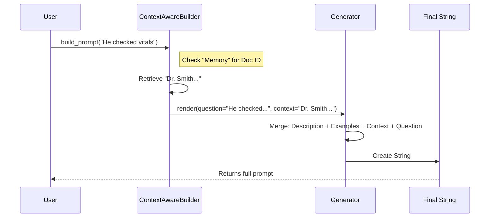

# Chapter 5: Prompt Engineering

In [Smart Chunking](04_smart_chunking.md), we learned how to slice a large document into safe, bite-sized pieces called "chunks."

But here is the catch: you cannot just throw a raw chunk of text at an LLM and expect a JSON object back. If you send just the text *"Patient denies chest pain,"* the model might reply with *"That is good news!"* or *"Medical record noted."*

To get structured data, we need to wrap that chunk in a very specific set of instructions. This wrapper is called a **Prompt**.

## The Problem: The "Blank Slate"

Language models are generalists. They don't know they are supposed to be "Data Extractors" unless you tell them. Furthermore, if you are processing 100 chunks, you need to tell the model the exact same instructions 100 times, perfectly consistently.

Additionally, we have the **"Amnesia Problem."** When the model reads Chunk #2, it has already forgotten Chunk #1. If Chunk #2 says *"He has a fever,"* the model won't know who *"He"* is.

## The Solution: The Prompt Builder

In `langextract`, **Prompt Engineering** isn't just string concatenation. It is a structured pipeline that:
1.  **Sets the Stage:** Defines the system instructions (The "System Prompt").
2.  **Teaches by Example:** Injecting "Few-Shot" examples so the model mimics the pattern.
3.  **Injects Context:** Sneaking in the last few lines of the *previous* chunk so the model remembers who we are talking about.

### A Simple Use Case

We want to extract names.
*   **Instruction:** "Extract person names."
*   **Example:** "Input: 'Hello Bob.' -> Output: {'name': 'Bob'}"
*   **Current Chunk:** "Sarah is here."

We need `langextract` to combine these three elements into one final string to send to the API.

## Key Concepts

### 1. The Structured Template
This is the "Recipe." It holds your high-level instructions and the examples you created in Chapter 1. It acts as the blueprint for every prompt.

### 2. The Generator
This is the "Chef." It takes the recipe (Template) and the ingredients (the current Text Chunk) and cooks them into the final text prompt.

### 3. Context Awareness
This is the "Memory." It creates a bridge between chunks. It automatically appends the last few sentences of Chunk #1 to the beginning of Chunk #2, labeled as `[Previous text]`.

## How to Use It

Let's build a prompt pipeline manually to see how it works.

### Step 1: Define the Template
First, we create the static parts of our prompt: the description and the examples.

```python
from langextract.prompting import PromptTemplateStructured
from langextract.core import data

# 1. Create a "Few-Shot" example
ex = data.ExampleData(
    text="John eats an apple",
    extractions=[data.Extraction(extraction_text="John", extraction_class="Person")]
)

# 2. Create the Template
template = PromptTemplateStructured(
    description="Extract all people mentioned in the text.",
    examples=[ex]
)
```
*Explanation: We created a blueprint. Any prompt built from this will know it's supposed to extract people, and it will show the 'John' example first.*

### Step 2: Initialize the Generator
The generator needs to know how to format the data (JSON vs YAML), so it needs a [Format Handler](02_format_handling.md).

```python
from langextract.prompting import QAPromptGenerator
from langextract.core import format_handler

# Create a standard JSON handler
handler = format_handler.FormatHandler()

# Create the generator
generator = QAPromptGenerator(
    template=template,
    format_handler=handler
)
```

### Step 3: Build the Prompt
Now, imagine we are processing a document. We have a text chunk.

```python
# The text we actually want to analyze
current_chunk = "Sarah went to the store."

# Generate the final string
final_prompt_string = generator.render(question=current_chunk)

print(final_prompt_string)
```

**Output (simplified):**
```text
Extract all people mentioned in the text.

Examples
Q: John eats an apple
A: ```json [{"extraction_text": "John", ...}] ```

Q: Sarah went to the store.
A: 
```

*Explanation: See how it stitched everything together? It put the instruction first, then the example, then our current text, and finally an "A:" waiting for the model to complete it.*

## Context Awareness (Solving the "He" Problem)

What if we have this text split into two chunks?
1.  "Dr. Smith entered the room."
2.  "He checked the patient's vitals."

If we process chunk 2 alone, the model doesn't know "He" is Dr. Smith.

We use `ContextAwarePromptBuilder` to solve this.

```python
from langextract import prompting

# Create a builder that remembers the last 50 chars
builder = prompting.ContextAwarePromptBuilder(
    generator=generator,
    context_window_chars=50
)

# Simulate processing Chunk 1
builder.build_prompt("Dr. Smith entered the room.", document_id="doc1")

# Process Chunk 2
prompt_2 = builder.build_prompt(
    "He checked the patient's vitals.", 
    document_id="doc1"
)

print(prompt_2)
```

**Output for Chunk 2:**
```text
... instructions ...
[Previous text]: ...entered the room.

Q: He checked the patient's vitals.
A:
```
*Explanation: The builder automatically injected `[Previous text]`. Now the LLM can deduce that "He" refers to the person who just entered the room.*

## Visualizing the Flow

Here is how the components interact to build the final string.



## Under the Hood: Implementation

Let's look at `langextract/prompting.py`.

### 1. Rendering the Prompt
The `QAPromptGenerator.render` method is the workhorse. It builds a list of strings and joins them.

```python
# From langextract/prompting.py
def render(self, question: str, additional_context: str | None = None) -> str:
    # 1. Add Description
    prompt_lines: list[str] = [f"{self.template.description}\n"]

    # 2. Add Examples (if they exist)
    if self.template.examples:
        prompt_lines.append(self.examples_heading)
        for ex in self.template.examples:
            # Format the example's output using the FormatHandler
            prompt_lines.append(self.format_example_as_text(ex))

    # 3. Add the current Question (the chunk)
    prompt_lines.append(f"{self.question_prefix}{question}")
    
    return "\n".join(prompt_lines)
```

### 2. Formatting Examples
Notice `format_example_as_text`. This ensures that the examples you show the model match the output format (JSON/YAML) you expect. It uses the `FormatHandler` we discussed in Chapter 2.

```python
# From langextract/prompting.py
def format_example_as_text(self, example: data.ExampleData) -> str:
    question = example.text
    # Convert the Python object example into a JSON/YAML string
    answer = self.format_handler.format_extraction_example(example.extractions)
    
    return f"Q: {question}\nA: {answer}\n"
```

### 3. State Management (Context)
The `ContextAwarePromptBuilder` maintains a simple dictionary to track the history of documents.

```python
# From langextract/prompting.py
class ContextAwarePromptBuilder(PromptBuilder):
    def _update_state(self, document_id: str, chunk_text: str) -> None:
        # Save the current text so it can be used as context for the NEXT chunk
        if self._context_window_chars:
            self._prev_chunk_by_doc_id[document_id] = chunk_text
```

## Conclusion

**Prompt Engineering** in `langextract` is about consistency. By using templates and builders, we ensure that every single chunk of data is presented to the LLM in the exact same format, with the exact same examples, and with helpful context from previous segments.

We have the chunks, and now we have the prompts. The final step is to actually send these prompts to the model and get the response back.

[Next Chapter: Language Model Interface](06_language_model_interface.md)

---

Generated by [Code IQ](https://github.com/adityasoni99/Code-IQ)